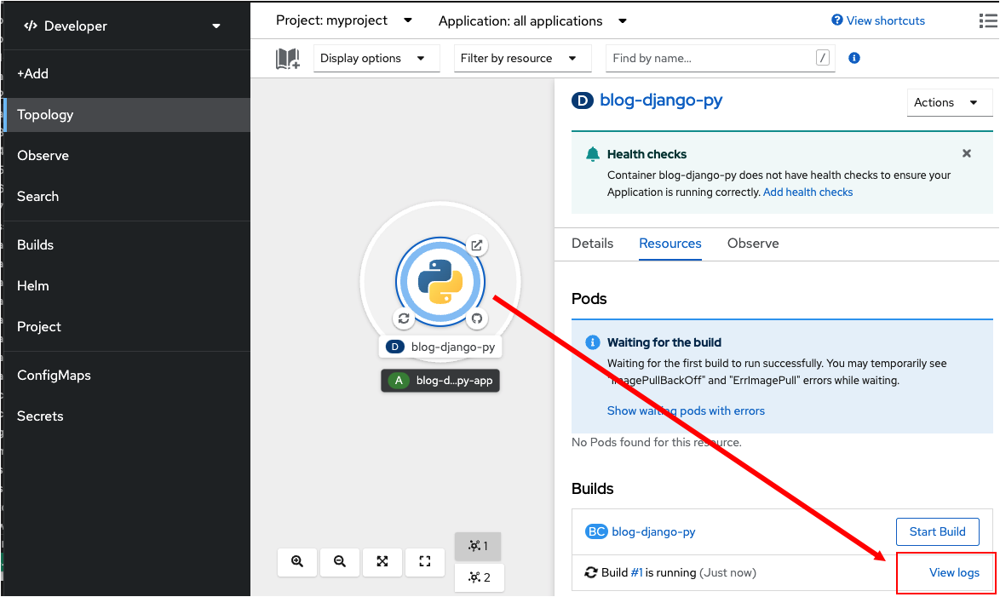
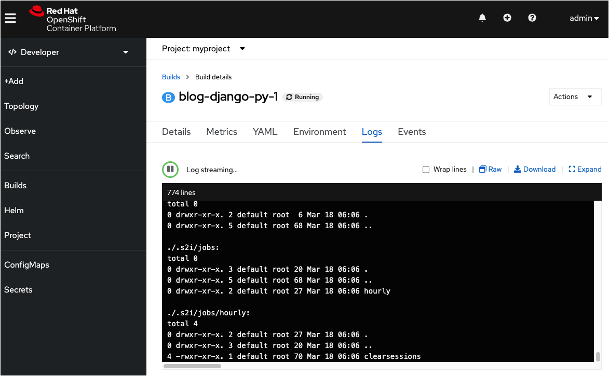

In this topic you will learn how to view a deployment's logs from within the OpenShift web console. In this case, you will view the logs for the Python application deployment you started in the previous topic.

----

`Step 1:` Click the **Web Console** tab from the horizontal menu bar over the terminal to the left to open the OpenShift web console.

Make sure you are in the Topology overview page in the OpenShift web console. You'll see the graphic for the Python application deployment.

----

`Step 2:`Click the center of the Python deployment graphic. The details of the deployment will appear in a panel that slides out from the right side of the web page.

You'll see a button on the lower right with the label, **View logs**.

----

`Step 3:` Click the **View logs** button as shown in the figure below.

When you click the **View logs** button you'll be presented with a panel that displays a continuous stream of log data as shown in the figure below.

Viewing the deployment logs allows you to monitor the progress of the build as it runs. When the build completes successfully you see a final message, "Push successful". This indicates that the container image for the application was pushed to the OpenShift internal image registry and the application is up and running.

# Congratulations!

You've just learned how to view a deployment's logs in the OpenShift web console.

----

**NEXT:** Access the application from the Internet
