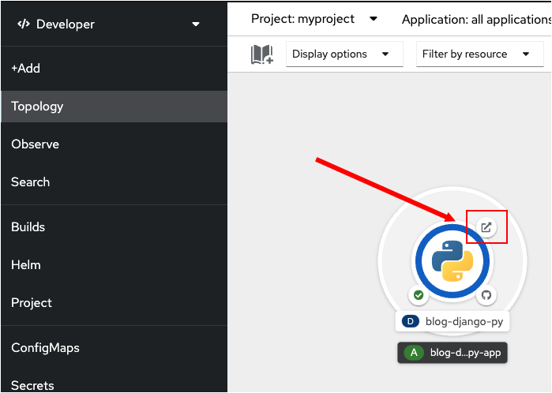

In the previous topics, you built and deployed the Python application. In this topic you will open the application in a web browser from the Topology page using the **Route** assigned by OpenShift.

----

`Step 1:`Click the **Web Console** tab from the horizontal menu bar over the terminal to the left to open the OpenShift web console.

Click on **Topology** button in the left hand menu bar to return to the topology view for the project.

As you read in a previous topic, when you created the application using the web console, an OpenShift `route` was automatically created for the application. The `route` exposed the application outside of the cluster to the Internet. You'll use the `route`'s URL created by OpenShift to access the application from a web browser window.

----

`Step 2a:` Click on the icon at the top right of the ring in the application visualization as shown in the figure below to quickly access the URL for the deployed application in the Topology view.

Make sure the ring surrounding the Python logo is dark blue.

`Step 2b:` Click on the Open URL icon as shown in the figure above.

Clicking the icon will open a new tab in your browser that displays a blog web site page as shown in the figure below.

This web site is driven by the Python application you built from the source code in GitHub and deployed using the OpenShift web console.

# Congratulations!

You've successfully built and deployed an application from source code using the OpenShift web console.

----
**NEXT:** Deleting the deployment from the command line using the OpenShift CLI Tool

