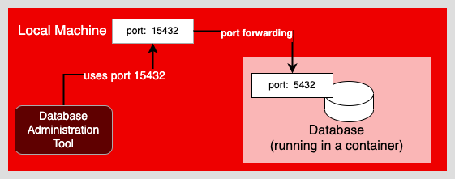

In this topic, you will execute port forwarding to connect the Postgres database running internally in the OpenShift cluster to a local process running in the terminal window to the left.

---

`Step 1:` Run the following command as you did in a previous step to create an instance of the environment variable `POD` that has the name of `pod` hosting the Postgres database. (This topic needs its own instance of the `POD` environment variable):

```
POD=$(oc get pods --selector name=database -o custom-columns=NAME:.metadata.name --no-headers); echo $POD
```

You get output similar to, but not exactly like the following:

```
database-1-t24zj
```

You will now expose the database service outside of the OpenShift cluster, so that you can use a database administration tool running on the local machine.

# Understanding the need for port forwarding

Under OpenShift, a web application is made visible outside of the cluster by creating a `route` resource. A `route` lets a user access the web application from a web browser with a URL. A route is typically used for web applications that use the HTTP protocol.

However, a `route` cannot be used to expose a database, because databases have their own distinct communication protocol. In short, a `route` uses a different protocol than a database server's, thus hindering communication.

A way to address this shortcoming it to create a temporary network connection from your local machine to the internal database using port forwarding.

Port forwarding creates a port number on your local machine that maps to the port number of a Linux container running inside an OpenShift cluster. You can use this mapping to connect a database administration tool running on the local machine to a database running within an OpenShift cluster as shown in the figure below.



You use the `oc port-forward` command to set up port forwarding between a local machine and the database running on OpenShift.

The format for the command to set up port forwarding is:

```
oc port-forward <pod-name> <local-port>:<remote-port>
```

**WHERE**

* `<pod-name>` is the name of the `pod` internal to OpenShift
* `<local-port>` is the port that you want to use on the local machine
* `<remote-port>` is the port being used by the database or application running on a container internally in an OpenShift `pod`.

The following is a real-world example of executing port forwarding:

```
oc port-forward $POD 15432:5432
```

**WHERE**

* `$POD` is an environment variable that has the actual name of the `pod` internal to OpenShift that's running the Postgres database server
* `15432` is the port used by a Postgres administration tool running on an local machine outside the OpenShift cluster
* `5432` is the port that the database running internally within a container in OpenShift cluster is listening upon.

Operationally this means the client tool will call port `15432` outside the cluster and OpenShift will map the call to port `5423` that's running inside the OpenShift cluster.

# Implementing port forwarding

`Step 2:` Run the following command to create a connection to the PostgreSQL database listening on port `5432` inside the OpenShift cluster and expose it to the local machine that's calling outside the cluster from port `15432`:

```
oc port-forward $POD 15432:5432
```

You will get the following output:

```
Forwarding from 127.0.0.1:15432 -> 5432
```

# Avoiding port number collisions

Notice that you're using port `15432` for the local machine, rather than using port `5432`. You're using port `15432` to avoid a port collision.

If an instance of PostgreSQL was already running on the local machine at port `5432` and you set up port forwarding to bind another instance of port `5432` on the local machine to port `5432` on container internal to the cluster, the `5432` to `5432` port binding will fail because port `5432` is already in use by the preexisting database running on the local machine.

Thus, you would use another port number on the local machine--in this case `15432`--to bind to port `5432` on the container internal to the cluster. Using different port numbers avoids a port collision.

# Working with a database via port forwarding

At this point you'll need to open a second terminal window to exercise the connection to the database you made using port forwarding.

`Step 3:` Click the tab labeled **Terminal 2** in the horizontal menu bar over the interactive window to the left. Clicking **Terminal 2** will open a second terminal window for which you can execute instructions from the command line.

Be advised that an instance of the Postgres administrative client was installed on the interactive learning environment's local machine automatically when the learning session started. Thus, with the aid of port forwarding, you'll be able to execute `psql` commands against the Postgres database running within the Linux container in the OpenShift cluster automatically.

----

`Step 4:`  Run the following command from the second terminal window to log into the underlying Postgres database:

```
psql sampledb username --host=127.0.0.1 --port=15432
```

You'll be presented with the prompt for running database operations via `psql`.

```
Handling connection for 15432
psql (13.4, server 10.17)
Type "help" for help.
```

Let's exercise the database `sampledb` by creating a new table named `company`

----

`Step 5`: Copy the following SQL statement into the second terminal window at the `sampledb=>` prompt, and press the `ENTER` key:

```
CREATE TABLE COMPANY(
   ID INT PRIMARY KEY     NOT NULL,
   NAME           TEXT    NOT NULL,
   AGE            INT     NOT NULL,
   ADDRESS        CHAR(50),
   SALARY         REAL
);
```
You will get the following output:

```
CREATE TABLE
```

You have created a table named `customer`.

----

Let's verify that the `customer` table was created.

`Step 6`: Run the following command in the second terminal window at the `sampledb=>` prompt.

```
\dtables
```

You'll get output similar to the following:

```
          List of relations
 Schema |  Name   | Type  |  Owner
--------+---------+-------+----------
 public | company | table | username
(1 row)
```

As you can see, the table named `company` has indeed been created.

Using Postgres client tools to access a Postgres database running inside the OpenShift cluster allows you to dynamically create database tables, add data, or modify existing data.

----

`Step 6`: Run the following command at the `sampledb=>` to exit the Postgres client tool:

```
\q
```

You will now return to the command prompt for the local machine.


# Congratulations!

You've just learned to implement port forwarding using the `oc port-forward ` command.

You also learned how to use a Postgres administrative tool installed on the local machine to access a Postgres database running in a Linux container within the OpenShift cluster.

Finally you created a table within the Postgres database running within OpenShift directly from the Postgres client on the local machine. The Postgres client on the local machine connected to the Postgres database running within OpenShift using port forwarding.

----

This is the final topic in this track