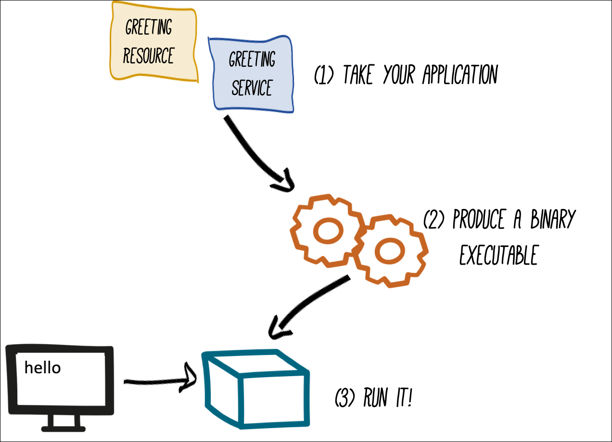

In this topic you're going to learn how produce a native executable for the demonstration application.

The executable you'll create improves the startup time of the application and produces a minimal disk footprint.

The executable will have everything needed to run the application as a standalone binary, including the Java Virtual Machine (JVM) and the application. (The size of the JVM will be shrunk to be just the right size to run the application.)



You'll be using [GraalVM](https://en.wikipedia.org/wiki/GraalVM). GraalVM includes a native compiler for producing native images from a number of languages, including Java. GraalVM is installed in the `$GRAALVM_HOME` directory.


`Step 1:` Run the following command in **Terminal 1** to discover the location of GraalVM this Instruqt instance.

```
echo $GRAALVM_HOME
```

# Building a native image

Within the `getting-started/pom.xml` file the is a `<profile>` section that declares a property value, `native`.

The  `native` property is used to configure the Quarkus Maven plugin to create native, binary packages as shown in the code snippet below.

```xml

    <profile>
      <id>native</id>
      <activation>
        <property>
          <!--This property will be used by quarkus.package.type -->
          <name>native</name>
        </property>
      </activation>
      <build>
      ...
      <properties>
        <quarkus.package.type>native</quarkus.package.type>
      </properties>
    </profile>

```

You are using the profile shown above because, as you will see very soon, packaging the code into a native image provides a significant benefit.

Packaging the code into a native image takes a few seconds. However, this compilation time is only incurred once, when the application is built for deployment. Other approaches for building and executing JARs compile the code every time the application starts. Requiring only a single compilation improves performance significantly.

----

`Step 2:` Go to **Terminal 1** and run the following command to create a native executable.

```
mvn clean package -Pnative -DskipTests -f /root/projects/quarkus/getting-started
```

This step will take a minute or so to finish. Please be patient and wait for the execution to complete.

You'll see a lot of screen output. Finally, you will see output similar to the following:
```
INFO] ------------------------------------------------------------------------
[INFO] BUILD SUCCESS
[INFO] ------------------------------------------------------------------------
[INFO] Total time:  03:14 min
[INFO] Finished at: 2022-04-01T19:13:08Z
[INFO] ------------------------------------------------------------------------
```

|NOTE:|
|----|
|Since you are in a Linux environment and the OS that will eventually run your application is also Linux, you can use your local OS to build the native Quarkus app. <br>If you need to build native Linux binaries when on other OS's such as Windows or Mac OS X, you can use the option **-Dquarkus.native.container-runtime=[podman &vert; docker]** when invoking `mvn clean package`. <br>You'll need either Docker or [Podman](https://podman.io) installed locally depending on which container runtime you want to use.|


In addition to the usual files, the build also produces a file named `target/getting-started-1.0.0-SNAPSHOT-runner`. The file `getting-started-1.0.0-SNAPSHOT-runner` is a native Linux binary.

Let's take a look at the details of the file.

----

`Step 3a:`  Run the following command in **Terminal 1** to go to the working directory of the demonstration API application.

```
cd /root/projects/quarkus/getting-started
```

`Step 3b:` Run the following command view a description of the file `target/getting-started-1.0.0-SNAPSHOT-runner`

```
file target/getting-started-1.0.0-SNAPSHOT-runner
```

You'll get output similar to the following:

```bash
target/getting-started-1.0.0-SNAPSHOT-runner: ELF 64-bit LSB executable, x86-64, version 1 (SYSV), dynamically linked, interpreter /lib64/ld-linux-x86-64.so.2, for GNU/Linux 3.2.0, BuildID[sha1]=61109b6a2cc71d269c61b3b964c419c22fbb038b, not stripped
```

Notice that the description shown above indicates that the file is an `ELF 64-bit LSB executable`.

# Running a native image

`Step 4:` Run the following command in **Terminal 1** to execute the binary you just created:

```
./target/getting-started-1.0.0-SNAPSHOT-runner
```

You'll get output similar to the following.

```console
INFO  [io.quarkus] (main) Quarkus x.xx.x started in 0.044s. Listening on: http://[::]:8080
INFO  [io.quarkus] (main) Installed features: [cdi, resteasy]
```
Notice in the output shown above is reporting a startup time of 44 milliseconds! That's an amazingly fast startup time.


# Inspecting memory usage

One of the key features of applications running under Quarkus is that they consume small amounts of memory.

Let's take a look at how much memory the application binary is using.

----

`Step 5:` Run the following command in **Terminal 2** to get a report of the application's memory usage:

```
ps -o pid,rss,command -p $(pgrep -f runner)
```

You will see output similar to the following.

```bash
  PID   RSS COMMAND
 261971 53740 ./target/getting-started-1.0.0-SNAPSHOT-runner
```

The output displayed above shows that the process is taking around 53 MB of memory as shown in the RSS ([Resident Set Size](https://en.wikipedia.org/wiki/Resident_set_size) column. 53 MB is a pretty compact use of memory!

|NOTE:|
|----|
|The RSS/memory usage of any application, including Quarkus, will vary depending on your specific environment, rising as the application experiences increased load.|

`Step 6:` Run the following command in **Terminal 2** to make sure the app's endpoint is still working as expected.

```bash
curl http://localhost:8080/hello/greeting/quarkus
```

You get the following output:

```bash
hello quarkus
```

Quarkus is still operational. Nice!

# Terminating the application

`Step 7:`  Got to **Terminal 1** and press the `CTRL+C`  keys to to stop the native app.

# Congratulations!

You've learned how to build a Java application as both an executable JAR and as a Linux native binary. Now let's give the app superpowers by deploying to it to an OpenShift cluster as a Linux container image.

----

**NEXT:** Moving the container to the cloud

