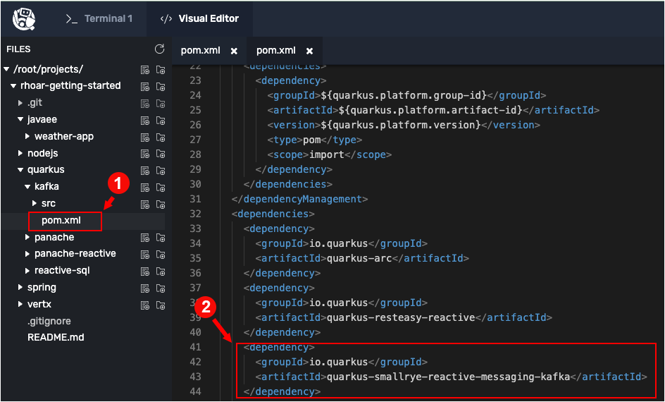

In this topic you will import the source code for the demonstration application from GitHub. Also, you will learn about the Kafka architecture the demonstration application uses. Finally, you will add the Kafka extension for Maven to the demonstration project's `pom.xml` file.

## Importing the code from GitHub

`Step 1:` Run the following command in **Terminal 1** in the terminal window to the left to clone the sample project's source code into the interactive educational environment:

```
cd /root/projects && rm -rf rhoar-getting-started && git clone https://github.com/openshift-instruqt/rhoar-getting-started
```

You'll get output similar to the following:

```
Cloning into 'rhoar-getting-started'...
remote: Enumerating objects: 2572, done.
remote: Counting objects: 100% (756/756), done.
remote: Compressing objects: 100% (411/411), done.
remote: Total 2572 (delta 278), reused 641 (delta 215), pack-reused 1816
Receiving objects: 100% (2572/2572), 1.16 MiB | 17.16 MiB/s, done.
Resolving deltas: 100% (855/855), done.
```

----

`Step 2:` Run the following command in **Terminal 1** to navigate to the source code's working directory:

```
cd rhoar-getting-started
```

## Inspecting Java runtime

The Java runtime (JRE) needs to be installed in order to execute the tasks and code within this track. The JRE was preinstalled when the track was set up. Still, it's a good idea to verify that the Java runtime is indeed installed.

----

`Step 3:`  Run the following command in **Terminal 1** to verify that the JRE is installed:

```
$JAVA_HOME/bin/java --version
```

You get output similar to the following:

```console
openjdk 11 2018-09-25
OpenJDK Runtime Environment 18.9 (build 11+28)
OpenJDK 64-Bit Server VM 18.9 (build 11+28, mixed mode)
```
The versions and dates in the output above may be slightly different than those shown below.

If the command fails, wait a few moments and try again. The JRE is installed in a background process and make take a few moments to become operational depending on system load.

## Understanding the demonstration application

The demonstration application is a basic Maven-based application with the usual `pom.xml` entries for a Quarkus app.

The demonstration application also includes a front-end HTML file at `src/main/resources/META-INF/resources/index.html` that will render the data stream.

The application consists of three components that pass messages via Kafka and an in-memory stream, then uses Server Sent Events (SSE) to push messages to the browser. The following figure illustrates the structure of the application's architecture.


## Adding the Kafka extension

In order to get Kafka up and running under Quarkus you’ll need to add an extension to the Maven project.

----

`Step 4:`  Run the following command in **Terminal 1** to add the extension named `smallrye-reactive-messaging-kafka` to the demonstration application's Maven project:

```
mvn quarkus:add-extension -Dextensions="smallrye-reactive-messaging-kafka" -f /root/projects/rhoar-getting-started/quarkus/kafka
```

You'll see a lot of screen output as the command executes. Finally, you'll get output similar to the following:

```console
[INFO] [SUCCESS] ?  Extension io.quarkus:quarkus-smallrye-reactive-messaging-kafka has been installed
[INFO] ------------------------------------------------------------------------
[INFO] BUILD SUCCESS
[INFO] ------------------------------------------------------------------------
[INFO] Total time:  10.628 s
[INFO] Finished at: 2022-04-11T17:16:33Z
[INFO] ------------------------------------------------------------------------
```

NOTE: The first time you add the extension, new dependencies may be downloaded as part of Maven. This download should only happen once. After that, things will go even faster.

The command you just executed above in **Terminal 1** will add the necessary entry to the project's `pom.xml` file that bring's the Kafka extension into the runtime environment.

Let's take a look at the entry in the `pom.xml` file.

----

`Step 5:`  Click the **Visual Editor** tab on the horizontal menu bar over the terminal to the left.

----
`Step 6:` Use the Visual Editor's directory tree to navigate to the file, `/root/projects/rhoar-getting-started/quarkus/kafka/pom.xml`, as shown in the figure below:



You will see in the following `pom.xml` file entry on `Line 41`:

```xml
<dependency>
    <groupId>io.quarkus</groupId>
    <artifactId>quarkus-smallrye-reactive-messaging-kafka</artifactId>
</dependency>
```
The entry shown above with made by Maven automatically when you ran the `mvn quarkus:add-extension` command.

**Congratulations!**

In this topic you installed the source code for the demonstration project into the interactive learning environment.

Also, you got an overview of the demonstration application's messaging architecture.

Finally, you installed the Kafka extension for Maven.

----

**NEXT:** Binding to a stream
