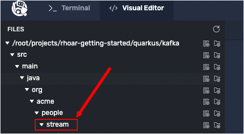

In this topic you will insert Java code that reads names coming in from a Kafka stream, then adds a random honorific title (in English) to the beginning of the name.

# Creating name converter

`Step 1:` Click the **Visual Editor** tab on the horizontal menu bar over the terminal window to the left.

----

`Step 2:` Use the Visual Editor's directory tree to navigate to the directory, `/root/projects/rhoar-getting-started/quarkus/kafka/src/main/java/org/acme/people/stream/`, as shown in the figure below:



----

`Step 3:` Click the `New File` icon to create a new file named `NameConverter.java` in the directory `/root/projects/rhoar-getting-started/quarkus/kafka/src/main/java/org/acme/people/stream/`.


----

`Step 4:` Click the `NameConverter.java` file in the directory tree to open the new file for editing.

----

`Step 5:` Copy and paste the following code into the file `NameConverter.java`:

```java
package org.acme.people.stream;

import javax.enterprise.context.ApplicationScoped;
import org.eclipse.microprofile.reactive.messaging.Incoming;
import org.eclipse.microprofile.reactive.messaging.Outgoing;
import io.smallrye.reactive.messaging.annotations.Broadcast;

@ApplicationScoped
public class NameConverter {

    private static final String[] honorifics = {"Mr.", "Mrs.", "Sir", "Madam", "Lord", "Lady", "Dr.", "Professor", "Vice-Chancellor", "Regent", "Provost", "Prefect"};

    @Incoming("names")
    @Outgoing("my-data-stream")
    @Broadcast
    public String process(String name) {
        String honorific = honorifics[(int)Math.floor(Math.random() * honorifics.length)];
        return honorific + " " + name;
    }
}
```
----

`Step 6:` Click on the `Disk` icon or press `CTRL+S` to save the file.

# Analyzing `NameConverter.java`

The code in the file `NameConverter.java` does the following:

* Uses the annotation [`@Incoming("names")`](https://download.eclipse.org/microprofile/microprofile-reactive-messaging-1.0/microprofile-reactive-messaging-spec.html#_message_consumption_with_incoming) to implicitly have the code consume the items from the `names` topic of the data stream
* Creates an array named `honorifics` that has honorific titles. The code picks a honorific title from the ` honorifics` array at random and prepends the honorific text to the start of each name in the stream.
* Uses the annotation [`@Outgoing("my-data-stream")`](https://download.eclipse.org/microprofile/microprofile-reactive-messaging-1.0/microprofile-reactive-messaging-spec.html#_message_consumption_with_incoming) to send the modified name to a stream named `my-data-stream`.
* Uses the [`@Broadcast`](https://smallrye.io/smallrye-reactive-messaging/smallrye-reactive-messaging/3.13/advanced/broadcast.html) to send the message to all **subscribers** of the in-memory `my-data-stream` stream.

The `process()` method is called for every Kafka record from the `names` topic. The `names` topic will be configured in the application configuration in upcoming steps. Every result is sent to the `my-data-stream` in-memory stream.

**Congratulations!**

You're inserted the Java code that takes a message from an incoming message stream and modifies its contents. Then the code sends the modified message forward to another data stream to be consumed by all subscribers to that stream.

----

**NEXT:** Binding a stream to a JAX-RS resource
