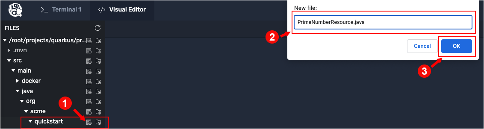
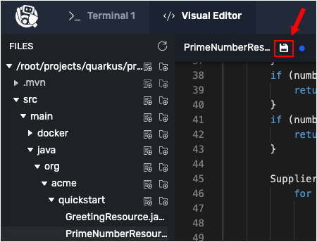

In this topic you will add a new endpoint named `/is-prime` to the demonstration application. The endpoint will have a behavior that checks a number submitted as a query string parameter to determine if it is prime or not. Also, you will add a [MeterFilter](https://www.javadoc.io/static/io.micrometer/micrometer-core/1.0.4/index.html?io/micrometer/core/instrument/config/MeterFilter.html) to the demonstration application that will gather special performance metrics.

# Creating the /is-prime endpoint

`Step 1a:` Using the **Visual Editor**, navigate to the directory `primes/src/main/java/org/acme/quickstart`.

`Step 1b:` Click the `New File` icon to create the file named `PrimeNumberResource.java` in the directory `primes/src/main/java/org/acme/quickstart` as shown in the figure below.



`Step 1c:` Click the `PrimeNumberResource.java` file to open it for editing and add the following code:

```java
package org.acme.quickstart;

import io.micrometer.core.instrument.MeterRegistry;

import javax.ws.rs.GET;
import javax.ws.rs.Path;
import javax.ws.rs.PathParam;
import javax.ws.rs.Produces;
import javax.ws.rs.core.MediaType;
import java.util.concurrent.atomic.LongAccumulator;
import java.util.function.Supplier;

@Path("/is-prime")
public class PrimeNumberResource {

    private final LongAccumulator highestPrime = new LongAccumulator(Long::max, 0);
    private final MeterRegistry registry;

    PrimeNumberResource(MeterRegistry registry) {
        this.registry = registry;

        // Create a gauge that uses the highestPrimeNumberSoFar method
        // to obtain the highest observed prime number
        registry.gauge("prime.number.max", this,
                PrimeNumberResource::highestObservedPrimeNumber);
    }

    @GET
    @Path("/{number}")
    @Produces(MediaType.TEXT_PLAIN)
    public String checkIfPrime(@PathParam("number") long number) {
        if (number < 1) {
            return "Only natural numbers can be prime numbers.";
        }
        if (number == 1) {
            return "1 is not prime.";
        }
        if (number == 2) {
            return "2 is prime.";
        }
        if (number % 2 == 0) {
            return number + " is not prime, it is divisible by 2.";
        }

        Supplier<String> supplier = () -> {
            for (int i = 3; i < Math.floor(Math.sqrt(number)) + 1; i = i + 2) {
                if (number % i == 0) {
                    return number + " is not prime, is divisible by " + i + ".";
                }
            }
            highestPrime.accumulate(number);
            return number + " is prime.";
        };

        return registry.timer("prime.number.test").wrap(supplier).get();
    }

    /**
     * This method is called by the registered {@code highest.prime.number} gauge.
     * @return the highest observed prime value
     */
    long highestObservedPrimeNumber() {
        return highestPrime.get();
    }
}
```

`Step 1d:` Click on the `Disk` icon or press the `CTRL+S` keys to save the `PrimeNumberResource.java` file as shown in the figure below.



**KEY POINTS TO UNDERSTAND**

The `PrimeNumberResource` class implements an algorithm that verifies that a given number is a prime number. This algorithm is exposed as a RESTful interface. Also, because the Micrometer extension is enabled, metrics for all HTTP server requests are collected automatically.

The class collects the following metrics, which are stored in the Micrometer [registry](https://docs.spring.io/spring-metrics/docs/current/public/prometheus#meter-registries):

* A [counter](https://prometheus.io/docs/concepts/metric_types/#counter) implemented in the statement `highestPrime.accumulate(number)` at `Line 51` increments when a prime number is discovered.
* A [gauge](https://prometheus.io/docs/concepts/metric_types/#gauge) at `Line 24` stores the highest prime number discovered.
* A [timer](https://javadoc.io/doc/io.micrometer/micrometer-core/0.10.0.RELEASE/io/micrometer/core/instrument/Timer.html) at `Line 55` records the time spent testing if a number is prime.

# Exercising the demonstration application

Let's exercise the new endpoint `is-prime/{number}` by submitting a few prime and non-prime numbers.

----

`Step 4:` Run the following command in the **Terminal 1** console to submit the number `1` to `/is-prime/`:

```
curl http://localhost:8080/is-prime/1
```

You will see `1 is not prime.`.

----

`Step 5:` Run the following command in the **Terminal 1** console to submit the number `350` to `/is-prime/`:

```
curl http://localhost:8080/is-prime/350
```

You will see `350 is not prime, it is divisible by 2.`.

----

`Step 6:` Run the following command in the **Terminal 1** console to submit the number `2` to `/is-prime/`:

```
curl http://localhost:8080/is-prime/2
```

You will see `2 is prime.`

----

`Step 7:` Run the following command in the **Terminal 1** console to submit the number `629521085409773` to `/is-prime/`:

```
curl http://localhost:8080/is-prime/629521085409773
```

You will see `629521085409773 is prime.`

----

`Step 8:` Run the following command in the **Terminal 1** console to submit the number `1111111111111111111` to `/is-prime/`:

```
curl http://localhost:8080/is-prime/1111111111111111111
```

You will see `1111111111111111111 is prime.`

Each command will output whether the number is prime or not. The last two commands might take longer (up to five-10 seconds) because the commands submit large numberss. Determining that these large numbers are prime takes time. Interestingly enough, these numbers also form [the basis](https://access.redhat.com/blogs/766093/posts/2177481) of modern internet security.

# Viewing basic performance metrics

Next let's view the metrics generated when the `/is-prime` endpoint is exercised.

----

`Step 8:` Run the following command in the **Terminal 1** console to view the metrics collected by Micrometer:

```
curl http://localhost:8080/q/metrics
```

You'll see many metrics, for example:

```
# HELP prime_number_max
# TYPE prime_number_max gauge
prime_number_max 887.0
# TYPE http_server_requests_seconds summary
http_server_requests_seconds_count{method="GET",outcome="SUCCESS",status="200",uri="/is-prime/{number}",} 4.0
http_server_requests_seconds_sum{method="GET",outcome="SUCCESS",status="200",uri="/is-prime/{number}",} 0.082716484
```

----

`Step 9:` Run the following command in the **Terminal 1** console to display only the "prime"-related metrics:

```
curl -s http://localhost:8080/q/metrics | grep -i prime
```

You'll see output similar to the following:

```
# HELP prime_number_max
# TYPE prime_number_max gauge
prime_number_max 1.11111111111111117E18
http_server_requests_seconds_count{method="GET",outcome="SUCCESS",status="200",uri="/is-prime/{number}",} 5.0
http_server_requests_seconds_sum{method="GET",outcome="SUCCESS",status="200",uri="/is-prime/{number}",} 14.332203472
http_server_requests_seconds_max{method="GET",outcome="SUCCESS",status="200",uri="/is-prime/{number}",} 12.898092857
# HELP prime_number_test_seconds
# TYPE prime_number_test_seconds summary
prime_number_test_seconds_count 2.0
prime_number_test_seconds_sum 13.173653891
# HELP prime_number_test_seconds_max
# TYPE prime_number_test_seconds_max gauge
prime_number_test_seconds_max 12.888273294
```

|NOTE|
|----|
|Metrics are generated lazily, so you often won’t see any data for your endpoint until something tries to access it.|

<br>

|NOTE|
|----|
|You can optionally enable the [JSON exporter](https://quarkus.io/guides/micrometer#quarkus-micrometer_quarkus.micrometer.export.json.enabled) to output metrics as JSON-formatted objects. Once enabled, requests must pass the `Accept: application/json` HTTP header to get JSON metrics.|

# Configuring and filtering metrics

Micrometer uses `MeterFilter` instances to customize the metrics emitted by `MeterRegistry` instances. The Micrometer extension will detect `MeterFilter` CDI beans and use them when initializing `MeterRegistry` instances. These filters can be used to exert greater control over how and when meters are registered, and what kinds of statistics the meters emit.

Meter filters serve three basic functions:

* **Deny** (or accept) meters from being registered.
* **Transform** meter IDs (e.g., changing the name, adding or removing tags, or changing the description or base units).
* **Configure** distribution statistics for some meter types (e.g. timers).

You create MeterFilters by declaring them using annotations in your Java code.

Quarkus will identify and inject `MeterFilters` into `MeterRegistry`s when they are created, based on criteria specified in the annotations.

Let's add some MeterFilters using Java code.

----

`Step 10a:` Using the **Visual Editor**, navigate to the directory `primes/src/main/java/org/acme/quickstart`.

`Step 10b:` Click the `New File` icon to create the file named `CustomConfiguration.java` in the directory `primes/src/main/java/org/acme/quickstart`, as shown in the figure below.


`Step 10c:` Click the `CustomConfiguration.java` file to open it for editing and add the following code:

```java
package org.acme.quickstart;

import java.util.Arrays;

import javax.annotation.Priority;
import javax.inject.Singleton;
import javax.interceptor.Interceptor;
import javax.enterprise.inject.Produces;

import org.eclipse.microprofile.config.inject.ConfigProperty;

import io.micrometer.core.instrument.Clock;
import io.micrometer.core.instrument.Meter;
import io.micrometer.core.instrument.Tag;
import io.micrometer.core.instrument.config.MeterFilter;
import io.micrometer.core.instrument.distribution.DistributionStatisticConfig;
import io.micrometer.prometheus.PrometheusConfig;
import io.micrometer.prometheus.PrometheusMeterRegistry;
import io.prometheus.client.CollectorRegistry;
import io.quarkus.micrometer.runtime.MeterFilterConstraint;

@Singleton
public class CustomConfiguration {

    @ConfigProperty(name = "deployment.env")
    String deploymentEnv;

    @Produces
    @Singleton
    @MeterFilterConstraint(applyTo = PrometheusMeterRegistry.class)
    public MeterFilter configurePrometheusRegistries() {
        return MeterFilter.commonTags(Arrays.asList(
                Tag.of("registry", "prometheus")));
    }

    @Produces
    @Singleton
    public MeterFilter configureAllRegistries() {
        return MeterFilter.commonTags(Arrays.asList(
                Tag.of("env", deploymentEnv)));
    }

    /** Enable histogram buckets for a specific timer */
    @Produces
    @Singleton
    public MeterFilter enableHistogram() {
        return new MeterFilter() {
            @Override
            public DistributionStatisticConfig configure(Meter.Id id, DistributionStatisticConfig config) {
                if(id.getName().startsWith("prime")) {
                    return DistributionStatisticConfig.builder()
                        .percentiles(0.5, 0.95)     // median and 95th percentile, not aggregable
                        .percentilesHistogram(true) // histogram buckets (e.g. prometheus histogram_quantile)
                        .build()
                        .merge(config);
                }
                return config;
            }
        };
    }
}
```

`Step 10d:` Click on the `Disk` icon or press the `CTRL+S` keys to save the `PrimeNumberResource.java` file.

**KEY POINTS TO UNDERSTAND**

* `configurePrometheusRegistries()` at `Line 31` adds a custom tag `registry: prometheus` tag to Prometheus registry metrics.
* `configureAllRegistries()` at `Line 38` adds a custom `env: [value]`  tag using the value of the `ConfigProperty` named `deploymentEnv`. The `ConfigProperty` which must be present in the `application.properties` file.
* `enableHistogram()` at `Line 46`  enables any timer metric that has a name that begins with `prime` to report additional quantile metrics; for example mean, median, and other custom histograms).

Filtering and tagging is useful for organizing reporting, thus enabling you to more easily draw conclusions about the application's performance data.

Now that you have programmed `CustomConfiguration.java`, you need to add the configuration values referenced in the `configureAllRegistries` filter to the `application.properties` file.

----

`Step 11a:` Using the **Visual Editor**, navigate to the directory `primes/src/main/resources/`.

`Step 11b:` Click the `application.properties` file to open it for editing and append the following lines of code to the end of the file:

```text
# Configure value for the tag we add to metrics
deployment.env=prod
```

`Step 11c:` Click on the `Disk` icon or press the `CTRL+S` keys to save the `application.properties` file.

The addition you just made to `application.properties` will cause an `env: prod` tag to be added to each metric based on the filter created previously.

# Exercising the new metrics

Let's do a quick exercise of the `is-prime` endpoint to make sure the changes you made are working.

----

`Step 12` Run the following code in the **Terminal 1** console to submit a non-prime number to `/is-prime`:

```
curl http://localhost:8080/is-prime/350
```

You will get the following output: `350 is not prime, it is divisible by 2.`

----

`Step 13` Run the following code in the **Terminal 1** console to submit a prime number to `/is-prime`:

```
curl http://localhost:8080/is-prime/629521085409773
```

You will get the following output: `629521085409773 is prime.`

Next, let's see how exercising the RESTful endpoint added the expected `env="prod"` tag.

`Step 14` Run the following code in the **Terminal 1** console to query the endpoint `/q/metrics` to get metrics output and then pipe the result to `grep` to filter those metrics that container the word `prime`:

```
curl -s http://localhost:8080/q/metrics | grep prime
```

You will see new types of [quantile](https://en.wikipedia.org/wiki/Quantile) metrics along with the new `env` and `registry` tags as shown in the snippet below:

```console
.
.
.
prime_number_test_seconds{env="prod",registry="prometheus",quantile="0.5",} 0.0
prime_number_test_seconds{env="prod",registry="prometheus",quantile="0.95",} 0.0
prime_number_test_seconds_bucket{env="prod",registry="prometheus",le="0.001",} 0.0
prime_number_test_seconds_bucket{env="prod",registry="prometheus",le="0.001048576",} 0.0
prime_number_test_seconds_bucket{env="prod",registry="prometheus",le="0.001398101",} 0.0
prime_number_test_seconds_bucket{env="prod",registry="prometheus",le="0.001747626",} 0.0
.
.
.
```

The output shown above is raw content that is difficult to read. A better way to manage and view of the metrics data is to integrate Prometheus and OpenShift which you'll do next.

# Congratulations!

In this topic, you added the `PrimeNumber` resource that publishes a RESTful endpoint `/is-prime`. You exercised the new endpoint to determine that the behavior for identifying prime numbers works as expected. Then, you added a `CustomConfiguration` that enhances metric data to include the tags `env` and `registry`.
----

**NEXT:** Integrating Prometheus with OpenShift
