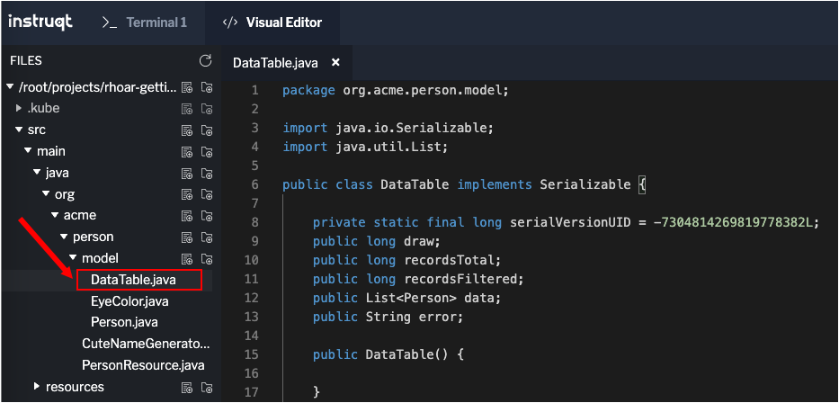

In the previous topic you added custom queries to the `Person` entity and the updated `PersonResource` to create additional RESTful endpoints that are bound to the added queries.

In this topic you'll build a slightly more complex query that provides filtering, searching, and paging capabilities.

# Showing data in tables

In the previous topic you used `curl` to access the demonstration application's data. `curl` is useful for testing, but for real-world use cases you need to expose data in other ways, particularly if you need to search, filter, and page data in a database.

One technique to access data in a reactive application is to use a jQuery-based plugin called [DataTables](https://www.datatables.net/).

DataTables features a server-side processing mode that leverages the server to do the work of searching, filtering, sorting, and paging. In this case the server that DataTables uses is the Quarkus demonstration application.

DataTables is particularly useful for working with very large datasets, on the order of hundreds of thousands of records or more. Transmitting the entire dataset as a single response to the client browser is inefficient. Return large datasets in the body of a single response runs the risk of crashing browsers, increasing networking usage, and frustrating users.

Taking a reactive approach reduces such risks considerably.

|LEARN THE DETAILS OF USING DATATABLES|
|----|
|DataTables has extensive documentation about [using the product in general](https://www.datatables.net/manual/) as well as a comprehensive description of how to [use DataTables for server side processing](https://www.datatables.net/manual/server-side).

# Adding a new endpoint to PersonResource

DataTables passes several query parameters that define to sort, filter, search criteria for server-side execution. There are also parameters intended to be used to traverse data. These parameters define page size and reports the current page of data being viewed.

You are going to work with the following parameters to enable search and paging through data:

* `start` - The index of the first element needed.
* `length` - Total number records to return (or less, if there are fewer records that meet the criteria).
* `draw` - DataTables does asynchronous processing, so this value is sent with each request, expecting it to be returned as-is, so DataTables can piece things back together on the frontend if a user runs things quickly.
* `search[value]` - The value of the search box.

----

`Step 1a:` From the **Visual Editor** tab, navigate to the folder: `src/main/java/org/acme/person/`.

`Step 1b:` Click on the file `PersonResource.java` to open it for editing as shown in the figure below:


`Step 1c:` Add this code to the file `PersonResource.java` after the `// TODO: add datatable query` comment:

```java
    @GET
    @Path("/datatable")
    @Produces(MediaType.APPLICATION_JSON)
    public Uni<DataTable> datatable(@QueryParam("draw") int draw, @QueryParam("start") int start, @QueryParam("length") int length, @QueryParam("search[value]") String searchVal) {
      // TODO: Construct query

      // TODO: Execute pipeline

    }
```

`Step 1d:` Click on the `Disk` icon or press `CTRL+S` to save the contents of `PersonResource.java`.


The code in the method `Uni<DataTable> datatable((...)` shown above in `Step 1c` uses [JAX-RS `@QueryParam`](https://docs.oracle.com/javaee/7/api/javax/ws/rs/QueryParam.html) values to specify the incoming parameters to be applied to queries executed within the function. These parameters are passed to the server from the front-end call to the endpoint, `GET /person/datatable`.

The method `Uni<DataTable> datatable((...)` code you just added has a number of `TODO` statements that need to be implemented. You'll fill in the `TODO`s in a moment. But, first you need to review the predefined class `DataTable.java`.

----

`Step 2a:` From the **Visual Editor** tab, navigate to the folder: `src/main/java/org/acme/person/model`.

`Step 2b:` Click on the file `DataTable.java` to open it for viewing as shown in the figure below.



Take a look at the code in general. Also, notice the data fields in `DataTable.java`. A description of each field follows:

* `draw` - The async processing record id.
* `recordsTotal` - Total records in the database.
* `recordsFiltered` - Total records that match the filtering criteria.
* `data` - The actual array of records.
* `error` - An error string, if any.

DataTables uses these fields to facilitate transforming data retrieved from the demonstration application as entity objects into JSON the is refined to meet the particular paging constraints defined in the request.

However, before the transformation can happen, the data must be retrieved from the database according to search criteria.

This work is done by adding a query to the `PersonResource.java` class.

----

`Step 3a:` From the **Visual Editor** tab, navigate to the folder: `src/main/java/org/acme/person/`.

`Step 3b:` Click on the file `PersonResource.java` to open it for editing as shown in the figure below.


`Step 3c:` Add this code to the file `PersonResource.java` after the `// TODO: Construct query` comment:

```java
      int pageNumber = start / length;

      PanacheQuery<Person> filteredPeople = Optional.ofNullable(searchVal)
          .filter(val -> !val.isEmpty())
          .map(val -> Person.<Person>find("name like :search", Parameters.with("search", "%" + val + "%")))
          .orElseGet(() -> Person.findAll())
          .page(pageNumber, length);
```
`Step 3d:` Click on the `Disk` icon or press `CTRL+S` to save the contents of `PersonResource.java`.

----

`Step 4a:` Add the following code to the file `PersonResource.java` after the `// TODO: Execute pipeline` comment:

```java
        return filteredPeople.list()
            .map(people -> {   // Convert List<Person> to DataTable
                DataTable result = new DataTable();
                result.setDraw(draw);
                result.setData(people);

                return result;
            })
            .flatMap(datatable -> Person.count().map(recordsTotal -> {   // Get the total records count
                datatable.setRecordsTotal(recordsTotal);
                return datatable;
            }))
            .flatMap(datatable -> filteredPeople.count().map(recordsFilteredCount -> {   // Get the number of records filtered
                datatable.setRecordsFiltered(recordsFilteredCount);
                return datatable;
        }));
```

`Step 4b:` Click on the `Disk` icon or press `CTRL+S` to save the contents of `PersonResource.java`.

The logic in the code you inserted into the file `PersonResource.java` at `Step 3b` above assigns the results of the search of the database to the object variable `filteredPeople`.

Then, the fields in the object variable `filteredPeople` are applied to a `DataTable` object named `result`. `result` does the work of taking the field values and data in `filteredPeople` and converting it to JSON, which is then passed back from the RESTful endpoint `/person/database`.

The endpoint `/person/database` supports querystring parameters for `draw`, `start`, `length`, and `search`.


# Testing the endpoint

You'll need to redefine the environment variable `$APP_URL` you used in previous topics in order to work with it in this topic.

----

`Step 5:` Run the following command in **Terminal 1** to use `curl` to exercise the endpoint `/person/database` to search for users with `yan` in their name:

```
curl -s "$APP_URL/person/datatable?draw=1&start=0&length=10&search\[value\]=yan" | jq
```

You will see the following result:

```json
{
  "data": [
    {
      "id": 1,
      "birth": "1974-08-15",
      "eyes": "BLUE",
      "name": "Farid Ulyanov"
    }
  ],
  "draw": 1,
  "recordsFiltered": 1,
  "recordsTotal": 3
}
```

The return will be a single entity since there is only one record that has `yan` in the name field.


# Congratulations

You have successfully written a reactive endpoint that supports searching and paging.

In the next topic you'll "react" to a startup asynchronously to create thousands of `Person`s in the database. And you'll use Live Coding to automatically deploy the updated code to OpenShift.

----

**NEXT:** Adding a startup task to the PersonResource