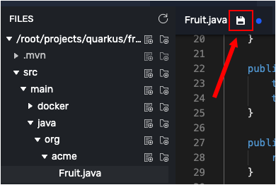

# Create Spring Data Repository
The Spring Data repository abstraction simplifies working with data models and data binding by reducing the amount of boilerplate code required to implement data access layers for various persistence stores (such as JPA). The `@Repository` annotation and annotations such as `@CrudRepository` for associated sub-interfaces are the [central concepts in Spring Data](https://docs.spring.io/spring-data/jpa/docs/current/reference/html/#repositories.core-concepts). (`@Repository` is a marker interface that provides data manipulation functionality for the entity class that is being managed.)

When the application starts, Quarkus automatically configures the required persistence technologies and provides an implementation for the interfaces used.

In this topic you're going to add data access capabilities to the demonstration application. Also, you're going to bind the demonstration application to a database using data access annotations provided by Spring Boot.

First, you need a data model.

## Creating a Model

`Step 1:` Click the the **Visual Editor** tab on the horizontal menu bar over the terminal window to the left.

----

`Step 2:` Navigate to the directory in `fruit-taster/src/main/java/org/acme/` in the Visual Editor.

----

`Step 3:` Click the `Create File` icon in the **Visual Editor** at directory `fruit-taster/src/main/java/org/acme/` and create a new file named `Fruit.java`  as shown in the figure below.


----

`Step 4:` Open `Fruit.java` by clicking the filename in the filesystem tree on the left side of the **Visual Editor**.

----

`Step 5:` Add the following code to the file, `Fruit.java`
```java
package org.acme;

import javax.persistence.Entity;
import javax.persistence.GeneratedValue;
import javax.persistence.Id;

@Entity
public class Fruit {

    @Id
    @GeneratedValue
    private Long id;

    private String name;

    private String color;


    public Fruit() {
    }

    public Fruit(String name, String color) {
        this.name = name;
        this.color = color;
    }

    public Long getId() {
        return id;
    }

    public void setId(Long id) {
        this.id = id;
    }

    public String getName() {
        return name;
    }

    public void setName(String name) {
        this.name = name;
    }

    public String getColor() {
        return color;
    }

    public void setColor(String color) {
        this.color = color;
    }
}
```
----

`Step 6:` Click on the `Disk` icon or press `CTRL+S` to save the file as shown in the figure below



You have created a simple POJO (Plain Old Java Object) that describes a Fruit. Notice that the POJO has private instance variables named `id`, `name` and `color`. The POJO also has getters and setters for those instance variables

Next, you need to declare the data repository that represents the database where the application's data is stored.

## Creating a Spring Data Repository

`Step 7:` Create a file named `FruitRepository.java` by clicking the `Create File` icon in the **Visual Editor** at the directory `fruit-taster/src/main/java/org/acme/` in the editor's filesystem tree.

----

`Step 8:` Add the following code to the file `FruitRepository.java`.


```java
package org.acme;

import org.springframework.data.repository.CrudRepository;

import java.util.List;

public interface FruitRepository extends CrudRepository<Fruit, Long> {

    List<Fruit> findByColor(String color);

}
```

----

`Step 9:` Save the file `FruitRepository.java` by clicking the `Disk` icon or striking the `CTRL+S` keys as you did previously in an earlier step.

Notice in the code above that the interface `FruitRepository` extends the interface `org.springframework.data.repository.CrudRepository`.

When you extend Spring's `CrudRepository` interface you'll automatically get a complete set of methods, e.g. `count()`, `findAll()`, `delete()` that you will use to manipulate data access in the `FruitRepository`. In this case you also added a method `findByColor(String color)` which is special to `FruitRepository`

Now you're going to create some data that will be stored in the database bound to the `FruitRepository`.

## Creating sample data

`Step 10:`  In the **Visual Editor** navigate to the directory `fruit-taster/src/main/resources/`

----

`Step 11:` Click the `Create File` icon next to `fruit-taster/src/main/resources/` in the directory tree and create the file `import.sql`

----

`Step 12:` Click the filename `import.sql` in the **Visual Editor** filesystem tree.

----

`Step 13:` Copy the follow SQL statements into the file `import.sql`.

```sql
INSERT INTO fruit(id, name, color) VALUES (nextval('hibernate_sequence'), 'cherry', 'red');
INSERT INTO fruit(id, name, color) VALUES (nextval('hibernate_sequence'), 'orange', 'orange');
INSERT INTO fruit(id, name, color) VALUES (nextval('hibernate_sequence'), 'banana', 'yellow');
INSERT INTO fruit(id, name, color) VALUES (nextval('hibernate_sequence'), 'avocado', 'green');
INSERT INTO fruit(id, name, color) VALUES (nextval('hibernate_sequence'), 'strawberry', 'red');
```

----

`Step 14:` Save the file `import.sql` by clicking the `Disk` icon or striking the `CTRL+S` keys as you did previously in an earlier step.

The `import.sql` file will inject information about fruit with the names, `cherry`, `orange`, `banana`, `avocado` and `strawberry` into the database represented by the `FruitRepository`.

## Configuring a database connection in Quarkus

In order to work with the `FruitRepository` database, you need to configure the demonstration app with the appropriate database connection settings.

----

`Step 15:` Using the **Visual Editor** directory tree, open the file named `application.properties` in the directory `fruit-taster/src/main/resources/`. The file will be empty.

----

`Step 16:` Copy the following key-value pairs into the `application.properties` file:

```text
quarkus.datasource.db-kind=h2
quarkus.datasource.jdbc.url=jdbc:h2:mem:rest-crud
quarkus.hibernate-orm.database.generation=drop-and-create
quarkus.hibernate-orm.log.sql=true
quarkus.hibernate-orm.sql-load-script=import.sql
```
----

`Step 17:` Save the file `application.properties` by clicking the `Disk` icon or striking the `CTRL+S` keys as you did previously in an earlier step.

The file `application.properties` contains configuration settings that will bind a database to Quarkus.

That’s it! You're now have all you need to work with data in a Spring Repository using Quarkus

**Congratulations!**

You created a database, a domain model named `Fruit` and a repository named `FruitRepository`. Also, you created the SQL statements that will inject working data into the underlying database.

|NOTE:|
|----|
| Although you are using `import.sql` to initialize the database in the demonstration app, you shouldn't use this in production. Instead, review [suggested uses of Hibernate ORM in production](https://quarkus.io/guides/hibernate-orm#hibernate-orm-in-production-mode) to learn the best practices for working with data in a production environment.

Next, you'll create some injectable Spring Beans that will give us access to the data using the Spring DI annotations.

----

**NEXT:** Creating the injectable Spring Beans