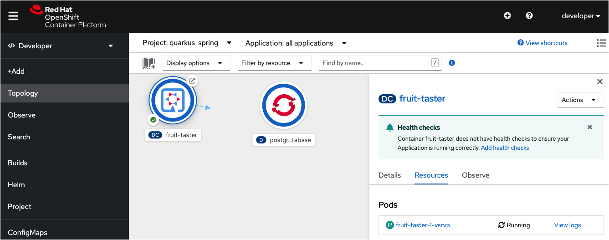
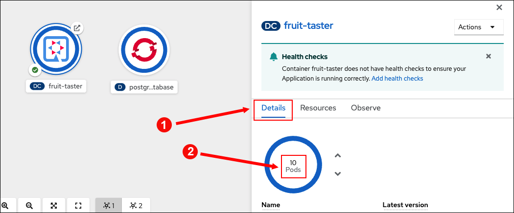

In this topic your going to create special .jar files for the Fruit Taster application that you'll deploy to Red Hat OpenShift. Then, you'll exercise the Fruit Taster application that's running on OpenShift using the browser based OpenShift web console.


## Installing the OpenShift extension

Quarkus has the ability to automatically generate OpenShift resources based on default and user supplied configuration settings.

The OpenShift extension is actually a wrapper extension that brings together OpenShift's [Kubernetes](https://quarkus.io/guides/deploying-to-kubernetes) and [container-image-s2i](https://quarkus.io/guides/container-image#s2i) extensions. These extensions make it easier for users to get started with Quarkus on OpenShift.

----

`Step 1:` Run the following command in the **Terminal 1** window to the left to add the Quarkus extension to the demonstration project:


```
mvn quarkus:add-extension -Dextensions="openshift" -f /root/projects/quarkus/fruit-taster
```
You'll see some screen output. When the process ends, you see output similar to the following:

```
[INFO] BUILD SUCCESS
[INFO] ------------------------------------------------------------------------
[INFO] Total time:  2.774 s
[INFO] Finished at: 2022-04-06T18:02:55Z
[INFO] ------------------------------------------------------------------------
```


## Logging in to OpenShift CLI


`Step 2:`Run the following command in **Terminal 1** to login with the OpenShift CLI as adminstrator

```
oc login -u developer -p developer
```

You will see the following output:

```bash
Login successful.

You don't have any projects. You can try to create a new project, by running

    oc new-project <projectname>
```

## Creating a project from the command line

For this scenario, you'll create a project that you will use to host your applications.

----

`Step 3:` Run the following command in **Terminal 1** to create a new project with the name `Sample Quarkus App using Spring APIs`

```
oc new-project quarkus-spring --display-name="Sample Quarkus App using Spring APIs"
```

You'll get output similar to the following:

```
Now using project "quarkus-spring" on server "https://api.crc.testing:6443".

You can add applications to this project with the 'new-app' command. For example, try:

    oc new-app rails-postgresql-example

to build a new example application in Ruby. Or use kubectl to deploy a simple Kubernetes application:

    kubectl create deployment hello-node --image=k8s.gcr.io/serve_hostname
```

You've created the project, but you have yet to create the application it's going to host.

The application needs a Postgres database in order to work. You're going to install the the database first, before installing the application.

## Deploying a Postgres data

`Step 4:` Run the following command in **Terminal 1** to deploy a Postgres database to the new project:

```
oc new-app \
    -e POSTGRESQL_USER=sa \
    -e POSTGRESQL_PASSWORD=sa \
    -e POSTGRESQL_DATABASE=fruits \
    -e POSTGRESQL_MAX_CONNECTIONS=200 \
    --name=postgres-database \
    openshift/postgresql
```

You see output similar to the following:

```
--> Found image d41bd78 (6 months old) in image stream "openshift/postgresql" under tag "13-el8" for "openshift/postgresql"

    PostgreSQL 13
    -------------
    PostgreSQL is an advanced Object-Relational database management system (DBMS). The image contains the client and server programs that you'll need to create, run, maintain and access a PostgreSQL DBMS server.

    Tags: database, postgresql, postgresql13, postgresql-13


--> Creating resources ...
    deployment.apps "postgres-database" created
    service "postgres-database" created
--> Success
    Application is not exposed. You can expose services to the outside world by executing one or more of the commands below:
     'oc expose service/postgres-database'
    Run 'oc status' to view your app.
```

## Configuring Quarkus

Since you are now deploying the application to OpenShift, the app's database will no longer be accessed on localhost. Instead, the app will use a Postgres database running in production on OpenShift. Thus, you need to extend the application's configuration with an additional profile to support the additional Postgres database.

Quarkus has a neat feature that allows you to create different profiles.

In this case you need a `%dev` profile for your local environment and a production configuration for running in OpenShift. You set the multiple profiles in the file `application.properties`

----

`Step 5:` Go the **Visual Editor** tab and use the filesystem tree to navigate to the directory `fruit-taster/src/main/resources/` .

----

`Step 6:` Click the file named `application.properties` in the filesystem tree to open the file.

----

`Step 7:` Replace the existing text in `application.properties` with the following:

```text
# Dev Configuration
%dev.quarkus.datasource.db-kind=h2
%dev.quarkus.datasource.jdbc.url=jdbc:h2:mem:rest-crud
%dev.quarkus.hibernate-orm.database.generation=drop-and-create
%dev.quarkus.hibernate-orm.log.sql=true

# OpenShift Production Configuration
quarkus.datasource.db-kind=postgresql
quarkus.datasource.jdbc.url=jdbc:postgresql://postgres-database:5432/fruits
quarkus.datasource.username=sa
quarkus.datasource.password=sa
quarkus.hibernate-orm.database.generation=drop-and-create
quarkus.hibernate-orm.sql-load-script = import.sql

taste.message = tastes great
taste.suffix = (if you like fruit!)
```

----

`Step 8:` Save the file `application.properties` by clicking the `Disk` icon or striking the `CTRL+S` keys as you did in previous steps.

## Deploying the application to OpenShift

Now let's deploy the application.

----

`Step 9:` Run the following command in **Terminal 1** to build and deploy the Quarkus app in OpenShift:

```
mvn clean package -f /root/projects/quarkus/fruit-taster \
-Dquarkus.kubernetes-client.trust-certs=true \
-Dquarkus.container-image.build=true \
-Dquarkus.kubernetes.deploy=true \
-Dquarkus.kubernetes.deployment-target=openshift \
-Dquarkus.openshift.route.expose=true \
-DskipTests
```

**WHERE:**

* `quarkus.kubernetes-client.trust-certs=true` - Indicates you're using self-signed certs in this simple example. This option instructs the Quarkus extension to trust the certificates.
* `quarkus.container-image.build=true` - Instructs the extension to build a container image
* `quarkus.kubernetes.deploy=true` - Instructs the extension to deploy to OpenShift after the container image is built
* `quarkus.kubernetes.deployment-target=openshift` - Instructs the extension to generate and create the OpenShift resources (like `DeploymentConfig`s and `Service`s) after building the container
* `quarkus.openshift.route.expose=true` - Instructs the extension to generate an OpenShift `Route` so you can access the application from outside the OpenShift cluster

The build process can take some time, up to 2 or 3 minutes. Please be patient. You'll get a lot of screen output.

When the `mvn clean package` command finishes you'll see output similar to the following:

```
[INFO] ------------------------------------------------------------------------
[INFO] BUILD SUCCESS
[INFO] ------------------------------------------------------------------------
[INFO] Total time:  01:38 min
[INFO] Finished at: 2022-04-06T18:10:00Z
[INFO] ------------------------------------------------------------------------
```

----

`Step 10:` Run the following command in **Terminal 1** to verify that the deployment rollout has completed:

```
oc rollout status -w dc/fruit-taster
```

You'll see the following output when the rollout is complete.

```
replication controller "fruit-taster-1" successfully rolled out
```

|NOTE:|
|----|
|If the `oc rollout` command does not seem to be finishing, enter the `CTRL+C` keys in the terminal to stop the process. Then, run the `oc rollout` command again.|

Now that the application is up and running in OpenShift let's use the OpenShift web console to access the app via a web browser.

## Viewing the deployment in OpenShift

As mentioned previously, OpenShift ships with a web-based console that will allow users to perform various tasks via a browser. Let's log into it.

----

`Step 11:` Click on `OpenShift Web Console` tab on the horizontal menu bar over the terminal window to the left. You'll be presented with a login dialog as shown in the figure below.


|NOTE:|
|----|
|You might see the following warning notification due to using an untrusted security certificate.

If you do get the warning, click the **Advanced** button to grant permission to access the OpenShift Web Console.|

----

`Step 12:` Log in to OpenShift using the following credentials:

* Username: `developer`
* Password: `developer`

You'll be presented with the Developer perspective when you login.

----

`Step 13:` Click the **Skip Tour** option to avoid the new user introduction.

----

`Step 14:` Select the **Topology** menu item on the left side of the web console. You'll be presented the Topology page.

----

`Step 15:` Click the `quarkus-spring` project link as shown in the figure below.


You'll be presented with the Topology page for the `quarkus-spring`.

----

The Topology page for the `quarkus-spring` has two circular graphics as shown in the figure below.




One graphic represents to the Fruit Taster demonstration application. The other circular graphic represents the Postgres database that's storing the fruit data. When you click on the center of the Fruit Taster graphic an information page will side out from the right side of the web console.

As you become more familiar with OpenShift, you'll find that can do a lot of work withing the application's information page on the  web console.

But, you can also use the `oc` command line tool to work with OpenShift directly. For example, you used the `oc` tool previously to log into the OpenShift cluster. In addition, you used the `oc` tool to create an OpenShift project and get the Quarkus/Spring Boot demonstration application up and running.

Also, you can use `oc` to scale the number of replica pods for an application up and down.

Let's take a look at using the `oc` to scale pods up and down.
----

## Scaling the app using the `oc` command line tool

Previously you used the OpenShift web console to view the deployment of the Fruit Taster demonstration application.

Now let's work at the command line to use the `oc` tool to scale up the app and then view the result in the OpenShift web console.

----

`Step 16:` Run the following command in the **Terminal 1** window to scale up the Fruit Taster app to 10 replicas

```
oc scale --replicas=10 dc/fruit-taster
```

You'll get the following result:

```
deploymentconfig.apps.openshift.io/fruit-taster scaled
```

----

`Step 17:` Click on the **Web Console** tab in the horizontal menu bar over the terminal window to return to the web console web page.

----

`Step 18:` Click the center of the circular graphic for the Fruit Taster in the **Topology** view of the web console as shown in the figure below.


The information page for the Fruit Taster app will slide out from the right side.

----

`Step 19:` Click the **Details** tab in the horizontal menu bar of the Fruit Taster information page as shown in figure below.



Notice that the there is another circular graphic indicating that 10 instances of the Fruit Taster app are running as shown in the figure above.

More instances translates into better performance.

----

Do you think that 10 instances might not be enough? Try scaling the app up to 50 instances.

`Step 20:` Run the command at the command line in **Terminal 1** to scale the demonstration app to 50 instances:

```
oc scale --replicas=50 dc/fruit-taster
```

You get output similar to the following:

```
deploymentconfig.apps.openshift.io/fruit-taster scaled
```


----

`Step 21:` Run the following command at the command line in **Terminal 1** to watch the 50 pods spinning up:

```
oc get pods -w -l app.kubernetes.io/name=fruit-taster
```

----

`Step 22:` Watch as long as you like, then enter the `CTRL+C` keys in **Terminal 1** to stop watching the pods.

----

`Step 23:`Finally, Run the following command at the command line in **Terminal 1** to scale the demonstration application back down to a single pod.:

```
oc scale --replicas=1 dc/fruit-taster
```

----

`Step 24:` Run the following `oc` command at the command line in **Terminal 1** to view the number of pods running:

```
oc get pods  -l app.kubernetes.io/name=fruit-taster
```

Notice that  the pods are terminating.

----

`Step 25:` Run the following `oc` command in **Terminal 1** again:

```
NAME                   READY   STATUS    RESTARTS   AGE
fruit-taster-1-8j82l   1/1     Running   0          73m
```

Notice that only one pod is running in the deployment

## Congratulations!

This topic covered the deployment of a Quarkus application on OpenShift using the Spring compatibility APIs. You installed a Postgres database. Then you modified the Fruit Taster code to bind to the Postgres database automatically when the application installs.

You installed the demonstration application as a native app running on OpenShift. Also, you learned how to use the OpenShift web console to view information about the application in Topology view. Finally used the `oc` command to scale the demonstration application up and down from the command line.

This is the last topic in the track.

## BONUS SECTION: Try working with the solution in an IDE in the Cloud!

Want to continue exploring this solution on your own in the cloud?

You can use the free [Red Hat CodeReady Workspaces](https://developers.redhat.com/products/codeready-workspaces/overview) IDE running on the free [Red Hat Developer Sandbox](http://red.ht/dev-sandbox). [Run here](https://workspaces.openshift.com) to login or to register if you are a new user. This free service expires after 30 days, but you can always enable a new free 30-day subscription.

Once logged in, [run here](https://workspaces.openshift.com/f?url=https://raw.githubusercontent.com/openshift-katacoda/rhoar-getting-started/solution/quarkus/spring/devfile.yaml) to open the solution for this project in the cloud IDE. While loading, if it asks you to update or install any plugins, you can say no.