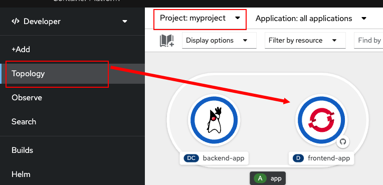
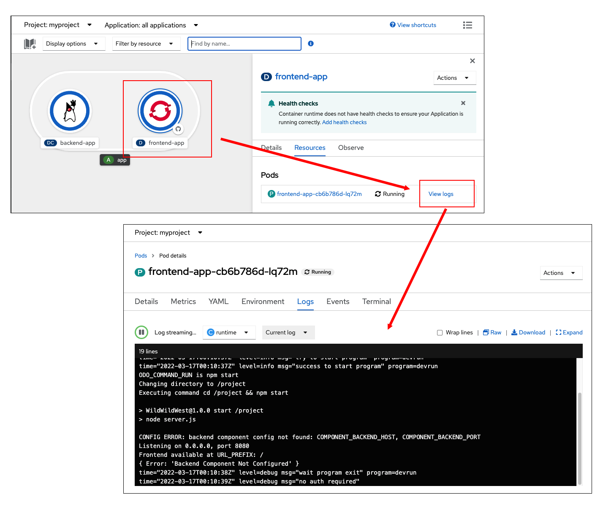

In this topic, you will learn how to bring up the `frontend` component for the Wild West demonstration application and connect it to the `backend` component. The source code for the component is already available in the command line environment.

----

# Creating a front-end component

`Step 1:` Run the following command to navigate to the `frontend` directory:

```
cd /root/frontend
```

----

`Step 2:` Run the following command to the contents of the `frontend` directory:

```
ls -lh
```

You'll get output similar to the following:

```
root@container:~/frontend# ls -lh
total 2.0M
-rwxr-xr-x 1 root root 2.5K Mar 16 23:22 README.md
drwxr-xr-x 2 root root 4.0K Mar 16 23:22 assets
drwxr-xr-x 2 root root 4.0K Mar 16 23:22 bin
-rw-r--r-- 1 root root  969 Mar 16 23:22 devfile.yaml
-rw-r--r-- 1 root root  32K Mar 16 23:22 favicon.ico
-rw-r--r-- 1 root root 5.4K Mar 16 23:22 index.html
-rwxr-xr-x 1 root root  296 Mar 16 23:22 kwww-frontend.iml
-rw-r--r-- 1 root root  23K Mar 16 23:22 package-lock.json
-rw-r--r-- 1 root root  889 Mar 16 23:22 package.json
-rwxr-xr-x 1 root root 1.9M Mar 16 23:22 playfield.png
-rw-r--r-- 1 root root 3.3K Mar 16 23:22 server.js
```

The source code for the `frontend` component shown above are the files for a typical Node.JS application.

Since `frontend` is written in Node.js which is an interpreted language, there is no build step analogous to the Maven build you performed previously for the `backend` component.

You can proceed directly to specify the `nodejs` environment from the cluster's catalog.

----

`Step 3:` Run the following `odo` command to give this Node.js component the name `frontend`:

```
odo create frontend --app=app
```

You'll get output similar to the following:

```
 ✓  odo will create a devfile component from the existing devfile: /root/frontend/devfile.yaml [7ms]
Validation
 ✓  Validating if devfile name is correct [36765ns]
 ✓  Validating the devfile for odo [11ms]
 ✓  Updating the devfile with component name "frontend" [1ms]

Please use `odo push` command to create the component with source deployed
 ```

`odo` will create a `config.yaml` just as it did with the `backend` component. Also take a look at the last line in the output above. Notice that `odo` instructs you to run the command `odo push`.


Now that you have the component named and the config file created, you can do as `odo` instructs and push the Node.js source code into a Linux container.

----

# Pushing source code into a Linux container

`Step 4:` Run the following command from the current directory to push the Node.js application into a Linux container:

```
odo push
```

When `odo push` completes, you'll see output that looks similar to the following snippet:

```
.
.
.
Pushing devfile component "frontend"
 ✓  Changes successfully pushed to component
```

You can also follow the status of your container creation in the OpenShift web console by viewing the Topology page for the project as we did in the previous topic. Let's view the Topology page now.

# Viewing the component in the OpenShift web console

----

`Step 5:` Click the **Web Console** tab on the horizontal menu bar above the interactive terminal.

Depending on how far along your `odo push` is, you might see the pod for the `frontend` component starting up with a light blue ring as shown below.


A light blue ring means the pod is in a pending state and hasn't started yet.

Once the pod becomes available, you'll see the `frontend` component become available with a dark blue ring around it like the `backend` component has. This is shown below:



----

`Step 6a:` Click on the `frontend` component circle. This will bring up the deployment config for `frontend` and present the option to **View Logs** under the **Pods** section. This is shown below:



`Step 6b:` Click on **View logs** where you should eventually see the following logs confirming that the `frontend` is running:

```
CONFIG ERROR: backend component config not found: COMPONENT_BACKEND_HOST, COMPONENT_BACKEND_PORT
Listening on 0.0.0.0, port 8080
Frontend available at URL_PREFIX: /
{ Error: 'Backend Component Not Configured' }
```

Don't worry about the error message for now! You'll correct this in the next section.

`Step 6c:` When you are done viewing the logs, click on the **Topology** tab on the left side of the OpenShift web console to head back to `myproject`.

# Congratulations!

 You've just installed the `frontend` component of the Wild West demonstration application using `odo`.

----

**NEXT:** Configuring components
