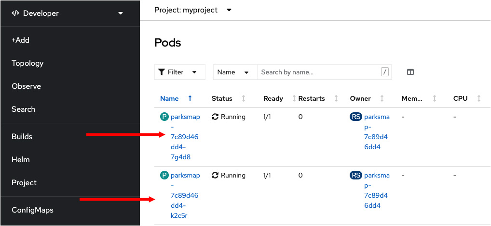
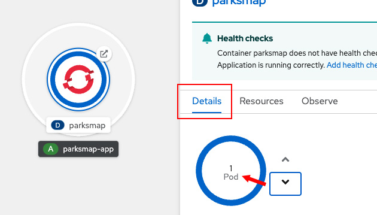

In this step, you will learn how to scale your application up by creating multiple replicas of the pod that represents the application in the cluster. Red Hat OpenShift will make it look like all of the replicas are a single application. But, behind the scenes, OpenShift routes traffic among the replicas automatically.

The benefit of replicating a pod is that it increases the amount of Internet traffic the application can accommodate. The result is better overall performance.

# Scaling up the application

You will scale up the application up to 2 replicas.

----

`Step 1:` Click inside the circle for the `parksmap` application you just installed within the **Topology** view. The details window will appear in a side panel as shown in the figure below.

----

`Step 2:` In the side panel, click the **Details** tab, and then click the up arrow next to the pod to increase the number of pods to 2. (The word [`pod` is a Kubernetes term](https://kubernetes.io/docs/concepts/workloads/pods/). In this case, a `pod` refers to an instance of the application.)

The figure below illustrates selecting the **Details** and increasing the number of pods to 2.

You are now running two replicas of the application.

# Verifying the number of replicas

----

`Step 3:` To verify that we changed the number of replicas, click the **Resources** tab in the side panel. You will see a list of pods as shown in the figure below.

You can see that we now have 2 replicas. Now, let's take a look at OpenShift's self-healing feature. Self Healing ensures that the number of pods you declare for your application is always running.

# Understanding application "self healing"

Under the OpenShift application **Deployments** are constantly monitored to see that the desired number of pods are actually running. Therefore, if the actual state ever deviates from the desired state--for example, if a pod goes down--OpenShift will fix the situation.

Now you will kill one of the pods to see if OpenShift will bring it back to life.

----

`Step 4:` On the **Resources** tab where you viewed the list of pods after scaling to 2 replicas, click the name of one of the pods in the list as shown in the figure below.

----

`Step 5:` In the top right corner of the page, there is an **Actions** drop down menu. Click it and select **Delete Pod** as shown in the figure below.

After deleting the pod, you will be taken to a page listing pods. Notice that even though you deleted one pod, two pods are still running, as shown in the figure below.

A replacement pod was created because OpenShift will always make sure that when a pod dies, it creates a new pod to fill its place.

# Scaling down an application

Before we continue, go ahead and scale your application down to a single instance.

----

`Step 6a:` Click the **Topology** item on the left side menu.

`Step 6b:` Click the `parksmap` circle.

`Step 6c:` Click the **Details** tab in the side panel.

`Step 6d:` Click the down arrow to the right of the pod circle to reset the number of pods to 1 as shown in the figure below.

# Congratulations!

 You've learned how to use the OpenShift web console to scale the number of replica pods for an application up and down.

----

**NEXT:** Viewing a route to the application
