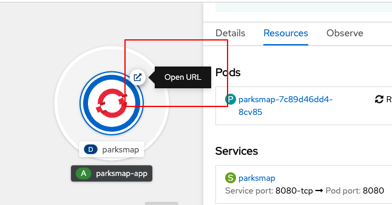

In this step you will explore **routes**.

In Red Hat OpenShift, the **service** resource provides the internal abstraction that binds access to an application to its logic, which is represented in an application's pods. Also, a **service** provides load-balancing capabilities within an OpenShift environment.

The binding of a **service** to an application's pods is internal to an OpenShift cluster. The way that external clients access applications running in OpenShift is through the OpenShift routing layer.

The formal name for the resource which represents the routing layer is called a **route**.

As mentioned earlier in the tutorial, When you create an application from a **container image**, OpenShift creates a **route** for the application automatically. Let's take a look at where the **route** is published. Then, let's access the application's website from a browser using its route URL.

# Viewing a route's URL

`Step 1:` To view the **route** for your application, make sure you are in the **Developer** perspective by selecting **Developer** from the dropdown list on the left side menu bar. Then from within **Topology** view, click the application circle as shown in the figure below.

The information page for the pods will slide out as a panel on the right-hand side of the page.

----

`Step 2:` Click the **Resource** tab in the side panel.

----

`Step 3:` Scroll down to the **Routes** section at the bottom of the web page as shown figure below.

The route URL for your application is shown as a link.

----

`Step 4:` Click that link to load the application's web page in your browser.

# Accessing a Route's URL

You can also access an application's **route** URL directly within the application's circular graphic in the **Topology** page.

----

`Step 5:` Click the icon in the upper right of the application's circular graphic as shown in the figure below.

Clicking the icon opens the application's web page in a browser as shown in th figure below.

----

# Congratulations!

 You have now located the application's **route** URL in the OpenShift web console. Also, you've learned how to open the application in a web page from the **Resource** tab in the application detail, and also directly from the application's circular graphic in the **Topology** view.

This is the final step in this track.

# What's Next?

Congratulations on completing this lab. Keep learning about OpenShift:

* Visit the [Red Hat Developer learning page](https://developers.redhat.com/learn) for more labs and resources
* [Want to try a free, instant 30-day OpenShift cluster? Get started with the Developer Sandbox for Red Hat OpenShift](https://developers.redhat.com/developer-sandbox)

Don't forget to finish the lab and rate your experience on the next page. Thanks for playing!