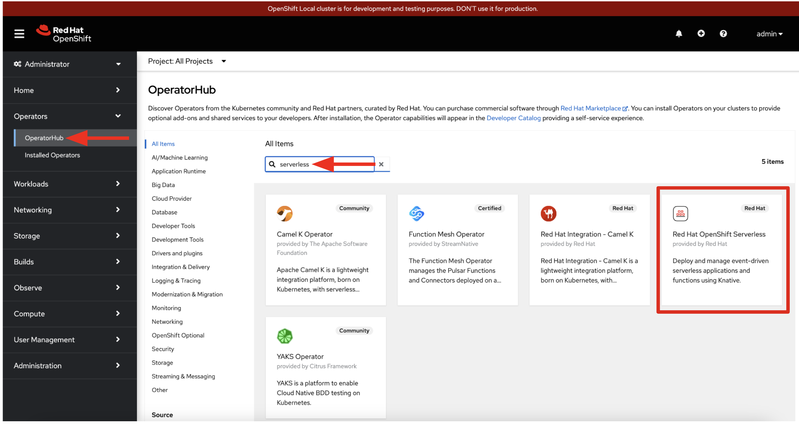
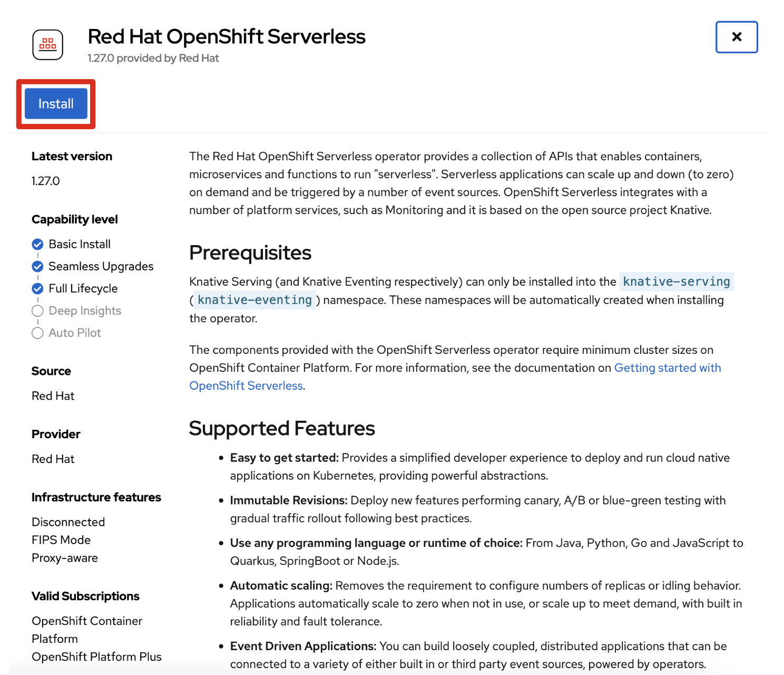
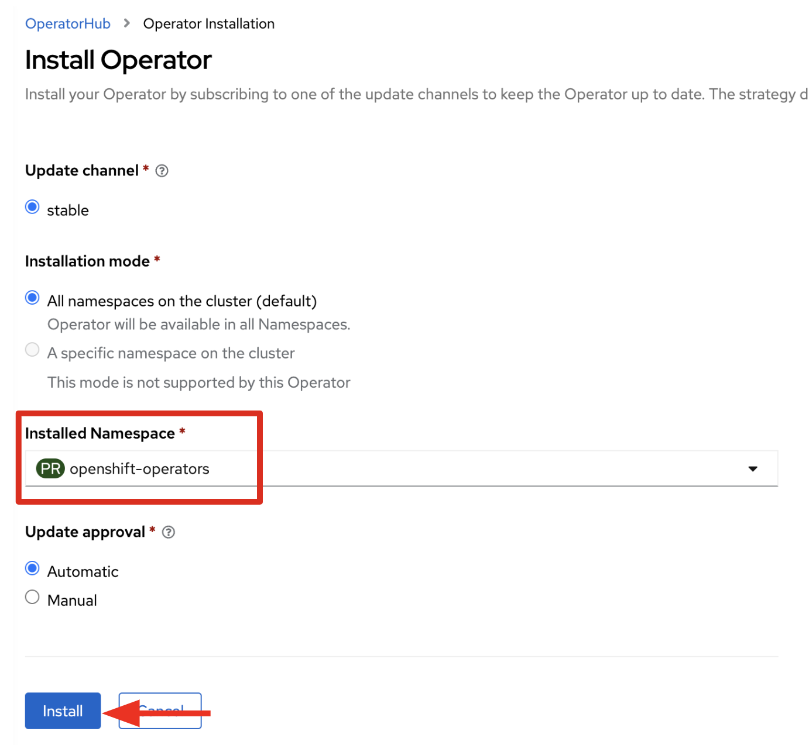
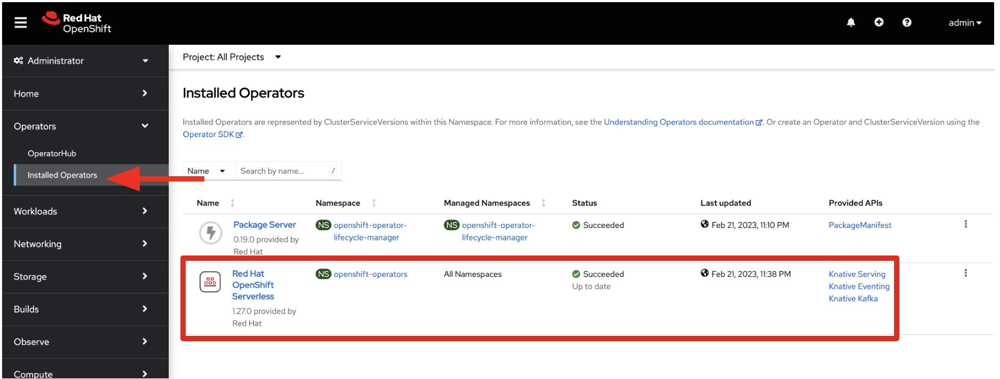
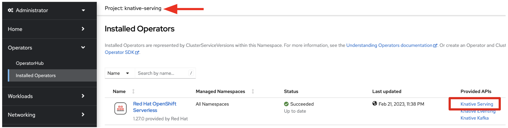
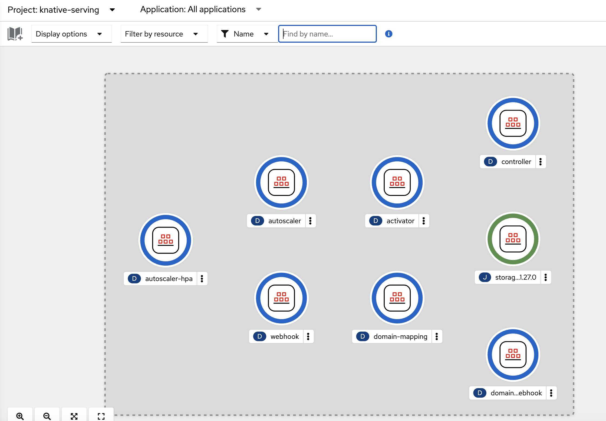

[serverless-install-script]: https://github.com/openshift-labs/learn-katacoda/blob/master/assets/01-prepare/install-serverless.bash
[olm-docs]: https://docs.openshift.com/container-platform/latest/operators/understanding/olm/olm-understanding-olm.html
[serving-docs]: https://github.com/knative/serving-operator#the-knativeserving-custom-resource

OpenShift Serverless is an OpenShift add-on that can be installed via an operator that is available within the OpenShift OperatorHub.

Some operators are able to be installed into single namespaces within a cluster and are only able to monitor resources within that namespace.  The OpenShift Serverless operator is one that installs globally on a cluster so that it is able to monitor and manage Serverless resources for every single project and user within the cluster.

You could install the Serverless operator using the *Operators* tab within the web console, or you can use the CLI tool `oc`.  In this instance, the terminal on the side is already running through an automated CLI install.  This [script can be found here][serverless-install-script].

Since the install will take some time, let's take a moment to review the installation via the web console.

> **Note:** *These steps are for informational purposes only. **Do not** follow them in this instance as there already is an automated install running in the terminal.*

## Log in and install the operator

### Logging in to the Cluster

To log in to the cluster as an administrator from the terminal:

```
oc login -u admin -p admin
```

You can login to the Web Console using the **Web Console** Tab with this credentials:

You will then be able to login with admin permissions with:

* **Username:** `admin`
* **Password:** `admin`


### Install Serverless Operator


Cluster administrators can install the `OpenShift Serverless` operator via *Operator Hub*



> **Note:** *We can inspect the details of the `serverless-operator` packagemanifest within the CLI via `oc describe packagemanifest serverless-operator -n openshift-marketplace`.*
>
> **Tip:** *You can find more information on how to add operators on the [OpenShift OLM Documentation Page][olm-docs].*

Next, our scripts will install the Serverless Operator into the `openshift-operators` project using the `stable` update channel.





> **Note:** In case you see the warning message (`Danger alert:A Subscription for this Operator already exists in Namespace "openshift-serverless"`), please ignore it and click on `Cancel` button.

Open the **Installed Operators** tab and watch the **OpenShift Serverless Operator**.  The operator is installed and ready when the `Status=Succeeded`.



> **Note:** *We can inspect the additional api resouces that the serverless operator added to the cluster via the CLI command `oc api-resources | egrep 'Knative|KIND'`*.

Next, we need to use these new resources provided by the serverless operator to install KnativeServing.

## Install KnativeServing
As per the [Knative Serving Operator documentation][serving-docs] you must create a `KnativeServing` object to install Knative Serving using the OpenShift Serverless Operator.

> **Note:** *Remember, these steps are for informational purposes only. **Do not** follow them in this instance as there already is an automated install running in the terminal.*

Move to the `knative-serving` project. Open the **Installed Operators** tab and the **OpenShift Serverless Operator**.  Then click on the **Knative Serving**.



Click on `Create KnativeServing` button. Leave all values by default and click on `Create` button.


Let's go to the `Toplogy view` in the *Developer perspective*, you will see the deployed pods as below:



OpenShift Serverless should now be installed!

## Login as a Developer and Create a Project
Before beginning we should change to the non-privileged user `developer` and create a new `project` for the tutorial.

> **Note:** *Remember, these steps are for informational purposes only. **Do not** follow them in this instance as there already is an automated install running in the terminal.*

To change to the non-privileged user in our environment we login as username: `developer`, password: `developer`

```
oc login -u developer -p developer
```

Create a project from the terminal:

```
oc new-project serverless-tutorial
```

There we go! You are all set to kickstart your serverless journey with **OpenShift Serverless**.