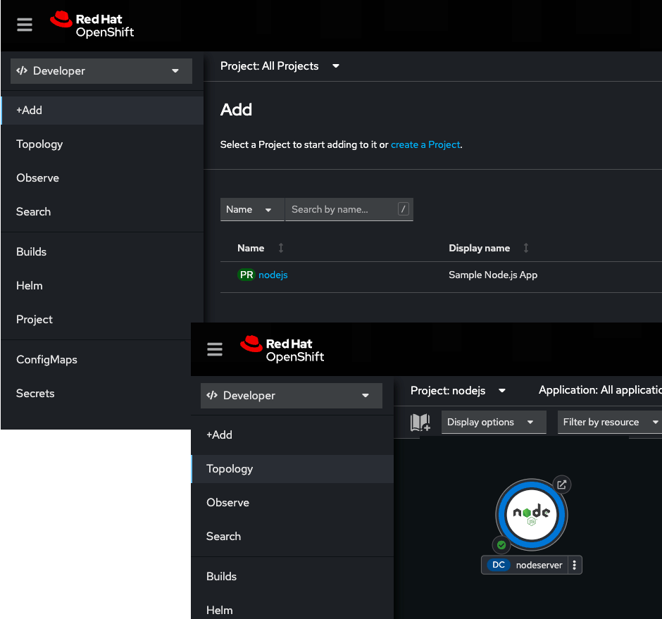

Now that we have the Application built, let's move it onto the cloud.

# Logging in to the OpenShift Web Console

`Step 1:` Click the **OpenShift Web Console** tab on the horizontal menu bar over the terminal window.

When you go get to the **OpenShift Web Console** you'll be presented with a login page as shown in the figure below.


----
`Step 2:`  Login to the **OpenShift Web Console** using the following credentials.

* Username: `developer`
* Password: `developer`

----

`Step 3:` Run the following command in **Terminal 1** to log into OpenShift from the command line.


```
oc login -u developer -p developer
```

You will see the following output.

```console
Login successful.

You don't have any projects. You can try to create a new project, by running

    oc new-project <projectname>
```

# Creating a project from the command line using `oc`

For this scenario, let's create a project that you'll use to host your application.

`Step 4:` Run the following command to create a new project with the display name, `Sample Node.js App`.

```
oc new-project nodejs --display-name="Sample Node.js App"
```

You'll get output similar to the following:

```
Now using project "nodejs" on server "https://api.crc.testing:6443".

You can add applications to this project with the 'new-app' command. For example, try:

    oc new-app rails-postgresql-example

to build a new example application in Ruby. Or use kubectl to deploy a simple Kubernetes application:

    kubectl create deployment hello-node --image=k8s.gcr.io/serve_hostname
```

You now have a project to host the application. Next you need to deploy the application.

----

# Deploying the application to OpenShift

`Step 5:` Run the following commands in the **Terminal 1** window to the left to go to the working directory for the Node.js application

```sh
cd /root/projects/nodejs/nodeserver
```

<!--
IF JUST SHOWING THE NODESHIFT CLI, NO NEED FOR THE DOCKERFILE STUFF

`Step 6:`  Click the **Visual Editor** tab in the horizontal menu bar over the terminal window to the left. You'll see the code editor that is part of the interactive learning environment.

You will notice that a **Dockerfile** and a **.dockerignore** file is now part of the project. This is a very basic and generic Dockerfile to containerize Node.js applications. Feel free to take a minute and view the newly added files.

Once you are done inspecting those files, it is time to deploy this application to Openshift.  While there are multiple ways to do this,  we are going to use the nodeshift cli. -->

`Step 7:` Run the following commands in **Terminal 1** to deploy your Node.js application:

To deploy the application, we are going to use a tool called the [Nodeshift CLI](https://www.npmjs.com/package/nodeshift). The Nodeshift CLI is an opinionated command line application and programmable API that you can use in development to deploy Node.js projects to OpenShift.

We will use the `npx` command to run the CLI tool without having to install it globally. To learn more about `npx` and `npm`, [check out their official docs](https://docs.npmjs.com/cli/v9/commands/npx).

```
npx nodeshift --expose
```

We are using the `--expose` flag since we want Openshift to create an external Route for us so we can access our application.

You will see similar output to this and you will need to type `y` to proceed.

```
Need to install the following packages:
  nodeshift@11.3.0
Ok to proceed? (y) y
```

The Nodeshift CLI will take the application code that you just wrote and deploy it as a binary build to the Openshift Cluster. You should see similar output in your console:

```
2023-04-25T15:22:20.883Z INFO loading configuration
2023-04-25T15:22:20.890Z INFO No login.json file found
2023-04-25T15:22:20.913Z INFO using namespace nodejs at https://api.crc.testing:6443
2023-04-25T15:22:20.914Z WARNING a file property was not found in your package.json, archiving the current directory.
2023-04-25T15:22:20.917Z INFO creating archive of package-lock.json, package.json, server.js
2023-04-25T15:22:21.005Z INFO creating build configuration nodeserver-s2i
2023-04-25T15:22:21.005Z INFO Using the Source Build Strategy
2023-04-25T15:22:21.005Z INFO Using s2i image registry.access.redhat.com/ubi8/nodejs-14 with tag latest
2023-04-25T15:22:21.056Z INFO creating ImageStream nodeserver
2023-04-25T15:22:21.071Z INFO uploading binary archive /var/roothome/projects/nodejs/nodeserver/tmp/nodeshift/build/archive.tar
2023-04-25T15:22:36.413Z INFO binary upload complete
...
...
2023-04-25T15:23:13.205Z TRACE Successfully pushed image-registry.openshift-image-registry.svc:5000/nodejs/nodeserver@sha256:9161ac6c33edf67bef09212d187a305fa438c93f41001a5aed5db8ed6a478af4
2023-04-25T15:23:13.228Z TRACE Push successful
2023-04-25T15:23:19.100Z INFO creating new service nodeserver
2023-04-25T15:23:19.108Z INFO creating deployment configuration nodeserver
2023-04-25T15:23:19.109Z INFO creating new route nodeserver
2023-04-25T15:23:19.130Z INFO route host mapping nodeserver-nodejs.crc-lgph7-master-0.crc.kbbxqgyl7hbh.instruqt.io
2023-04-25T15:23:19.191Z INFO complete
```


The application is now deployed and running in OpenShift. You can now view it in the **OpenShift Web Console**.

----

`Step 8a:` Click the **Web Console** tab on the horizontal menu bar over the terminal window to the left.

`Step 8b:` Click the **Topology** tab on the left side of the web console as shown in the figure below:



`Step 8c:` Click the **nodejs** link in the Topology view's Project page as shown in the figure above. A circular graphic will appear. This graphic represents the Getting Started application.

----

You can access the application using `curl` once again.

`Step 9:` Run the following command in **Terminal 1** to get the URL to the applications endpoint and assign it to the environment variable named `APP_ROUTE`.

```bash
APP_ROUTE=`oc get route nodeserver -n nodejs -o jsonpath='{"https://"}{.spec.host}{"/"}{"\n"}'`
```

----
`Step 10` Run the following command in **Terminal 1** to exercise the application's endpoint:

```
curl $APP_ROUTE
```

You will see the following output:

```console
Hello, World!
```


----


# Congratulations

This is the final topic in this track.

This track provided an introduction to cloud-native development with Node.js by walking you through how to extend an Express.js-based application to leverage cloud capabilities.

To learn more about Node.js at Red Hat, checkout the [Node.js Topic page on Red Hat Developers](https://developers.redhat.com/topics/nodejs)

Also, be sure to check out the [Red Hat/IBM Node.js Reference Architecture](https://github.com/nodeshift/nodejs-reference-architecture) the teams 'opinion' on what components our customers and internal teams should use when building Node.js applications and guidance for how to be successful in production with those components.


# What's Next?

Congratulations on completing this lab. Keep learning about OpenShift:

* Visit the [Red Hat Developer learning page](https://developers.redhat.com/learn) for more labs and resources
* [Want to try a free, instant 30-day OpenShift cluster? Get started with the Developer Sandbox for Red Hat OpenShift](https://developers.redhat.com/developer-sandbox)

Don't forget to finish the lab and rate your experience on the next page. Thanks for playing!

