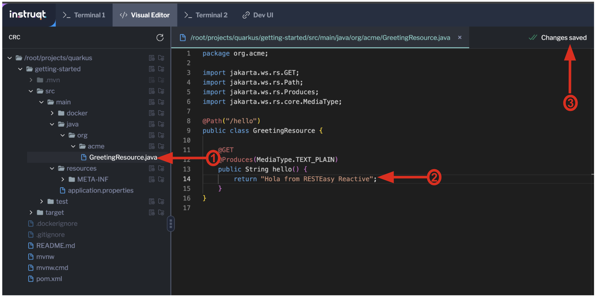
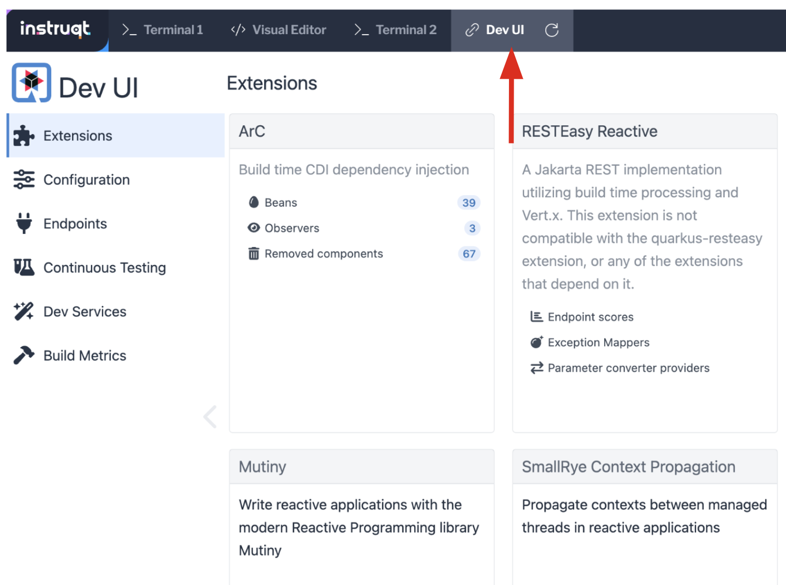
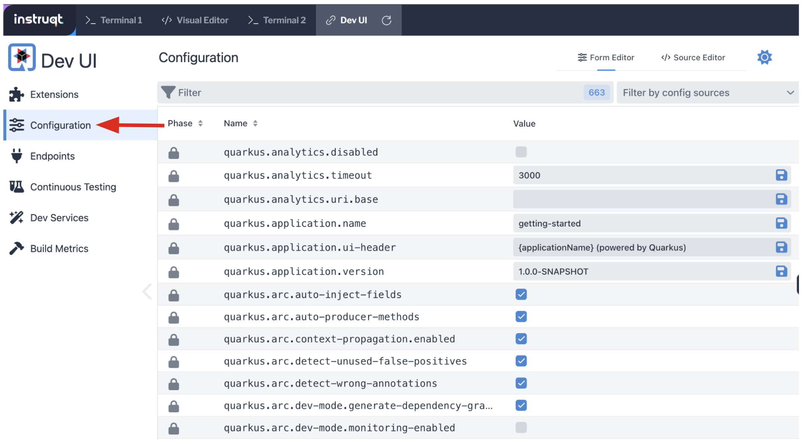
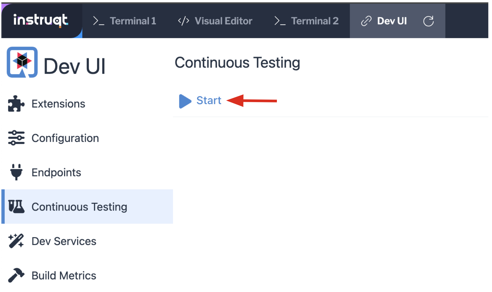
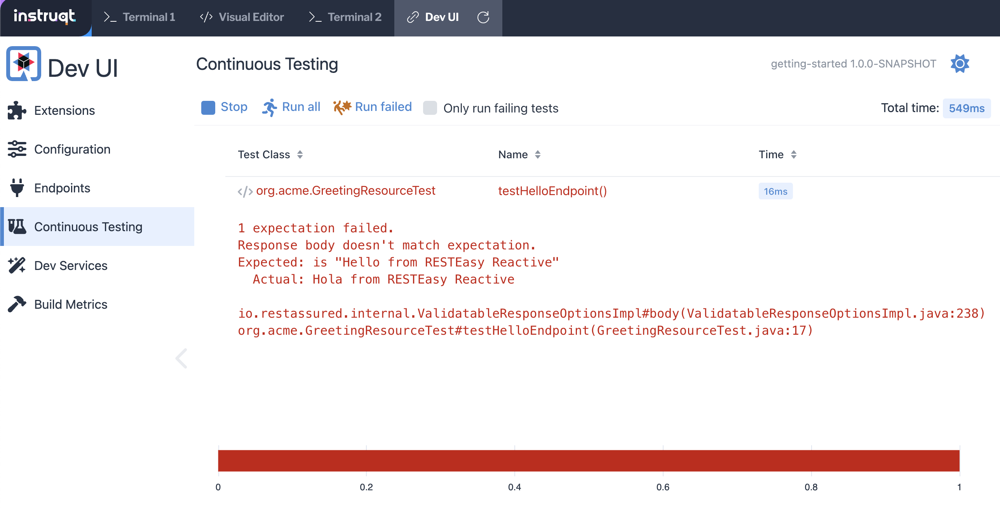
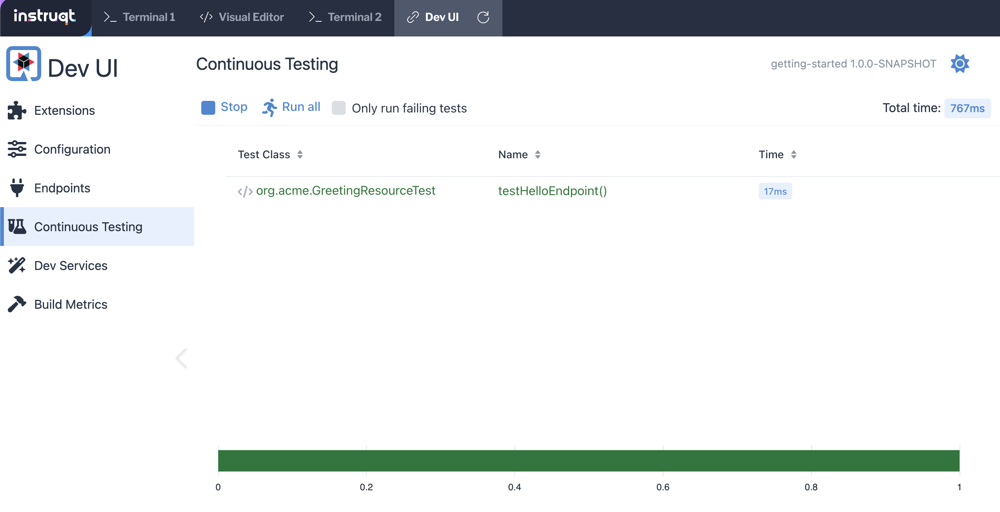

In this topic you will use Quarkus to create an API application that publishes a `/hello` endpoint. Also, you will use dependency injection to build on the `/hello` endpoint to publish an additional endpoint `/hello/greeting` by creating a **Greeting** bean.

The Maven project you're going to create has the following structure:
* An `org.acme.quickstart.GreetingResource` resource exposed on `/hello`
* An associated unit test
* A landing page that is accessible on `http://localhost:8080` after starting the application
* An example `Dockerfile`s for a variety of build targets (native, jvm, etc)
* The application configuration file


# Creating a basic project using Quarkus

`Step 1:` Run the following command in the **Terminal 1** window to the left to go to the working directory for the Quarkus application you're going to create. (The directory was created as part of the tracks setup process.)

```
cd /root/projects/quarkus/ && pwd
```

You'll get the following output.

```
/root/projects/quarkus/
```

----

`Step 2:` Run the following command in the **Terminal 1** window to create the basic Maven project.

```
mvn io.quarkus.platform:quarkus-maven-plugin:3.9.2:create \
    -DprojectGroupId=org.acme \
    -DprojectArtifactId=getting-started \
    -Dextensions='rest'
cd getting-started
```

The `mvn` command shown above invokes the installation process that creates all the files and artifacts needed to get the application up and running.

The snippet of code below shows you the output you'll get at the end of the installation process. The date information will be different in your output.

```
[INFO] ------------------------------------------------------------------------
[INFO] BUILD SUCCESS
[INFO] ------------------------------------------------------------------------
```

Before you start the Quarkus application, you need to disable the CORS filter to access the Quarkus DEV UI since the Quarkus application will run on the container rather than a local environment.

Click the **Visual Editor** tab in the horizontal menu bar over the terminal window to the left. You'll see the code editor that is part of the interactive learning environment. Open the `application.properties` file in the *src/main/resources* directory. Then, add the following key and values. Note that the changes will be save automacticatlly.

In case you don't see the subdirectories under the */root/projects/quarkus* directory, click on the reload icon.

Make sure to replace `YOUR_SANDBOX_ID` with the sandbox ID from the ROUTE URL.

```
%dev.quarkus.dev-ui.cors.enabled=false
%dev.quarkus.dev-ui.hosts=crc-8080-${INSTRUQT_PARTICIPANT_ID}.env.play.instruqt.com
```


# Running the Application

You are ready to run the Quarkus application

`Step 3` Run the following command in Terminal 1 to the left to compile and run the demonstration project.

```
mvn quarkus:dev -Dquarkus.http.host=0.0.0.0 -Dquarkus.analytics.disabled=true -f /root/projects/quarkus/getting-started
```

There will be a lot of output to the screen. When the process is finished running, you will see the following:

```
Listening for transport dt_socket at address: 5005
__  ____  __  _____   ___  __ ____  ______
 --/ __ \/ / / / _ | / _ \/ //_/ / / / __/
 -/ /_/ / /_/ / __ |/ , _/ ,< / /_/ /\ \
--\___\_\____/_/ |_/_/|_/_/|_|\____/___/
INFO  [io.quarkus] (Quarkus Main Thread) getting-started 1.0.0-SNAPSHOT on JVM (powered by Quarkus x.x.x) started in 3.618s.Listening on: http://0.0.0.0:8080
INFO  [io.quarkus] (Quarkus Main Thread) Profile dev activated. Live Coding activated.
INFO  [io.quarkus] (Quarkus Main Thread) Installed features: [cdi, rest, smallrye-context-propagation, vertx]

--
Tests paused
Press [e] to edit command line args (currently ''), [r] to resume testing, [o] Toggle test output, [:] for the terminal, [h] for more options>
```

----

Let's verify that the demonstration application is actually up and running.

`Step 4:` Click the **Terminal 2** tab on the horizontal menu bar over the pane to the left.

----

`Step 5:` Run the following command in the **Terminal 2** window that appears:

```
curl -w "\n" localhost:8080/hello/
```

You'll get the following output:

```
Hello from Quarkus REST
```

As you can see, the service endpoint is up and running.

# Exercising the Quarkus Live Reload Feature

A useful feature of Quarkus is that it will update and redeploy an application automatically when you make a code change.

Let's take a look.

----

You are going to change the output of the **Hello App** API application from `Hello from Quarkus REST` to `Hola from Quarkus REST` by doing nothing more than changing one line of code. Quarkus will take care of everything else.

----

`Step 6:`  Click the **Visual Editor** tab in the horizontal menu bar over the terminal window to the left. You'll see the code editor that is part of the interactive learning environment.

----

`Step 7a:`  Scroll through the file tree on the left side of the editor until you get to the file `/root/projects/quarkus/getting-started/src/main/java/org/acme/quickstart/GreetingResource.java`. Then click on the filename in the tree.


`Step 7b:`  Change the word `Hello` to `Hola` at Line 14 in the file `GreetingResource.java` as shown in the figure below at Callout 2.



`Step 7c:`  The change will be saved automatically, as shown in the figure above at Callout 3.

----

`Step 8:` Return to **Terminal 2** and tun the following command in the terminal window:

```
curl -w "\n" localhost:8080/hello/
```

You'll get the following output with the new phrase:

```
Hola from Quarkus REST
```

As you can see, all you did was change a string in a line of code. Quarkus did the rest!

# Working with the Dev UI

When running in Developer mode, a Quarkus application exposes a useful UI for inspecting and making on-the-fly changes to the application (much like live coding mode). The Quarkus UI allows you to quickly visualize a number of things.

You can see all the extensions currently loaded. You can see and edit their configuration values.

Also, you can see an extension's status and go directly to its documentation.

----

`Step 9:` Click the tab `Dev UI` on the horizontal menu bar over the interactive learning window on the left. In case you don't see the Dev UI properly, click on the reload icon.

You'll see the Dev UI for your running application as shown in the figure below.



----

`Step 10:`  Click on the `Configuration` in the left menu which allows developers to make configuration changes or experiment with various application settings in a very detailed manner.



|NOTE:|
|----|
|The Dev UI is only enabled when in `developer` mode. It is not deployed when in `production` mode because, as the name implies, it's designed for developers to use during development. For more detail on what you can do in developer mode, check out the [Dev UI Guide](https://quarkus.io/guides/dev-ui).|

# Implementing continuous testing

Quarkus enables you to automatically and continuously run your application's unit tests when you are in developer mode. (You put this instance of the application into developer mode when you started it using the command `mvn quarkus:dev`).

As you might recall, when you ran `mvn quarkus:dev` you were presented with the prompt  `Tests paused, press [r] to resume, [h] for more options>` as the end of installation process.

----

`Step 11:` Click on the `Continuous Testing` menu and then click on the `Start` button. (You can also press `r` at the testing prompt will run the application's unit test.)



As you will see from all the red test class which means the unit test is failed. The reason for the failure is that previously you changed the word `Hello` to `Hola`. The unit test expects the output `Hello from Quarkus REST`. The output failed to meet the expectation.



Let's fix the code and get the tests to pass.

----

`Step 12:` Click the **Visual Editor** tab in horizontal menu bar over the interactive learning window.

----

`Step 13:` Navigate to the file `/root/projects/quarkus/getting-started/src/main/java/org/acme/quickstart/GreetingResource.java`.

----

`Step 14:` Change `Hola from Quarkus REST` back to `Hello from Quarkus REST` in the editor.

----

As soon as your reset the code, Quarkus automatically re-runs the test.

----

`Step 15:` Go back to the `Continuous Testing` in the *Dev UI*.

----

`Step 16:` Look at the test result. You'll see that the test case has succeeded (green color).



Note that you can find the following test result in the terminal 1.

```
All 1 test is passing (0 skipped), 1 test was run in 618ms. Tests completed at 03:33:55 due to changes to GreetingResource.class.
```

Quarkus was smart enough to detect that you made a change to the code and ran the relevant test automatically.

The way Quarkus works is that it analyzes your unit tests and only re-runs the tests that are affected by code changes.

# Congratulations!

You've learned how to create a new Quarkus application. Then, you could keep developing the application without recompiling, rebuilding, redeploying, and restarting the application runtime based on Quarkus Live Coding. You also saw how Quarkus runs tests continuously to turbocharge your development tasks and facilitate test-driven development.

----

# What's Next?

Congratulations on completing this lab. Keep learning about OpenShift:

* Visit the [Red Hat Developer learning page](https://developers.redhat.com/learn) for more labs and resources
* [Want to try a free, instant 30-day OpenShift cluster? Get started with the Developer Sandbox for Red Hat OpenShift](https://developers.redhat.com/developer-sandbox)

Don't forget to finish the lab and rate your experience on the next page. Thanks for playing!
