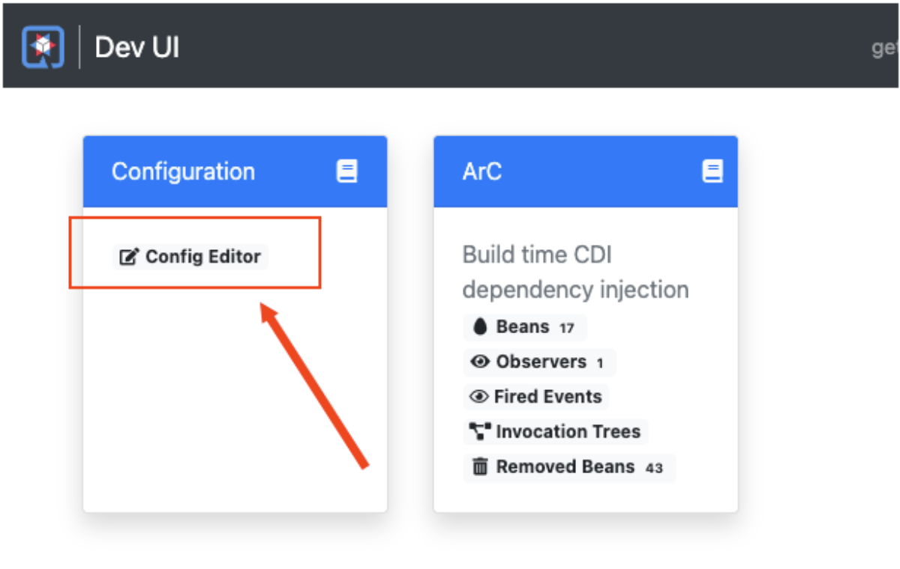
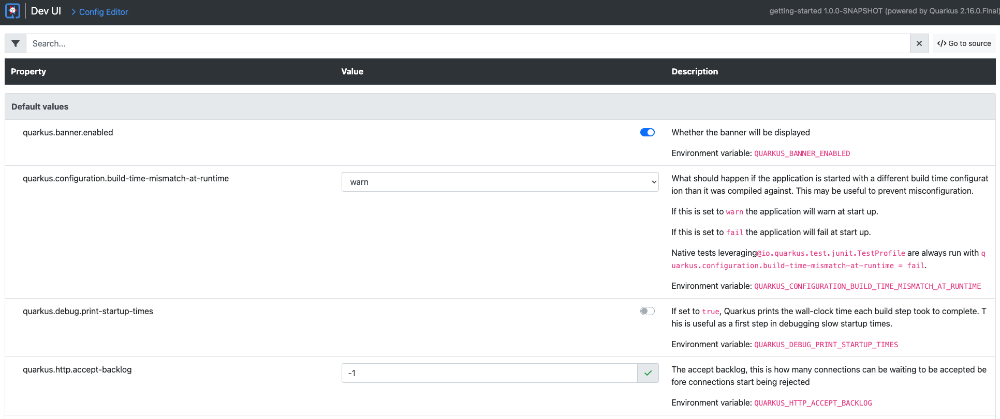

# Running the Application

You are ready to run the Quarkus application

`Step 1` Run the following command in Terminal 1 to the left to compile and run the demonstration project.

```
mvn quarkus:dev -Dquarkus.http.host=0.0.0.0 -f /root/projects/quarkus/getting-started
```

There will be a lot of output to the screen. When the process is finished running, you will see the following:

```
__  ____  __  _____   ___  __ ____  ______
 --/ __ \/ / / / _ | / _ \/ //_/ / / / __/
 -/ /_/ / /_/ / __ |/ , _/ ,< / /_/ /\ \
--\___\_\____/_/ |_/_/|_/_/|_|\____/___/
INFO  [io.quarkus] (Quarkus Main Thread) getting-started 1.0.0-SNAPSHOT on JVM (powered by Quarkus x.x.x.Final) started in 1.194s. Listening on: http://0.0.0.0:8080
INFO  [io.quarkus] (Quarkus Main Thread) Profile dev activated. Live Coding activated.
INFO  [io.quarkus] (Quarkus Main Thread) Installed features: [cdi, resteasy]
--
Tests paused, press [r] to resume, [h] for more options>
```

----

Let's verify that the demonstration application is actually up and running.

`Step 2:` Click the **Terminal 2** tab on the horizontal menu bar over the pane to the left.

----

`Step 3:` Run the following command in the **Terminal 2** window that appears:

```
curl -w "\n" localhost:8080/hello/
```

You'll get the following output:

```
Hello from RESTEasy Reactive
```

As you can see, the service endpoint is up and running.

# Exercising the Quarkus Live Reload Feature

A useful feature of Quarkus is that it will update and redeploy an application automatically when you make a code change.

Let's take a look.

----

You are going to change the output of the **Hello App** API application from `Hello RESTeasy Reactive` to `Hola RESTeasy Reactive` by doing nothing more than changing one line of code. Quarkus will take care of everything else.

----

`Step 4:`  Click the **Visual Editor** tab in the horizontal menu bar over the terminal window to the left. You'll see the code editor that is part of the interactive learning environment.

----

`Step 5a:`  Scroll through the file tree on the left side of the editor until you get to the file `/root/projects/quarkus/getting-started/src/main/java/org/acme/quickstart/GreetingResource.java`. Then click on the filename in the tree.


`Step 5b:`  Change the word `Hello` to `Hola` at Line 14 in the file `GreetingResource.java` as shown in the figure below at Callout 2.


`Step 5c:`  Click the save icon to save your changes, as shown in the figure above at Callout 3.

----

`Step 6:` Return to **Terminal 2** and tun the following command in the terminal window:

```
curl -w "\n" localhost:8080/hello/
```

You'll get the following output with the new phrase:

```
Hola from RESTEasy Reactive
```

As you can see, all you did was change a string in a line of code. Quarkus did the rest!

# Working with the Dev UI

When running in Developer mode, a Quarkus application exposes a useful UI for inspecting and making on-the-fly changes to the application (much like live coding mode). The Quarkus UI allows you to quickly visualize a number of things.

You can see all the extensions currently loaded. You can see and edit their configuration values.

Also, you can see an extension's status and go directly to its documentation.

----

`Step 7:` Click the tab `Dev UI` on the horizontal menu bar over the interactive learning window on the left.

You'll see the Dev UI for your running application as shown in the figure below.


----

`Step 8:`  Click on the `Config Editor` link within the `Configuration` file to see and make updates to the configuration as shown in the figure below.



As you can see in the figure below, the `Config Editor` allows developers to make configuration changes or experiment with various application settings in a very detailed manner.



|NOTE:|
|----|
|The Dev UI is only enabled when in `developer` mode. It is not deployed when in `production` mode because, as the name implies, it's designed for developers to use during development. For more detail on what you can do in developer mode, check out the [Dev UI Guide](https://quarkus.io/guides/dev-ui).|

# Implementing continuous testing

Quarkus enables you to automatically and continuously run your application's unit tests when you are in developer mode. (You put this instance of the application into developer mode when you started it using the command `mvn quarkus:dev`).

As you might recall, when you ran `mvn quarkus:dev` you were presented with the prompt  `Tests paused, press [r] to resume, [h] for more options>` as the end of installation process.

Entering the character `r` at the testing prompt will run the application's unit test.

----

`Step 9:` Click the **Terminal 1** tab and then press the `r` key in the terminal window. (The installation process will still be running in the terminal.)

As you will see from all the red error text in Terminal 1 on the left, the unit tests are failing. The reason for the failure is that previously you changed the word `Hello` to `Hola`. The unit test expects the output `Hello RESTEasy Reactive`. The output failed to meet the expectation.

Let's fix the code and get the tests to pass.

----

`Step 10:` Click the **Visual Editor** tab in horizontal menu bar over the interactive learning window.

----

`Step 11:` Navigate to the file `/root/projects/quarkus/getting-started/src/main/java/org/acme/quickstart/GreetingResource.java`.

----

`Step 12:` Change `Hola RESTEasy Reactive` back to `Hello RESTEasy Reactive` in the editor.

----

`Step 13:` Click the **Save File** icon on the top of the **Visual Editor** as shown above at `Step 7c`.


As soon as your reset the code, Quarkus automatically re-runs the test.

----

`Step 14:` Click the **Terminal 1** tab to go back a review the output from the continuous testing output.

----

`Step 15:` Look at the output at the bottom of the **Terminal 1** window. You'll see output similar to the following.

```
All 1 test is passing (0 skipped), 1 test was run in 618ms. Tests completed at 03:33:55 due to changes to GreetingResource.class.
```

Quarkus was smart enough to detect that you made a change to the code and ran the relevant test automatically.

The way Quarkus works is that it analyzes your unit tests and only re-runs the tests that are affected by code changes.

# Congratulations!

You've learned how to create a new Quarkus application. Then, you could keep developing the application without recompiling, rebuilding, redeploying, and restarting the application runtime based on Quarkus Live Coding. You also saw how Quarkus runs tests continuously to turbocharge your development tasks and facilitate test-driven development.

----

# What's Next?

Congratulations on completing this lab. Keep learning about OpenShift:

* Visit the [Red Hat Developer learning page](https://developers.redhat.com/learn) for more labs and resources
* [Want to try a free, instant 30-day OpenShift cluster? Get started with the Developer Sandbox for Red Hat OpenShift](https://developers.redhat.com/developer-sandbox)

Don't forget to finish the lab and rate your experience on the next page. Thanks for playing!