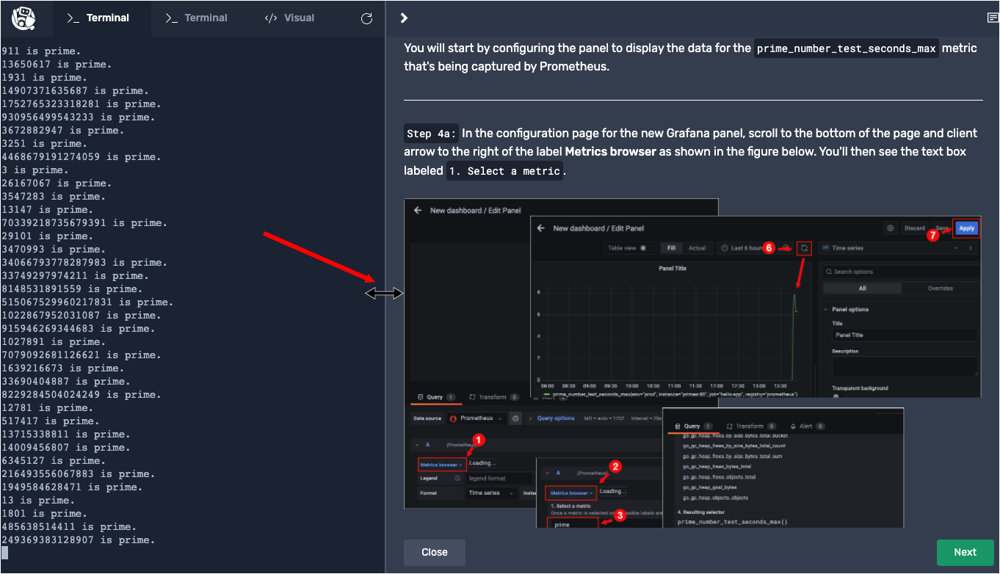

**Red Hat OpenShift Container Platform** is the preferred container orchestration platform for Quarkus. OpenShift is based on **Kubernetes** which is a very popular orchestration for containers running in production.

In this topic, you will create a demonstration project in OpenShift and then configure the OpenShift cluster to include Prometheus.

Be advised that there are a lot of detailed figures in this topic, as well as the other topics in this track. **Remember** that you can enlarge a figure for better viewing by sliding the content window to the left, as shown in the figure below.



# Logging into OpenShift

Log into OpenShift from a terminal using the OpenShift CLI.

----

`Step 1:` Run the following command in the **Terminal 1** console to log into OpenShift:

```
oc login -u developer -p developer
```

You will get output as follows:

```
Login successful.

You don't have any projects. You can try to create a new project, by running

    oc new-project <projectname>
```

You are now authenticated to the OpenShift server.

# Accessing an OpenShift project

OpenShift [projects](https://docs.openshift.com/container-platform/latest/rest_api/project_apis/project-project-openshift-io-v1.html)
are a top-level concept for organizing OpenShift [deployments](https://docs.openshift.com/container-platform/latest/applications/deployments/what-deployments-are.html).

An OpenShift project allows a user or a community of users to organize and manage application content in isolation.

For this track, you will create a project to host the demonstration application.

----

`Step 2:` Run the following command in the **Terminal 1** window to create an OpenShift project with the display name `Sample Monitored Quarkus App`:

```
cd /root/projects/quarkus/ && oc new-project quarkus --display-name="Sample Monitored Quarkus App"
```

You will see output similar to the following:

```
Login successful.

You don't have any projects. You can try to create a new project, by running

    oc new-project <projectname>
```

# Configuring Prometheus

Next, you'll install Prometheus. Prometheus is an open source systems monitoring and alerting toolkit that has the following features:

* A multi-dimensional [data model](https://prometheus.io/docs/concepts/data_model/) with time series data identified by metric name and key/value pairs.
* [PromQL](https://prometheus.io/docs/prometheus/latest/querying/basics/), a flexible query language to leverage this dimensionality.
* Time series data collection and reporting via a pull model over HTTP.

First, you need to create a [Kubernetes ConfigMap](https://developers.redhat.com/blog/2021/04/28/kubernetes-configuration-patterns-part-1-patterns-for-kubernetes-primitives#) that will hold the Prometheus configuration.

----

`Step 3:`  Run the following command in  **Terminal 1** to create the manifest file for the [Kubernetes ConfigMap](https://kubernetes.io/docs/concepts/configuration/configmap/):


```
cat <<EOF > /tmp/prometheus.yml
global:
  scrape_interval:     15s
  evaluation_interval: 15s
alerting:
  alertmanagers:
  - static_configs:
    - targets:
scrape_configs:
  - job_name: 'prometheus'
    static_configs:
    - targets: ['localhost:9090']
  - job_name: 'hello-app'
    metrics_path: '/q/metrics'
    static_configs:
    - targets: ['primes']
EOF
```

The YAML file shown above contains basic Prometheus configuration settings, plus a specific `scrape_config` attribute which tells Prometheus to look for application metrics from both Prometheus itself and a Quarkus application named `primes` at the `/q/metrics` endpoint. (You'll create the `primes` demonstration application later in this track.)

----

`Step 4:` Run the following command in  **Terminal 1** to create a ConfigMap using the manifest file at `/tmp/prometheus.yml`:

```
oc create configmap prom --from-file=prometheus.yml=/tmp/prometheus.yml
```

You will see the following output:

```
configmap/prom created
```

# Deploying Prometheus

`Step 5:` Run the following command in  **Terminal 1** to create, deploy, and expose Prometheus from its public Quay.io image:


```
oc new-app quay.io/prometheus/prometheus && oc expose svc/prometheus
```

You will see output similar to the following:

```
--> Found container image a5bac66 (4 days old) from quay.io for "quay.io/prometheus/prometheus"

    * An image stream tag will be created as "prometheus:latest" that will track this image

--> Creating resources ...
    imagestream.image.openshift.io "prometheus" created
    deployment.apps "prometheus" created
    service "prometheus" created
--> Success
    Application is not exposed. You can expose services to the outside world by executing one or more of the commands below:
     'oc expose service/prometheus'
    Run 'oc status' to view your app.
route.route.openshift.io/prometheus exposed
```

----

`Step 6:` Run the following command in  **Terminal 1** to mount the ConfigMap into the container running in the OpenShift cluster:

```
oc set volume deployment/prometheus --add -t configmap --configmap-name=prom -m /etc/prometheus/prometheus.yml --sub-path=prometheus.yml
```

You'll get the following output:

```
info: Generated volume name: volume-z8nmm
deployment.apps/prometheus volume updated
```

The command shown above causes the contents of the ConfigMap data to be mounted at `/etc/prometheus/prometheus.yml` inside the application container. Prometheus expects the ConfigMap to be at the location `/etc/prometheus/prometheus.yml`.

----

`Step 7:`

Run the following command in  **Terminal 1** to verify Prometheus is up and running:

```
oc rollout status -w deployment/prometheus
```

You will see output similar to the following:

```
deployment "prometheus" successfully rolled out
```
|NOTE:|
|----|
|If the command `oc rollout status -w deployment/prometheus` appears to hang, press the `CTRL+C` keys and run it again.|

# Congratulations!

You've created a new project in OpenShift. Also, you've installed a Kubernetes ConfigMap in the OpenShift cluster that will be used by Prometheus. Finally, you created a new application in the OpenShift cluster under the project you created previously.

You are now ready to have Prometheus gather performance metrics from the demonstration application. But, first you need to add Prometheus to the demonstration application.

----

**NEXT:** Adding the Prometheus extension
