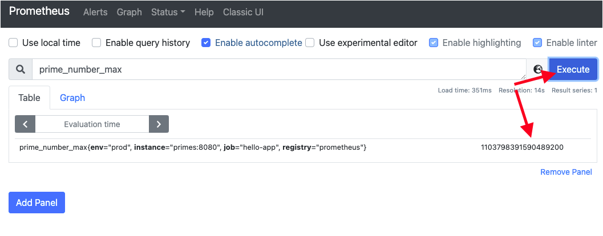

In this topic you will learn how to use the Prometheus graphical user interface (GUI) to display performance metrics generated by the demonstration application.

You'll submit numbers continuously to the `\is-prime` endpoint published by the demonstration application. Continuously submitting numbers will generate performance metrics on an ongoing basis.

You will use the [prime feature](https://www.openssl.org/docs/man1.1.1/man1/openssl-prime.html) found in the the open source [OpenSSL](https://www.openssl.org/) tool to generate example random numbers for exercising the demonstration application.

OpenSSL was preinstalled when the topic started. However, you will need to verify that OpenSSL is operational.

----

`Step 1:` Run the following command in **Terminal 1** to verify that `openssl` is installed. If it is not, you might need to wait a few seconds and run the command again until it reports a proper version:

```
cd /root/projects/quarkus/primes && \
  openssl version
```

You will see output similar to the following:

```console
OpenSSL 1.1.1g FIPS  21 Apr 2020
```

----

`Step 2:` Run the following command in **Terminal 1** to get the URL for the Prometheus GUI:

```
oc get route prometheus -n quarkus -o jsonpath='{"http://"}{.spec.host}'
```

----

`Step 3:` Copy the URL into a new browser window's address bar in order to access the Prometheus GUI as shown in the figure below.


|NOTE|
|----|
|Keep a copy of the URL in case you accidently close the browser window hosting the Prometheus GUI.|

Next, you will generate performance behavior to be reported by Prometheus.

To do this, you will set up a loop that continuously submits random numbers to the demonstration application to determine if the given number is prime or not.

# Generating a load against the demonstration application

`Step 4:` Run the following command in **Terminal 1** to continuously submit a random number every two seconds using `curl` to the endpoint `/is-prime`:

```
while [ true ] ; do
        BITS=$(( ( RANDOM % 60 )  + 1 ))
        NUM=$(openssl prime -generate -bits $BITS)
        ROUTE=$(oc get route primes -n quarkus -o jsonpath='{.spec.host}')
        curl http://$ROUTE/is-prime/${NUM}
        sleep 2
done
```
|NOTE|
|----|
|The demonstration application was deployed to OpenShift in the previous topic.|

Eventually you will see continuous output similar to the following:

```
123073248505959307 is prime.
909971267 is prime.
17028166907561 is prime.
4333773398384347 is prime.
4271242109 is prime.
948049627687 is prime.
503 is prime.
```

----

`Step 5:` Return to the Prometheus GUI running in the web browser.

Prometheus should start scraping the metrics from the demonstration application within about 15-30 seconds.

|NOTE|
|----|
|If you do not see any `prime` metrics when querying Prometheus, wait 15 seconds, reload the Prometheus page, and try again. The metrics will eventually show up.|

# Querying for metrics

----

`Step 6:` Using the Prometheus GUI, type the string `prime`, and then select the term `prime_number_max` from the dropdown as shown in the figure below.


----

`Step 7:` Using the Prometheus GUI, click the **Execute** button as shown in the figure below.



Running **Execute** will fetch the metric that reports the largest prime number found so far, as shown in the figure above.

Let's view another metric.

----

`Step 8:`  Using the Prometheus GUI, type or copy/paste the string `http_server_requests_seconds_count` in the search text box, and then click the **Execute** button as shown in the figure below.


Notice that in the illustrated instance shown above there were four requests made to the application. Also, a variety of attributes about reach requests are reported. Among them are status codes, and the time it took for each request to execute is also displayed.

Prometheus also has a graphing feature which you'll look at next.

----

`Step 9:`  Click the **Graph** button in the results section of the Prometheus GUI as shown in the figure below.


A graph of the metrics output is displayed. The illustration shown above displays the endpoints with different colors, one for each endpoint: `/is-prime/{number}`, `/q/metrics`, and the `404 not-found`.

# Congratulations!

You just generated random numbers continuously. You submitted the numbers to the demonstration application to determine if the submitted number was prime or not. All activity metrics were captured by Micrometer and made viewable in the Prometheus GUI.

Next you'll start the process of integrating data captured and reported by Prometheus into a Grafana dashboard.

----

**NEXT:** Integrating Grafana with OpenShift and Prometheus
