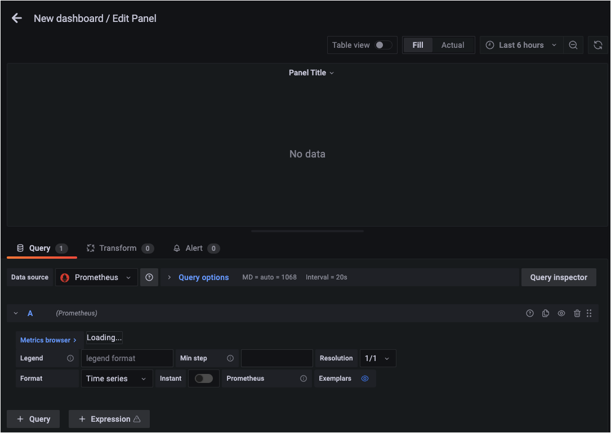
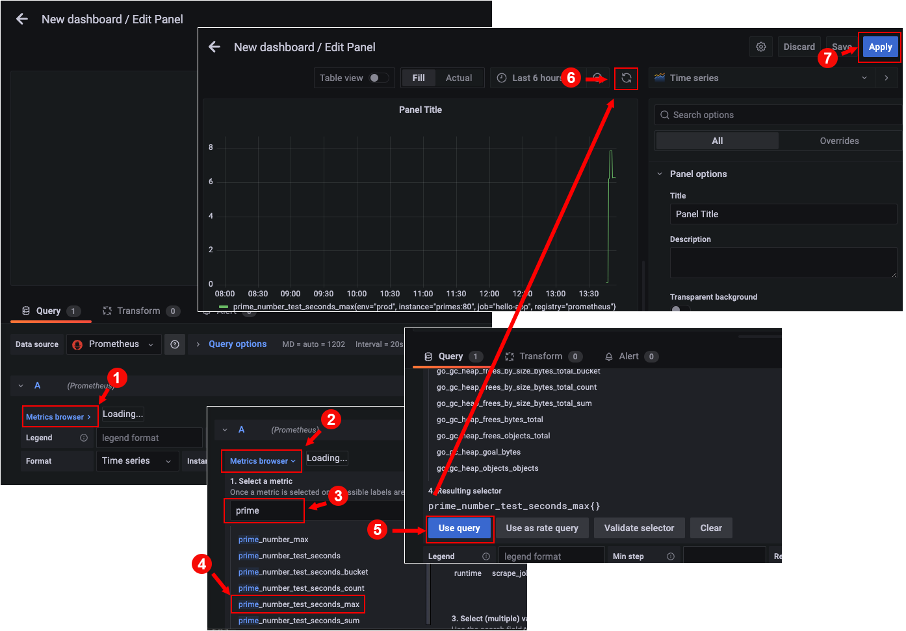
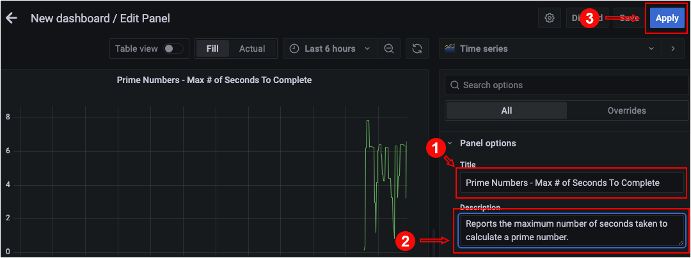
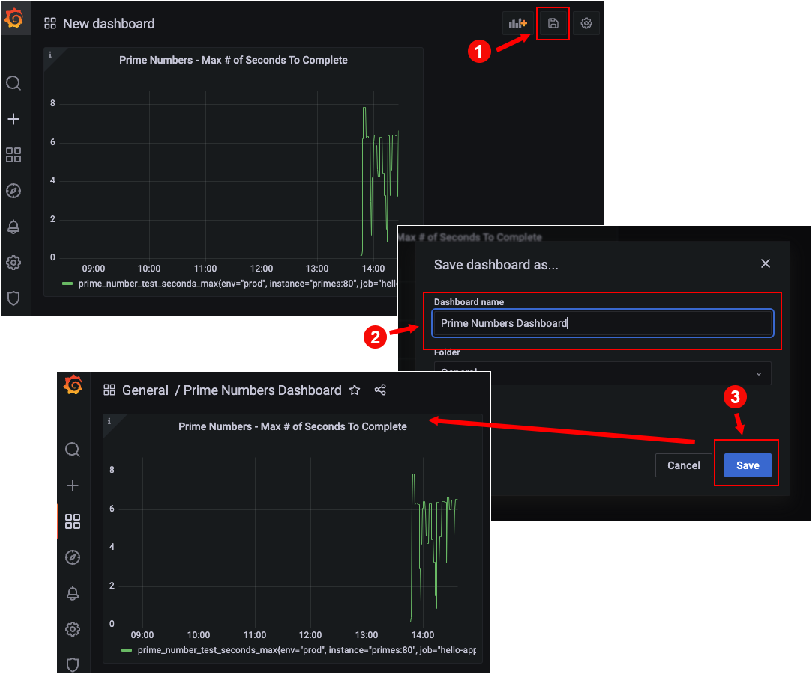
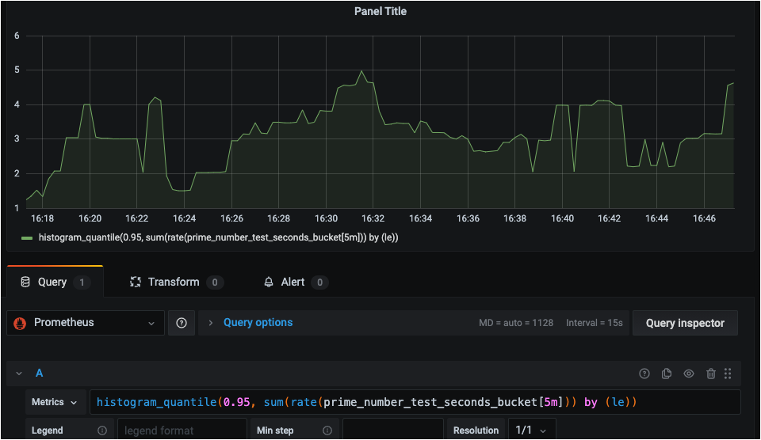

In this topic, you will create a Grafana dashboard that uses metric data captured and stored by Prometheus.

Be advised there are a lot of detailed figures in this topic. **Remember**: You can enlarge a figure for better viewing by sliding the content window to the left, as shown in the figure below.


# Generating data for the new Grafana dashboard

Before you create the new Grafana dashboard, you need to keep generating the metric data that gets captured and stored by Prometheus.

`Step 1:` Run the following command in **Terminal 1** to continuously submit a random number every 2 seconds using `curl` to the endpoint `/is-prime`:

```
while [ true ] ; do
        BITS=$(( ( RANDOM % 60 )  + 1 ))
        NUM=$(openssl prime -generate -bits $BITS)
        ROUTE=$(oc get route primes -n quarkus -o jsonpath='{.spec.host}')
        curl http://$ROUTE/is-prime/${NUM}
        sleep 2
done
```

# Creating a new dashboard

`Step 2:` Go to the upper left of the Grafana web page, hover over the `+` button on the left, and then select **Dashboard** as shown in the figure below.


The `New dashboard` page will appear.

----

`Step 3:` Click the text block labeled `Add a new panel` as shown in the figure below.


The panel configuration page will appear as shown in the figure below.



Each panel in a Grafana dashboard visualizes a computed metric. The metric can be either a single metric or a more complex query.

You will start by configuring the panel to display the data for the `prime_number_test_seconds_max` metric.

----

`Step 4a:` In the configuration page for the new Grafana panel, scroll to the bottom of the page and press the client arrow to the right of the label **Metrics browser**, as shown in the figure below. You'll then see the text box labeled `1. Select a metric`.



`Step 4b:` Enter the string `prime` in the `Select a metric` textbox. You'll be presented with a list of metrics that have the term `prime`.

`Step 4c:` Choose the term `prime_number_test_seconds_max` from the dropdown.

# KEY POINTS TO UNDERSTAND

* The selection `prime_number_test_seconds_max` describes the query for the custom `prime.number.test` metric that you created in Java code in a previous topic.
* The `seconds_max` suffix indicates that Grafana will display the maximum number of seconds it takes the `is-prime` endpoint to determine a prime when called by the the `curl` command from within the `while` loop.

`Step 4d:` Scroll down the metrics page. The button labeled `Use query` will appear. Click the button labeled `Use query`.

`Step 4e:` Go back to the top of the Edit panel page and click on the **Refresh** icon at the top right as shown in the figure above. The data for `prime_number_test_seconds_max` will plot out in a graph.

`Step 4f:` Click the button labeled `Apply` on the right side of the Edit panel page as shown in the figure above to save the Dashboard panel.

The completed panel will be added to the Grafana dashboard as shown in the figure below.


|NOTE|
|----|
|Statistics such as max, percentiles, and histogram counts decay over time to give greater weight to recent samples. Thus, you'll see the `max` value going up and down as older values drop out of the rolling window of samples.|


# Editing a dashboard panel

You just created a panel that displays the `prime_number_test_seconds_max` metric data. However, the panel is not very descriptive. At the least, the panel will benefit from having a title and description. Adding a title and description to the panel are the tasks you'll do next next.

----
`Step 5a:` Hover your mouse to the right of the `Panel Title` caption in the Dashboard page where the new panel you just created is displayed, as shown in the figure below. A down arrow will appear. Click it and select the `Edit Item` as shown in the figure below.


`Step 5b:` Click the Edit option from the dropdown that appears, as shown in the figure above.

You will be brought back to the Edit panel page.

The Edit panel lets you fine tune the display. Next you'll edit the **Title** and **Description** fields.

----

`Step 6a:` In the Edit panel page, go to the **Panel options** section and add the string `Prime Numbers - Max # of Seconds To Complete` to the **Title** text box as shown in the figure below.




`Step 6b:` Then, add the text `Reports the maximum number of seconds taken to calculate a prime number.` to the **Description** text box as shown in the figure above.

`Step 6c:` Click the button labeled `Apply` in the upper right of the Edit panel page as shown in the figure above. The edited panel with with the new caption `Prime Numbers - Max # of Seconds To Complete` will appear as shown in the figure below.

The updated panel will appear in the dashboard.

The next task is to name the dashboard.

# Naming the dashboard

`Step 7a:` Click the disk icon at the upper right of the Dashboard page as shown in the figure below.



`Step 7b:` In the **Dashboard name** text box, enter the title `Prime Numbers Dashboard`.

`Step 7c:` Click the button labeled `Save` on the lower right of the **Save dashbard as..** text box.

You have now created a dashboard panel and saveed it. Also, you've saved a Grafana dashboard.

# Adding more panels to a dashboard

A dashboard is the organizational unit for grouping panels. Under Grafana there can be many dashboards. And, each dashboard can have many panels.

The steps that follow describe how to add a new panel to a dashboard.

----

`Step 8a:` In the current dashboard page click the **Add panel** icon as shown in the figure below:


The **Select panel** page will appear.

`Step 8b:` Click the **Add new panel** text block as shown in the figure above.

Then create a new panel using the processes described above in steps two through six.

# Adjusting a panel's time span

Grafana allows you to adjust the date-time range in which the metric data is displayed. For example, you can view metric data that's been collected over the last 15 minutes. You can view data from the last two hours, three hours, or even over days. You can even set custom date ranges.

The follow steps demonstrate how to set a custom time range from a time you decide until `now`.

----

`Step 9a:` In the Prime Numbers Dashboard, select the date-time range drop down in the upper right of the web page as shown in the figure below. (By default, Grafana displays metric data collected during the last six hours.)


A dialog will appear. You can select predefined date-time ranges from the dialog, for example **Last 5 minutes**, **Last 15 minutes**, **Last 30 minutes**, etc.

`Step 9b:` In the **Absolute time range** section of the dialog box to the right of the graph, within the **From** text box, enter the exact date and time from when reporting will start, as shown in the figure above.

In the example above the **From** date time is `2022-04-28 14:00:00` which is April 28, 2022 starting at 2 PM.

`Step 9c:` In the **To** text box enter `now`. Entering `now` means that the cut-off time will be, as the name implies, now.

`Step 9d:` Click the button labeled `Apply time range` as shown in the figure above.

You have now saved the custom date range, the graph in the dashboard panel will display metric data accordingly.

`Step 9e:` Click **Save dashboard** again to save the changes.

# EXTRA CREDIT

You might want to take the time to exercise what you've just learned. Try adding panels for:

  - The HTTP endpoint timers using the `http_server_requests_seconds_count` metric. (Set the panel title `Primes HTTP Timer`.)
  - The RSS Memory using the `process_resident_memory_bytes` metric. (Set the panel title to `RSS Memory`.)
  - To see the quantile metrics, create another panel using the `prime_number_test_seconds_bucket` metric. When you select that metric, Grafana will notice that you want a histogram panel. You'll be presented with helpful tips demonstrating how to show the 95% quantile. The histogram graph will update to show the 95% quantile of the time it takes to evaluate whether a number is prime or not.




# Congratulations!

In this track you created a panel for a Grafana dashboard from scratch. The panel you created reported data from the `prime_number_test_seconds_max` metric gathered by Prometheus. Also, you gave the panel a useful, desrciptive name that made it easy to identify it in the Grana dashboard.

This is the last topic in the track.

This track demonstrated how a Quarkus application can utilize the [Micrometer Metrics extension](https://quarkus.io/guides/micrometer) to visualize metric data. You learned how to consume metrics using Prometheus and Grafana in conjunction with Micrometer.

In addition to gathering metric data, Micrometer, Prometheus and Grafana support alerting. Alerts generate immediate notifications when an application starts to reach danger thresholds. Also, alerts can be used with automation scripts so applications can react seamlessly to hazards without the need for human interaction.

# What's Next?

Congratulations on completing this lab. Keep learning about OpenShift:

* Visit the [Red Hat Developer learning page](https://developers.redhat.com/learn) for more labs and resources
* [Want to try a free, instant 30-day OpenShift cluster? Get started with the Developer Sandbox for Red Hat OpenShift](https://developers.redhat.com/developer-sandbox)

Don't forget to finish the lab and rate your experience on the next page. Thanks for playing!
