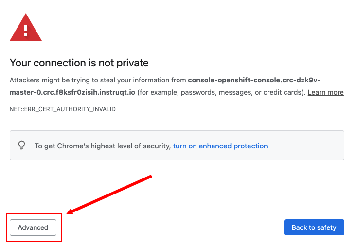
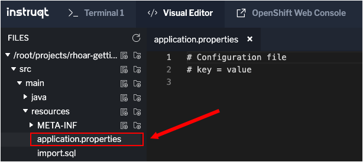

In this topic you'll create and implement the demonstration application as a project in OpenShift. You'll install the demonstration application's Postgres database. Also, you'll enable Live Coding.

Live Coding connects the demonstration application running on your local environment to an instance of the application running on OpenShift. Then, as you change source code locally, that code will be compiled and deployed automatically to the remote instance of the application running on OpenShift. The end result is that the code you write locally will run remotely on OpenShift automatically

|LEARN MORE ABOUT LIVE CODING|
|----|
|Read the article [Developer Joy](https://quarkus.io/vision/developer-joy) to learn more about the details of Live Coding under Quarkus.|

# Creating an OpenShift project using the CLI tool

`Step 1:` Run the following command in the **Terminal 1** console window to log into OpenShift:

```
oc login -u developer -p developer
```

You will see output similar to the following:

```bash
Login successful.

You don't have any projects. You can try to create a new project, by running

    oc new-project <projectname>
```

`Step 2:` Run the following command in the **Terminal 1** console window to create a project in OpenShift named `Sample Quarkus Datatable App`:

```
oc new-project quarkus --display-name="Sample Quarkus Datatable App"
```

You will get output similar to the following:

```
Now using project "quarkus" on server "https://api.crc.testing:6443".

You can add applications to this project with the 'new-app' command. For example, try:

    oc new-app rails-postgresql-example

to build a new example application in Ruby. Or use kubectl to deploy a simple Kubernetes application:

    kubectl create deployment hello-node --image=k8s.gcr.io/serve_hostname
```

# Deploying a Postgres database to OpenShift

The following step adds the Postgres database to the demonstration application.

----

`Step 3:` Run the following command in the **Terminal 1** console window to deploy a Postgres instance to the new project in OpenShift:

```
oc new-app \
    -e POSTGRESQL_USER=sa \
    -e POSTGRESQL_PASSWORD=sa \
    -e POSTGRESQL_DATABASE=person \
    --name=postgres-database \
    -l app.openshift.io/runtime=postgresql \
    openshift/postgresql
```

You'll get output similar to the following:

```
--> Found image d41bd78 (8 months old) in image stream "openshift/postgresql" under tag "13-el8" for "openshift/postgresql"

    PostgreSQL 13
    -------------
    PostgreSQL is an advanced Object-Relational database management system (DBMS). The image contains the client and server programs that you'll need to create, run, maintain and access a PostgreSQL DBMS server.

    Tags: database, postgresql, postgresql13, postgresql-13


--> Creating resources with label app.openshift.io/runtime=postgresql ...
    deployment.apps "postgres-database" created
    service "postgres-database" created
--> Success
    Application is not exposed. You can expose services to the outside world by executing one or more of thecommands below:
     'oc expose service/postgres-database'
    Run 'oc status' to view your app.
```

# Logging into OpenShift using the web console

`Step 4:` Click on `OpenShift Web Console` tab on the horizontal menu bar over the console window to the left to access the OpenShift web console web page. You will be presented with the console login page.


----

`Step 5:`  Enter the following access credentials into the OpenShift web console web page:

* Username: `developer`
* Password: `developer`

|NOTE|
|----|
|You might see the following warning notification due to using an untrusted security certificate.

If you do get the warning, click the **Advanced** button to complete the process necessary to grant permission to the browser to access the OpenShift web console.|

----

`Step 6:` Click the **Skip Tour** button.

----

`Step 7a:` Click the **Topology** tab on the left side of the OpenShift web console.

`Step 7b:` Then click the link `quarkus` in the projects list that appears as shown in the figure below.


You'll see a circular graphic that represents the Postgres database as shown in the figure below.


The presence of the circular graphic indicates that the Postgres database has been added to the OpenShift project.

# Adding the Quarkus OpenShift extension

Quarkus offers the ability to automatically generate OpenShift resources based on default and user supplied configuration. The OpenShift extension is a wrapper extension that brings together the [kubernetes](https://quarkus.io/guides/deploying-to-kubernetes) and [container-image-s2i](https://quarkus.io/guides/container-image#s2i) extensions.

The OpenShift extension makes it easier for the user to get started with Quarkus on OpenShift.

----

`Step 8:` Run the following command in **Terminal 1** to add the OpenShift extension to the demonstration project:

```
cd /root/projects/rhoar-getting-started/quarkus/panache-reactive && \
  mvn quarkus:add-extension -Dextensions="openshift"
```

You'll see the following output:

```
[INFO] Scanning for projects...
[INFO]
[INFO] --------------------------< org.acme:people >---------------------------
[INFO] Building people 1.0-SNAPSHOT
[INFO] --------------------------------[ jar ]---------------------------------
[INFO]
[INFO] --- quarkus-maven-plugin:2.0.1.Final:add-extension (default-cli) @ people ---
[INFO] [SUCCESS] ✅ Extension io.quarkus:quarkus-openshift has been installed
[INFO] ------------------------------------------------------------------------
[INFO] BUILD SUCCESS
[INFO] ------------------------------------------------------------------------
[INFO] Total time:  2.522 s
[INFO] Finished at: 2022-05-31T23:43:31Z
[INFO] ------------------------------------------------------------------------
```

# Configuring Quarkus for remote Live Coding

`Step 9a:` From the **Visual Editor** tab, navigate to the file  `src/main/resources/application.properties` as shown in the figure below.




`Step 9b:` Click the file `application.properties` to open it for editing and add the following code:

```text
# Remote Live Coding setup
quarkus.package.type=mutable-jar
quarkus.live-reload.password=changeit

# OpenShift Production Configuration
quarkus.datasource.reactive.url=postgresql://postgres-database:5432/person
quarkus.datasource.username=sa
quarkus.datasource.password=sa
quarkus.hibernate-orm.database.generation=drop-and-create
quarkus.hibernate-orm.sql-load-script=import.sql
```

`Step 9c:` Click on the `Disk` icon or press `CTRL+S` to save the contents of `EyeColor.java`.

**KEY CONCEPTS TO UNDERSTAND**

The statement `quarkus.package.type=mutable-jar` shown above in the file `application.properties` indicates that Quarkus will package the application as a `mutable` application. A mutable application is one that's capable of being changed and updated in-place, on demand and on a regular basis.

# Deploying the application to OpenShift

`Step 10:` Run the following command in **Terminal 1** to build and deploy the Quarkus application in OpenShift:

```
mvn clean package -DskipTests \
-Dquarkus.kubernetes.deploy=true \
-Dquarkus.container-image.build=true \
-Dquarkus.kubernetes-client.trust-certs=true \
-Dquarkus.kubernetes.deployment-target=openshift \
-Dquarkus.openshift.route.expose=true \
-Dquarkus.openshift.annotations.\"app.openshift.io/connects-to\"=postgres-database \
-Dquarkus.openshift.env.vars.quarkus-launch-devmode=true
```

You will see a good deal of screen output sent to the console window over a minute or two. Then, upon success you will see output similar to the following:

```
[INFO] [io.quarkus.deployment.QuarkusAugmentor] Quarkus augmentation completed in 94163ms
[INFO] ------------------------------------------------------------------------
[INFO] BUILD SUCCESS
[INFO] ------------------------------------------------------------------------
[INFO] Total time:  02:15 min
[INFO] Finished at: 2022-05-31T23:52:31Z
[INFO] ------------------------------------------------------------------------
```

**KEY CONCEPTS TO UNDERSTAND**

The following list describes the meaning of the options used in the command `mvn clean package`:

* `quarkus.kubernetes.deploy=true` - Instructs the extension to deploy to OpenShift after the container image is built.
* `quarkus.container-image.build=true` - Instructs the extension to build a container image.
* `quarkus.kubernetes-client.trust-certs=true` - Indicates that the application is using self-signed certificates and that the application is to trust the certificates.
* `quarkus.kubernetes.deployment-target=openshift` - Instructs the extension to generate and create the OpenShift resources, such as `DeploymentConfig` and `Service`, after building the container.
* `quarkus.openshift.route.expose=true` - Instructs the extension to generate an OpenShift [`Route`](https://docs.openshift.com/container-platform/3.11/architecture/networking/routes.html) making the demonstration application accessible from a browser.
* `quarkus.kubernetes.annotations."app.openshift.io/connects-to"=postgres-database` - Adds a visual connector to show the DB connection in the OpenShift web console topology view.
* `quarkus.openshift.env.vars.quarkus-launch-devmode=true` - Sets an environment variable in the container to tell Quarkus to launch in dev mode instead of production mode, which is the default when deploying to Kubernetes or OpenShift.


`Step 11:` Run the following command in **Terminal 1** to verify that the demonstration application has been rolled out:

```
oc rollout status -w dc/people
```

Upon success you will see the following output:

```
Waiting for rollout to finish: 0 of 1 updated replicas are available...
Waiting for latest deployment config spec to be observed by the controller loop...
replication controller "people-1" successfully rolled out
```

|NOTE|
|----|
|If the `oc rollout` command doesn't seem to finish, press the `CTRL+C` keys to terminate the process. Then run the command, `oc rollout status -w dc/people` again.|

Do a quick test to ensure the remote app is running by using `curl` to retrieve the list of sample people:

----

`Step 12a:` Run the following command in **Terminal 1** to get the demonstration application's Route:

```
export APP_URL=`oc get route people -n quarkus -o jsonpath='{"http://"}{.spec.host}'` && echo $APP_URL
```

You'll get output similar to the following:

```
http://people-quarkus.crc-dzk9v-master-0.crc.cgamswlsavav.instruqt.io
```

`Step 12b:` Run the following command in **Terminal 1** to make the environment variable available in the topics to come.

```
echo "export APP_URL=${APP_URL}" >> /root/.bashrc
```

|NOTE|
|----|
|You may need to run the `oc get route ...`  again if the initial execution doesn't work.|

----

`Step 13:` Run the following command in **Terminal 1** to execute `curl` against the `/person` endpoint of the demonstration application's RESTful API. The result will be piped to the [`jq`](https://stedolan.github.io/jq/) utility that displays the JSON in a pretty format:

```
curl -s $APP_URL/person | jq
```

You will see the following output:

```json
[
  {
    "id": 1,
    "birth": "1974-08-15",
    "eyes": "BLUE",
    "name": "Farid Ulyanov"
  },
  {
    "id": 2,
    "birth": "1984-05-24",
    "eyes": "BROWN",
    "name": "Salvador L. Witcher"
  },
  {
    "id": 3,
    "birth": "1999-04-25",
    "eyes": "HAZEL",
    "name": "Huỳnh Kim Huê"
  }
]
```

The demonstration application is now running on OpenShift.

# Congratulations!

You've seen how to build a basic Quarkus application and add a basic query using Panache Reactive. Also, you set up a remote connection to Live Code the demonstration application as it runs in the target environment.

In the next topic you'll add some more Panache Reactive queries.

----

**NEXT:** Adding reactive queries to the `Person` entity

