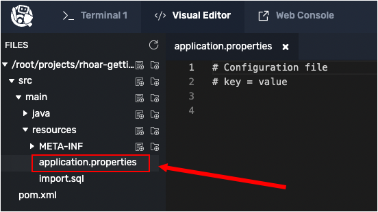

# Implementing remote Live Coding

OpenShift lets you configure your application to run in remote development mode. When running in remote development mode, you can make changes to an application's local files and then cascade those changes immediately into a remote container that's running remote OpenShift cluster.

This capability is called Live Coding. Live Coding allows you to develop code in the same environment your application runs in locally. Live Coding gives your code access to the same services that the application running in OpenShift is using.

In this topic you will deploy the application to OpenShift. Then you'll connect the application to your local environment. The end result is that your code runs as a fully functional app on the target OpenShift platform, yet you can edit code locally.

# Opening the OpenShift web console

OpenShift ships with a web-based console that allows users to perform various tasks via a browser. Let's start out by accessing the OpenShift web console.

----

`Step 1:` Click on **Web Console** tab on the horizontal menu bar over the terminal window to the left. You will be presented with a login page as shown in the figure below.


----

`Step 2:` Log into the web console using the credentials shown below:

* Username: `developer`
* Password: `developer`

NOTE: You might see the following warning notification due to using an untrusted security certificate.

If you do get the warning, click the **Advanced** button to complete the process necessary to grant permission to the browser to access the OpenShift web console.

----

`Step 3:` When you log into the web console, you are presented with a dialog offering a tour of OpenShift web console features. Click the **Skip Tour** button.

After you dismiss the tour page, you'll see that there are no projects found, as shown in the figure below.


This is about to change. You will add a project to OpenShift.

# Logging into OpenShift from the command line

You'll use the `oc` CLI command to log into OpenShift so that you can work on the demonstration application. After using `oc` to log in, you'be able to work with OpenShift in the web console and at the command line.

----

`Step 4:` Run the following command in **Terminal 1** to log in as the user `developer` using the password `developer`:

```
oc login -u developer -p developer
```

You'll see the following result:

```
Login successful.

You don't have any projects. You can try to create a new project, by running

    oc new-project <projectname>
```

You have now logged into OpenShift from the command line.

# Accessing the OpenShift project

Let's create a project that you'll use to host your applications.

----

`Step 5:` Run the following command in **Terminal 1** to create a new project in OpenShift with the display name `Sample Quarkus Datatable App`:

```
oc new-project quarkus --display-name="Sample Quarkus Datatable App"
```

You'll get output similar to the following:

```
Now using project "quarkus" on server "https://api.crc.testing:6443".

You can add applications to this project with the 'new-app' command. For example, try:

    oc new-app rails-postgresql-example

to build a new example application in Ruby. Or use `kubectl` to deploy a simple Kubernetes application:

    kubectl create deployment hello-node --image=k8s.gcr.io/serve_hostname
```

# Deploying the Postgres database

Next, you need to add a Postgres database to the project you just created.

----

`Step 6:` Run the following command in **Terminal 1** to deploy a Postgres instance to the new project:

```
oc new-app \
    -e POSTGRESQL_USER=sa \
    -e POSTGRESQL_PASSWORD=sa \
    -e POSTGRESQL_DATABASE=person \
    --name=postgres-database \
    -l app.openshift.io/runtime=postgresql \
    openshift/postgresql
```

You'll get output similar to the following:

```
--> Found image d41bd78 (7 months old) in image stream "openshift/postgresql" under tag "13-el8" for "openshift/postgresql"

    PostgreSQL 13
    -------------
    PostgreSQL is an advanced Object-Relational database management system (DBMS). The image contains the client and server programs that you'll need to create, run, maintain and access a PostgreSQL DBMS server.

    Tags: database, postgresql, postgresql13, postgresql-13


--> Creating resources with label app.openshift.io/runtime=postgresql ...
    deployment.apps "postgres-database" created
    service "postgres-database" created
--> Success
    Application is not exposed. You can expose services to the outside world by executing one or more of the commands below:
     'oc expose service/postgres-database'
    Run 'oc status' to view your app.
```

The Postgres database is now installed.

----

`Step 7:` Click the **Web Console** tab on the horizontal menu bar over the terminal window to the left.

The OpenShift web console will appear.

----

`Step 8a:` Click the **Topology** tab on the left side of the OpenShift web console.

`Step 8b:` Then click the link `quarkus` in the projects list that appears as shown in the figure below.


You'll see a circular graphic that represents the Postgres database as shown in the figure below.


You'll be working in the Topology view in upcoming topics.

# Adding the Quarkus OpenShift extension

The OpenShift extension for Quarkus provides the capability to automatically generate OpenShift resources based on default and user-supplied configuration settings.

The OpenShift extension is actually a wrapper extension that brings together the [Kubernetes](https://quarkus.io/guides/deploying-to-kubernetes) and [container-image-s2i](https://quarkus.io/guides/container-image#s2i) extensions with their defaults settings. Using thing the extension makes it easier to get started with Quarkus on OpenShift.

Let's add the OpenShift extension.

----

`Step 9:` Run the following command in **Terminal 1** to navigate to source code's working directory:

```console
cd /root/projects/rhoar-getting-started/quarkus/panache && pwd
```

You'll get the following output:

```
/root/projects/rhoar-getting-started/quarkus/panache
```

----

`Step 10:` Run the following command in **Terminal 1** to add the OpenShift extension for Quarkus:

```console
mvn quarkus:add-extension -Dextensions="openshift"
```

There will be some screen output. Then, at the end of the installation process you'll see screen output similar to the following:

```console
INFO] --- quarkus-maven-plugin:2.0.0.Final:add-extension (default-cli) @ people ---
[INFO] [SUCCESS] ?  Extension io.quarkus:quarkus-openshift has been installed
[INFO] ------------------------------------------------------------------------
[INFO] BUILD SUCCESS
[INFO] ------------------------------------------------------------------------
```

# Configuring Quarkus for remote live coding

`Step 11:` Go to the **Visual Editor** tab and using the directory tree on the left side of the visual editor, navigate to the directory `src/main/resources/`.

----

`Step 12:` Click the file named `application.properties` in the directory tree to open the file for editing as shown in the figure below:



----

`Step 13:` Add the following code to the `application.properties` file. The code you're adding to `application.properties` file contains Quarkus configuration settings:

```java
# Remote Live Coding setup
quarkus.package.type=mutable-jar
quarkus.live-reload.password=changeit

# OpenShift Production Configuration
quarkus.datasource.db-kind=postgresql
quarkus.datasource.jdbc.url=jdbc:postgresql://postgres-database:5432/person
quarkus.datasource.username=sa
quarkus.datasource.password=sa
quarkus.hibernate-orm.database.generation=drop-and-create
quarkus.hibernate-orm.sql-load-script = import.sql
```

-----

`Step 14:` Save the file `application.properties` by clicking the `Disk` icon or pressing the `CTRL+S` keys.

# Analyzing the settings in the application.properties file

`Step 15:` Take a look at the key-value entry `quarkus.package.type=mutable-jar` in the `application.properties` file.

The `quarkus.package.type=mutable-jar` declares that Quarkus is to package the application as a mutable application.

A mutable application includes the artifacts that are needed at deployment time so that Quarkus can run in development mode. Running in development mode means that Quarkus can do Live Code updating.

Remember, when running as Live Code, the changes you make in the application source code cascade immediately into the runtime environment in the OpenShift cluster. Live Coding lets you update and compile the application on the fly.

NOTE: Mutable applications running in development mode take up a bit more disk space than code running in production mode.

Notice the line `quarkus.datasource.jdbc.url=jdbc:postgresql://postgres-database:5432/person`. This entry configures Quarkus to use the Postgres database. The host name `postgres-database` is resolved by OpenShift to map to the running Postgres database host.

Also notice the following lines of key-value pairs:

```java
quarkus.datasource.username=sa
quarkus.datasource.password=sa
```
The lines above declare the username/password pair for accessing the Quarkus datasource, which in this case is Postgres.

The password is used to secure communication between the remote side and the local side.

One of the useful features of Live Coding is that you can change the remote live-reload password to whatever you want.

# Deploying the demonstration application to OpenShift


`Step 16:` Run the following command in **Terminal 1** to build and deploy the Quarkus application in Openshift:

```
mvn clean package -DskipTests \
-Dquarkus.kubernetes.deploy=true \
-Dquarkus.kubernetes-client.trust-certs=true \
-Dquarkus.kubernetes.deployment-target=openshift \
-Dquarkus.openshift.route.expose=true \
-Dquarkus.openshift.annotations.\"app.openshift.io/connects-to\"=postgres-database \
-Dquarkus.openshift.env.vars.quarkus-launch-devmode=true
```

**WHERE:**

* `quarkus.kubernetes.deploy=true` - Indicates the extension to deploy to OpenShift after the container image is built.
* `quarkus.kubernetes-client.trust-certs=true` - Indicates that the application is using self-signed certificates and that those certificates can be trusted.
* `quarkus.kubernetes.deployment-target=openshift` - Indicates that the extension will create the OpenShift resources such as `DeploymentConfig`s and `Service`s after building the deployment container in the OpenShift cluster.
* `quarkus.openshift.route.expose=true` - Indicates the extension will generate an OpenShift `Route` so you can access the application from a browser.
* `quarkus.kubernetes.annotations."app.openshift.io/connects-to"=postgres-database` - Adds a visual connector in the web console Topology view that shows the connection between the application and its database.
* `quarkus.openshift.env.vars.quarkus-launch-devmode=true` - Sets an environment variable in the container to tell Quarkus to launch in development mode as opposed to production mode. Production mode is the default when deploying to Kubernetes or OpenShift.


There will be a good deal of screen output. When the `mvn clean package` command finishes you will see output similar to the following:

```
[INFO] [io.quarkus.deployment.QuarkusAugmentor] Quarkus augmentation completed in 91102ms
[INFO] ------------------------------------------------------------------------
[INFO] BUILD SUCCESS
[INFO] ------------------------------------------------------------------------
```

----

`Step 17:` Run the following command in **Terminal 1** to verify that the package rollout has been completed:

```
oc rollout status -w dc/people
```

You might need to wait about 30 seconds. Eventually you will get the following output:

```
replication controller "people-1" successfully rolled out` before continuing.
```

NOTE: If the `oc rollout` command seems not to finish, press the `CTRL+C` keys to terminate the process. Then, run the `oc rollout` command again.

----

`Step 18:`  Click the **Web Console:** tab to view the updated **Topology** graphics as shown in the figure below.


Notice that both the People application and the Postgres database are represented in the graphic. Also notice that the relationship between the People application and the Postgres database is described visually by a connecting line between the two.

# Verifying the RESTful API from the command line

Next, let's do an informal test using the `curl` command to verify that the application is up and running and its RESTful endpoint is accessible.

----

`Step 18:` Run the following command in **Terminal 1** to get the URL representing the route within the OpenShift cluster. Then assign the URL to an environment variable named `APP_URL`:

```
export APP_URL=`oc get route people -n quarkus -o jsonpath='{"http://"}{.spec.host}'`
```

----

`Step 19:` Run the following command in **Terminal 1** to read the value of the `APP_URL` environment variable:

```
echo $APP_URL
```

You'll get output similar to, but not exactly like, the following:

```
http://people-quarkus.crc-lgph7-master-0.crc.nqguvly2ktsc.instruqt.io
```

----

`Step 20:` Run the following command in **Terminal 1** to exercise the application's RESTful endpoint `/person` and pipe the output to `jq` in order to prettify the JSON response. (The [`jq`](https://stedolan.github.io/jq/manual/) utility is already installed in the interactive learning environment.)

```
curl -s $APP_URL/person | jq
```

You will see the following output:

```json
[
  {
    "id": 1,
    "birth": "1974-08-15",
    "eyes": "BLUE",
    "name": "Farid Ulyanov"
  },
  {
    "id": 2,
    "birth": "1984-05-24",
    "eyes": "BROWN",
    "name": "Salvador L. Witcher"
  },
  {
    "id": 3,
    "birth": "1999-04-25",
    "eyes": "HAZEL",
    "name": "Huỳnh Kim Huê"
  }
]
```

The app is now running on OpenShift.

# Saving the APP_URL environment variable

You'll refer to the route's URL often, so you need to make it available to any upcoming process.

The route's URL is now in the environment variable `APP_URL`. Store the environment variable and its value in the file `/root/.bashrc`. (`.bashrc` is called whenever a terminal process starts.)

----

`Step 21:` Run the following command in **Terminal 1** to persist the environment variable `APP_URL` and the key-value pair in an `export` statement that's saved to the file `/root/.bashrc`:

```bash
echo "export APP_URL=${APP_URL}" >> /root/.bashrc
```

# Congratulations!

In this topic you've learned how to log in and create an OpenShift project using the `oc` CLI. You added Postgres to the OpenShift project. Then you configured the source code for the demonstration application to bind to the Postgres database.

You used the `mvn clean package` in a terminal window to deploy the demonstration application to OpenShift. Finally, you exercised the `/person` endpoint in the demonstration application's RESTful API to verify that the application is up and running.

In the next step we'll create additional Panache queries.

----

**NEXT:** Adding queries to the demonstration project's source code.