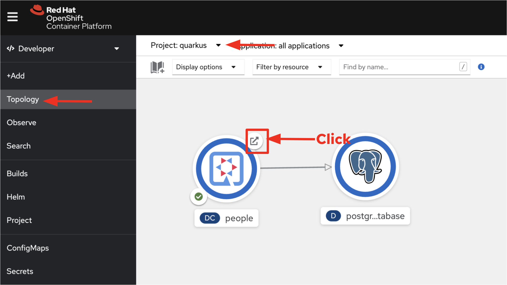
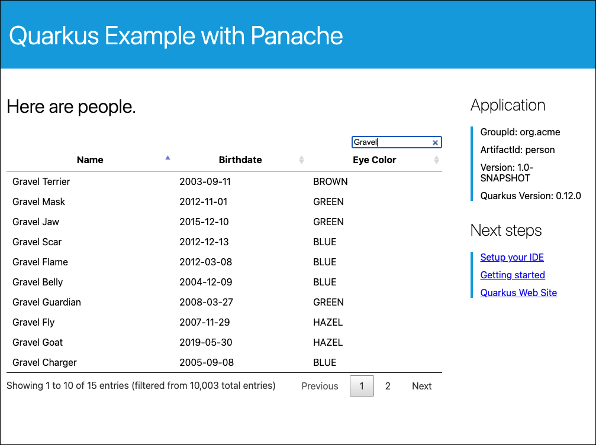

In this topic you will exercise the demonstration application using the front-end web site.

----

`Step 1:` Click the **Web Console** tab in the horizontal menu bar over the terminal window to the left.

----

`Step 2:` Click the **Topology** tab on the left side on the OpenShift web console. Then, click on the `Open URL` icon in the circular People graphic as shown in the figure below.

You'll be taken to the demonstration application's Web UI as shown in the figure below.

Notice the total number of records reported at the bottom of the figure shown above.

----

`Step 3:` Type in the word `Gravel` in the search box of the web UI. You will get a response similar to the one shown in the figure shown below.

It's important to remember that rather than having all 10,000 records loaded in the browser, DataTable makes a call back to the `/person/datatable` REST endpoint to fetch only those records that need to be shown, based on page size, the current page being viewed, and any search filters.

A maximum page size of `10` for each REST call will only return up to 10 records no matter how many there are in the database.

Skip around a few pages, try some different searches, and notice that the data is only loaded when needed. The overall performance is very good even for low-bandwidth connections or huge data sets.

# BONUS SECTION: Open the solution in an IDE in the cloud!
Want to continue exploring this solution on your own in the cloud?

You can use the free [Red Hat OpenShift Dev Spaces](https://developers.redhat.com/products/openshift-dev-spaces/overview) IDE running on the free [Developer Sandbox for Red Hat OpenShift](http://red.ht/dev-sandbox). [Run here](https://workspaces.openshift.com) to login or to register if you are a new user. This free service expires after 30 days, but you can always enable a new free 30-day subscription.

Once logged in, [run this](https://workspaces.openshift.com/f?url=https://raw.githubusercontent.com/openshift-katacoda/rhoar-getting-started/solution/quarkus/panache/devfile.yaml) to open the solution for this project in the cloud IDE.

## Congratulations

In this topic you got a glimpse of the power of Quarkus apps when working with large amounts of data.

You also got to experience Quarkus remote development. Quarkus remote development makes it so that local changes cascade immediately into the remote application. You deployed the application to OpenShift and Live Code made changes on the fly.

There is much more to Quarkus than what you've seen here. Learn even more about the architecture and capabilities of this exciting new framework for Java developers [by going here](https://developers.redhat.com/products/quarkus/getting-started).

----

This is the final topic in this track.

# Extra credit

There are [many other features of DataTables](https://datatables.net/manual/server-side) that could be supported on the server side with Quarkus and Panache. For example, when the endpoint is accessed, the set of columns upon which sorting wil be executed is also passed using the `order` and `columns` arrays. If you have time, try to add additional code to support these incoming parameters and order the resulting records accordingly!