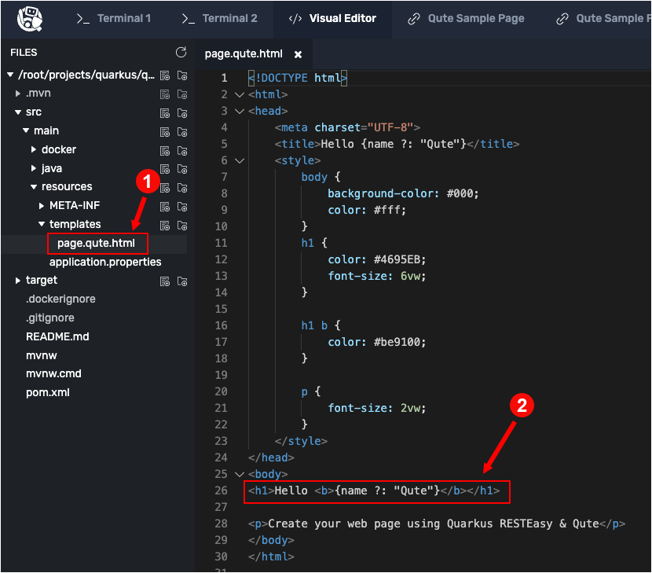
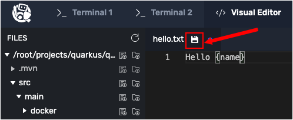
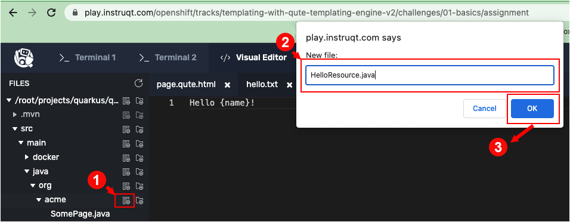

In this topic you will install the demonstration application using the Maven Quarkus plugin. The installation process also installs the Qute extensions. You'll get the application up and running in [Live Coding](https://developers.redhat.com/blog/2021/02/11/enhancing-the-development-loop-with-quarkus-remote-development) mode.

Then you'll exercise a preexisting RESTful endpoint published by the demonstration application. This endpoint uses a Qute template to render data into HTML.

Finally, you'll create a new Qute template from scratch. You'll also create a RESTful endpoint that uses the Qute template you'll create.

# Inspecting the Java runtime

This track ships with a Java Runtime (JRE) preinstalled. Let's verify that the JRE was properly installed during the initialization process.

----

`Step 1:` Run the following command in the **Terminal 1** console to the left to verify that the Java Runtime is installed:

```
$JAVA_HOME/bin/java --version
```

You will see output similar to the following:

```console
openjdk 17.0.6 2023-01-17
OpenJDK Runtime Environment Temurin-17.0.6+10 (build 17.0.6+10)
OpenJDK 64-Bit Server VM Temurin-17.0.6+10 (build 17.0.6+10, mixed mode, sharing)
```

|NOTE:|
|----|
|If the `$JAVA_HOME/bin/java --version`  command fails, wait a few moments and try again. (The JRE is installed in a background process and might take a few moments depending on system load)|


# Creating sample project

Let's create the basic Quarkus **Hello World** application. The creation process uses the Quarkus Maven Plugin to generate the demonstration Qute project. The project will include the necessary Qute extensions.

----

`Step 2:` Run the following command in the **Terminal 1** console to create the Quarkus demonstration project:

```
cd /root/projects/quarkus &&
 mvn io.quarkus:quarkus-maven-plugin:2.16.2.Final:create \
    -DprojectGroupId=org.acme \
    -DprojectArtifactId=qute \
    -Dextensions="quarkus-resteasy-qute,quarkus-vertx-web,quarkus-qute,quarkus-scheduler"
```

|NOTE:|
|----|
|The first time you create an app, new dependencies may be downloaded via Maven. This may take a minute or so. The download should only happen once. After that, things will go even faster.|

You will see a lot of output to the screen, finally when the process finishes you'll see the following output:

```
[SUCCESS] ?  quarkus project has been successfully generated in:
--> /var/roothome/projects/quarkus/qute
-----------
[INFO]
[INFO] ========================================================================================
[INFO] Your new application has been created in /var/roothome/projects/quarkus/qute
[INFO] Navigate into this directory and launch your application with mvn quarkus:dev
[INFO] Your application will be accessible on http://localhost:8080
[INFO] ========================================================================================
[INFO]
[INFO] ------------------------------------------------------------------------
[INFO] BUILD SUCCESS
[INFO] ------------------------------------------------------------------------
```

The demonstration project uses the `quarkus-resteasy-qute` extension, which includes the [`Qute` templating engine](https://quarkus.io/guides/qute) as well as integration with JAX-RS via [RestEasy](https://docs.jboss.org/resteasy/docs/3.0.19.Final/userguide/html_single/index.html). There are also a few other extensions included that you'll use later on.

----

# Starting the demonstration application

Quarkus has a feature called **Live Coding**. When Live Coding is in force, any change a developer makes to code that's stored locally is automatically cascaded into the OpenShift cluster in which the code is running remotely.

Let's enable Live Coding.

----

`Step 3:` Run on the following command in **Terminal 1** to start the demonstration project in Live Coding mode:

```
mvn quarkus:dev -Dquarkus.http.host=0.0.0.0 -f /root/projects/quarkus/qute
```

You will see the following output, which continues with log output:

```console
__  ____  __  _____   ___  __ ____  ______
 --/ __ \/ / / / _ | / _ \/ //_/ / / / __/
 -/ /_/ / /_/ / __ |/ , _/ ,< / /_/ /\ \
--\___\_\____/_/ |_/_/|_/_/|_|\____/___/
INFO  [io.quarkus] (Quarkus Main Thread) qute 1.0.0-SNAPSHOT on JVM (powered by Quarkus x.xx.xx) started in x.xxxs. Listening on: http://0.0.0.0:8080
INFO  [io.quarkus] (Quarkus Main Thread) Profile dev activated. Live Coding activated.
INFO  [io.quarkus] (Quarkus Main Thread) Installed features: [cdi, mutiny, qute, resteasy, resteasy-qute, scheduler, smallrye-context-propagation, vertx, vertx-web]
```

NOTE: The first time you build the app, new dependencies might be downloaded via Maven. This new dependencies download will only happen once. After that, initialization will go faster.

The app is now running locally within this track. Also, because Live Coding is enabled, the local instance of the application is bound to the remote instance running in the OpenShift cluster.

# Verifying that the demonstration application is running

You will now verify that the application's RESTful endpoints are running using two techniques. The first technique uses `curl` to view the HTML returned from an endpoint. The second technique is the view the rendered HTML in a browser built into the interactive learning environment.

----

`Step 4:` Click the **Terminal 2** tab directly to the right of the **Terminal 1** tab on the horizontal menu bar over the console to the left. You are using the **Terminal 2** window because **Terminal 1** is busy running the code for the demonstration application locally.

----

`Step 5:` Run the following command in the **Terminal 2** console to get the HTML for the page named Qute Sample Page:

```console
curl localhost:8080/some-page
```

You'll get the following output:

```html
<!DOCTYPE html>
<html>
<head>
    <meta charset="UTF-8">
    <title>Hello Qute</title>
    <style>
        body {
            background-color: #000;
            color: #fff;
        }
        h1 {
            color: #4695EB;
            font-size: 6vw;
        }

        h1 b {
            color: #be9100;
        }

        p {
            font-size: 2vw;
        }
    </style>
</head>
<body>
<h1>Hello <b>Qute</b></h1>

<p>Create your web page using Quarkus RESTEasy & Qute</p>
</body>
</html>
```

The HTML shown above is output from the RESTful endpoint `/some-page`.

Now let's look at the rendered HTML in a browser within the interactive learning environment.

----

`Step 6:` Click the tab labeled **Qute Sample Page** on the horizontal menu bar over the console window on the left. You'll see the HTML code rendered into the internal web browser as shown in the figure below.


Let's examine the server-side code to get an introductory understanding about how Qute templates work.

----

`Step 7:` Click the **Visual Editor** tab in the horizontal menu bar above the console window to the left. You'll be presented with the directories and files for the demonstration application, starting from the directory `/root/projects/quarkus/qute`.

# Understanding how Qute templating works


`Step 8:` Using the **Visual Editor**, navigate to the file, `qute/src/main/resources/templates/page.qute.html` as shown in the figure below:



----

`Step 9:` Take a look at the HTML at Line 26 as shown below:

```html
<h1>Hello <b>{name ?: "Qute"}</b></h1>
```
Notice the data expression `{name ?: "Qute"}`.

The intelligence behind the template will do the following. If a value for the data expression variable `name` is present when the page is rendered, that data expression variable value will be used. If not, the string `Qute` will be rendered as output in the HTML.

The question to be answered at this point is "how is a value passed to the data expression variable `name`?" The answer is found in the file, `qute/src/main/java/org/acme/SomePage.java`.

----

`Step 10:` Use the **Visual Editor** to navigate to the directory `qute/src/main/java/org/acme/SomePage.java` from the directory as shown in the figure below.


The file `SomePage.java` represents an endpoint in the demonstration application's RESTful API. In this case `SomePage.java` exposes an endpoint `/some-page` and provides intelligence to process requests to that endpoint. Thus, when you call `curl localhost:8080/some-page`, you are calling the endpoint.

The `SomePage.java` uses Java annotations in a variety of ways. The `@Path` annotation declares the endpoint path. The `@GET` and `@Produces` annotations declare that the method `get(@QueryParam("name") String name)` processes `GET` requests and returns a response formatted as HTML as specified by `MediaType.TEXT_HTML`.

Also, the `get()` method inspects the request's query string for a parameter with the name `name`. The value of that query string parameter is passed into the `get()` method where it's used in the following statement:

`return page.data("name", name);`

At this point there's a lot of implicit processing and naming conventions in force that are particular to the way `Qute` works.


Going back to the statement, `return page.data("name", name);` you can see that there is no variable named `page` declared in the method. Rather, `page` is declared as a field in the class like so:

```java
    @Inject
    Template page;
```

The value for `page` is of type `io.quarkus.qute.Template`. `Qute` does a good deal of implicit programming when the annotation `@Inject` is used with a `Template` object.

Under `Qute` if there is no `@ResourcePath` annotation provided, `Qute` uses the field name as the name of the template. (The `@ResourcePath` annotation tells `Qute` where to find a template file.)

By default, `Qute` goes into the directory `qute/src/main/resources/templates/` in search of a file that has a name beginning with the field name. (The `Qute` framework specifies that the directory `resources/templates/` is the default and conventional location where `Qute` templates are to be stored.)

In this case, the field name is `page`. Thus, `Qute` goes off in search of a file in the directory `qute/src/main/resources/templates/` that begin with the string `page`. The filename `page.qute.html` conforms to the convention. Thus, that is the file that `Qute` uses as the HTML rendering template in which to inject the value of the query string parameter `name`.

In the case of the call `curl localhost:8080/some-page`, no query parameter is provided. Thus, as you read above, the demonstration project will insert the string `Qute` in the line of template code at `<h1>Hello <b>{name ?: "Qute"}</b></h1>`. The actual HTML returned from the server will be `<h1>Hello <b>Qute</b></h1>`, which is the response you viewed previously.

Were you to execute the command `curl localhost:8080/some-page?name=Jerry` the HTML will response will be `<h1>Hello <b>Jerry</b></h1>`.

Let's try to get the name `Jerry` next.

----

`Step 11:` Run the following command in **Terminal 2** to pass the name `Jerry` to the demonstration application and then pipe the results to the `grep` command to filter out HTML that has the word Jerry:

```console
curl -s http://localhost:8080/some-page?name=Jerry | grep Jerry
```

You'll get output similar to the following:

```html
<title>Hello Jerry</title>
<h1>Hello <b>Jerry</b></h1>
```
As you can see, assigning a value to the `name` query string parameter works as expected.

Let's keep the app running and continue using Quarkus' Live Coding feature. Changes you make are immediately available in the running app when developing Quarkus apps.

# Creating a basic template

You've just worked with an existing template. Now, let's create a new text-based template from scratch.

----

`Step 12a:` Using the **Visual Editor**, navigate to the directory `/root/projects/quarkus/qute/src/main/resources/templates/`.

`Step 12b:` Click the `New File` icon to create a file named `hello.txt` in the directory `/root/projects/quarkus/qute/src/main/resources/templates/` as shown in the figure below:


`Step 12c:` Click the filename `hello.txt` to open the file for editing.

`Step 12d:` Add the text shown below to the file `hello.txt`:

```text
Hello {name}!
```

**WHERE** `{name}` is a placeholder expression that is evaluated when the template is rendered.

|NOTE:|
|----|
|By default, all files located in the `src/main/resources/templates` directory, and its subdirectories are registered as templates. Templates are validated during startup and watched for changes in the development mode.|

----

`Step 12e:` Click on the `Disk` icon or press `CTRL+S` keys to save the file, as shown in the figure below:



# Creating REST endpoint to access template

Now let’s create a resource class that defines a RESTful endpoint and binds the endpoint to the template defined in `hello.txt`.

----

`Step 13a:` Using the **Visual Editor**, go to the directory `qute/src/main/java/org/acme/` and click the `New File` icon to create a file named `HelloResource.java`, as shown in the figure below:




`Step 13b:` Click the new file `HelloResource.java` in the Visual Editor directory tree to open it for editing.

`Step 13c:` Add the following code to the file `HelloResource.java`:

```java
package org.acme;

import javax.inject.Inject;
import javax.ws.rs.GET;
import javax.ws.rs.Path;
import javax.ws.rs.Produces;
import javax.ws.rs.QueryParam;
import javax.ws.rs.core.MediaType;

import io.quarkus.qute.TemplateInstance;
import io.quarkus.qute.Template;

@Path("hello")
public class HelloResource {

    @Inject
    Template hello;

    @GET
    @Produces(MediaType.TEXT_PLAIN)
    public TemplateInstance get(@QueryParam("name") String name) {
        return hello.data("name", name);
    }
}
```

`Step 13d:` Click on the `Disk` icon or press `CTRL+S` keys to save the file named `HelloResource.java`.

**KEY POINTS TO UNDERSTAND:**

* As mentioned above, because there is no `@ResourcePath` qualifier provided when using the `@Inject` annotation to define the template, the field name `hello` is used to identify the template name. In this particular case, you’re injecting a template with path `templates/hello.txt`.
* `Template.data()` returns a new template instance that can be customized before the actual rendering is triggered. Thus, you have a lot of flexibility in the way the output eventually renders. In this case, we put the name value under the key `name`. The data map is accessible during rendering.
* Note that you don’t trigger the HTML rendering. This is done automatically by a special `ContainerResponseFilter` implementation.

# Exercising the new endpoint

The demonstration application already running in Live Coding mode, we can render the template by calling the new `hello` endpoint. Let's exercise it.

----

`Step 14:` Run the following command in **Terminal 2** to apply the name `James` to the internal `Qute` template:

```
curl http://localhost:8080/hello?name=James
```

You will see the following output:

```
Hello James!
```

The internal `Qute` template replaced the `{name}` expression with the value passed in with `hello.data("name", name);`.

Let's try another one.

----

`Step 15:` Run the following command in **Terminal 2** to apply the name `Amanda` to the internal `Qute` template:

```
curl http://localhost:8080/hello?name=Amanda
```

You will see the following output:

```
Hello Amanda!
```

**Congratulations!**

In this topic you installed Quarkus and Qute. You experimented with an existing Qute template. Then you analyzed the code.

Finally, you created a new Qute template and a RESTful endpoint to support that template. Then, you exercised the new endpoint.

In upcoming topics you'll explore various Quarkus features and principles.

----

**NEXT:** Extending Qute's templating capabilities

----

# Learn more about data templates

The ideas driving `Qute` and its syntax originated with other popular technologies. The following is a list of the frameworks and ideas from which `Qute` emerged:

* The [syntax](https://quarkus.io/guides/qute-reference#syntax-and-building-blocks) is mainly inspired by [Handlebars](https://handlebarsjs.com/) and [Dust.js](https://www.dustjs.com/).
* [Template inheritance](https://quarkus.io/guides/qute-reference#include_helper) is inspired by [Facelets](https://en.wikipedia.org/wiki/Facelets) and [Django](https://docs.djangoproject.com/en/3.0/ref/templates/language/).
* Qute supports the [elvis operator](https://en.wikipedia.org/wiki/Elvis_operator) you might be familiar with from [Groovy](https://groovy-lang.org/) and [Kotlin](https://kotlinlang.org/).
* [Extension methods](https://quarkus.io/guides/qute-reference#template_extension_methods) that can be used to extend the data classes with new functionality are also inspired by modern languages.
* If you come from the world of JSP/JSF/Facelets you’ll appreciate that `@Named` CDI beans can be referenced directly in any template through the `inject` namespace, e.g. `{inject:foo.price}`. See [Injecting Beans Directly In Templates](https://quarkus.io/guides/qute-reference#injecting-beans-directly-in-templates) for more information.
