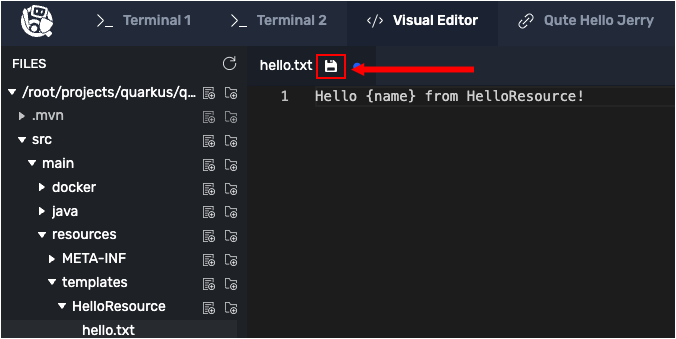

# Working with type-safe templates

There’s an alternate way to declare your templates in your Java code, which relies on the following convention:

* Organize your template files in the `/src/main/resources/templates` directory, by grouping them into one directory per resource class. So, if your `ItemResource` class references two templates `hello` and `goodbye`, place them at `/src/main/resources/templates/ItemResource/hello.txt` and `/src/main/resources/templates/ItemResource/goodbye.txt`. Grouping templates per resource class makes it easier to navigate to them.
* In each of your resource classes, declare a `@CheckedTemplate static class Template {}` class within your resource class.
* Declare one `public static native TemplateInstance method();` per template file for your resource.
* Use those static methods to build your template instances.

# Creating more templates

You will now create two templates. The first template will be a Hello template. The Hello template will display a hello message that includes a name defined within a data expression.

The second will be a Goodbye template that displays a goodbye message that also includes a name defined within a data expression.

Let's start by creating the Hello template. Previously, you created a `hello.txt` in the directory `qute/src/main/resources/template`. Now, you will create an additional template file with the name `hello.txt`, but this new file will be put in another directory named `qute/src/main/resources/template/HelloResource`.

----

`Step 1:` Run the following command in the **Terminal 1** console to the left to create a directory to hold the templates for a HelloResource class:

```
cd /root/projects/quarkus/qute && mkdir -p src/main/resources/templates/HelloResource
```

----

`Step 2:` Click the **Visual Editor** tab on the horizontal menu bar over console window to the left. The Visual Editor will appear.

----

`Step 3a:` Using the **Visual Editor**, navigate to the directory `qute/src/main/resources/templates/HelloResource` as shown in the figure below.


Remember, you created the directory `qute/src/main/resources/templates/HelloResource` within **Terminal 1** previously in `Step 1`.

`Step 3b:` Click the `New File` icon to create a new file named `hello.txt` as shown in the figure below.


`Step 3c:` Add the following code to the `hello.txt` file:

```text
Hello {name} from HelloResource!
```

Notice that the template file shown above has text that will render a message that's different than the `hello` message rendered in previous steps.

`Step 3d:` Click on the `Disk` icon or press `CTRL+S` keys to save the `hello.txt` file as shown in the figure below.



Next, let's create the Goodbye template.

----

`Step 4a:` Using the **Visual Editor**, click the `New File` icon to create a new file named `goodbye.txt` in the directory `qute/src/main/resources/templates/HelloResource/` as shown in the figure below.


`Step 4b:` Using the **Visual Editor**, click the file named `goodbye.txt` in the directory tree to open it for editing.

`Step 4c:` Add the following code to the file `goodbye.txt`:

```text
Goodbye {name} from GoodbyeResource!
```

`Step 4d:` Click on the `Disk` icon or press `CTRL+S` keys to save the `goodbye.txt` file.

Now let’s declare and use those templates in the `HelloResource` resource class.

----

`Step 5a:` Using the **Visual Editor** directory tree, navigate to the file `qute/src/main/java/org/acme/HelloResource.java` and click on the file name to open the file for editing as shown in the figure below.


----

`Step 5b:` Replace all of the existing code in `HelloResource.java` with the following code:

```java
package org.acme;

import javax.ws.rs.GET;
import javax.ws.rs.Path;
import javax.ws.rs.Produces;
import javax.ws.rs.QueryParam;
import javax.ws.rs.core.MediaType;

import io.quarkus.qute.TemplateInstance;
import io.quarkus.qute.CheckedTemplate;

@Path("hello")
public class HelloResource {

    @CheckedTemplate(requireTypeSafeExpressions = false)
    public static class Templates {
        public static native TemplateInstance hello();
        public static native TemplateInstance goodbye();
    }

    @GET
    @Produces(MediaType.TEXT_PLAIN)
    public TemplateInstance get(@QueryParam("name") String name) {
        return Templates.hello().data("name", name);
    }
}
```

`Step 5c:` Click on the `Disk` icon or press the `CTRL+S` keys to save the `HelloResource.java` file.

# Analyzing the HelloResource class

Let's take a moment to analyze the logic in the file `HelloResource.java`.

**KEY POINTS TO UNDERSTAND:**

* The inner class `Templates` has two methods `hello()` and `goodbye()`. The `Templates` inner class is decorated with the `@CheckedTemplate` annotation. Since the `@CheckedTemplate` static class is declared inside the `HelloResource` class, the method name `hello` is used to match template files in the directory `qute/src/main/resources/templates/HelloResource/` that have corresponding extensions such as `.txt`, `.html`, etc. (You can specify the exact name and path of a template file using the `@Location` annotation.)
* `Templates.hello()` returns a new template instance that can be customized before the actual rendering is triggered. In this case, the code makes a call to the `.data(name)` method to inject the value passed by `@QueryParam("name")` to the template. The actual data mapping to get the value for `name` is executed during rendering.
* Checked templates require type-safe expressions by default. A type-safe is an expression that is validated at build time. It's possible to use `@CheckedTemplate(requireTypeSafeExpressions = false)` to disable type-safe expression validation. In this case, type-safe expression validation has been disabled.

Once a class is decorated with the  `@CheckedTemplate` annotation, Qute will check that all of its methods point to existing templates. The result is that when you reference a template from your Java code that hasn't been added, Qute will let you know at build time.

# Creating a Goodbye resource

Let's create another resource that references the `HelloResource.Templates` static class.

----

`Step 6a:` Using the **Visual Editor**, click the `New File` icon to create a new file named `GoodbyeResource.java` in the directory `qute/src/main/java/org/acme/`.

----

`Step 6b:` Click the file named `GoodbyeResource` to open it for editing. Then, add the following code to the file `GoodbyeResource.java`:

```java
package org.acme;

import javax.ws.rs.GET;
import javax.ws.rs.Path;
import javax.ws.rs.Produces;
import javax.ws.rs.QueryParam;
import javax.ws.rs.core.MediaType;

import io.quarkus.qute.TemplateInstance;

@Path("goodbye")
public class GoodbyeResource {

    @GET
    @Produces(MediaType.TEXT_PLAIN)
    public TemplateInstance get(@QueryParam("name") String name) {
        return HelloResource.Templates.goodbye().data("name", name);
    }
}
```

`Step 6c:` Click on the `Disk` icon or press `CTRL+S` keys to save the `GoodbyeResource.java` file.

# Exercising the Hello and Goodbye endpoints

Let's exercise the new endpoints against the running Quarkus application.

----

`Step 7` Run the following command in **Terminal 1** to call the `/hello` endpoint. Notice that the value `James` is assigned to the query string parameter `name`:

```
curl http://localhost:8080/hello?name=James
```

You will see the following output:

```
Hello James from HelloResource!
```

----

`Step 8` Run the following command in **Terminal 1** to call the `/goodbye` endpoint. Again, notice that the value `James` is being assigned to the query string parameter `name`:

```
curl http://localhost:8080/goodbye?name=James
```

You will see the following output:

```
Goodbye James from GoodbyeResource!
```

As stated earlier, since the `TemplateInstance` is declared as an inner class inside of `HelloResource`, Qute will attempt to locate the template in the `HelloResource/` subdirectory. If instead you want to create a top-level declaration, you can do this inside of a separate class file.

The following is an example of using a single class file to create a top-level declaration for both the `hello.txt` and `goodbye.txt` templates:

```java
@CheckedTemplate
public class Templates {
    public static native TemplateInstance hello();
    public static native TemplateInstance goodbye();
}
```
The `hello.txt` template is associated with the static method `hello()`. The `goodbye.txt` template is associate with the static method `goodbye()`.

The code in the `Templates` class above causes Qute to look for the associated `hello.txt` or `goodbye.txt` files in the `src/main/resources/templates` directory, instead of `src/main/resources/templates/HelloResource`.


**Congratulations!**

In this topic you created two resource classes. One for a `/hello` endpoint. Another for a `/goodbye` endpoint. Both resource classes referenced a common template class named `HelloResource`.

You created two `Qute` template files, one is named `hello.txt` and the other is named `goodbye.txt`. You populated each with code that included a data expression.

Finally you exercised the endpoints and their backing Qute templates.

You didn't need to recompile any code to exercise the endpoints because the demonstration application is running under Quarkus Live Coding. Quarkus Live Coding makes it so any change you make in code is cascaded into the running application immediately.

----

**NEXT:** Working with type-safe templates in Qute
