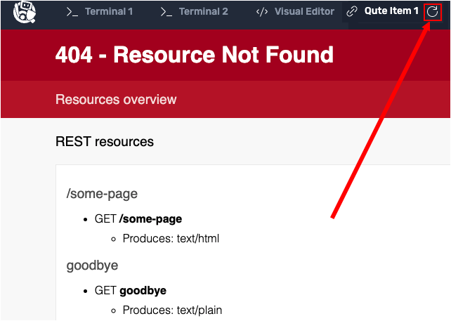

In this topic you will learn how to create Qute templates that consume data in a data source. In this case, the data source will be a mock database exposed via a service.

You'll create the mock database. Then, you'll create a variety of Qute templates that use the data in the mock database.

In addition you'll be introduced the concept of type-safe templates. A type-safe template will do the work of making sure that the correct data is being consumed by a particular template.

Finally, you'll create an error condition that demonstrates what happens when a Qute type-safe template encounters an inadmissable data expression.

# Implementing type safe templates

When you create a parameter in data expressions within a template, Qute will attempt to validate all expressions that reference that parameter. The build will fail when an incorrect expression is found.

Automatic error discovery is a key feature of Qute that reduces developer errors up front.

Let's exercise this feature.

----

`Step 1a:` Using the **Visual Editor**, navigate to the directory `qute/src/main/java/org/acme/`.

`Step 1b:` Click the `New File` icon to create the file `Item.java` in the directory `qute/src/main/java/org/acme/`.

`Step 1c:` Click the file `Item.java` to open it for editing.

`Step 1d:` Add the following content to the `Item.java` file:

```java
package org.acme;

import java.math.BigDecimal;

public class Item {
    public String name;
    public BigDecimal price;

    public Item(BigDecimal price, String name) {
        this.price = price;
        this.name = name;
    }
}
```

`Step 1e:` Click on the `Disk` icon or press `CTRL+S` keys to save the `Item.java` file.

The file you just created is a simple `Item` object that has two fields, `name` and `price`.

# Creating a template

Next, you will create a simple HTML page that renders an item with both the `name` and `price` values.

----

`Step 2:` Run the following command in **Terminal 1** to create the directory `qute/src/main/resources/templates/ItemResource` and confirm that the directory was created:


```
mkdir -p /root/projects/quarkus/qute/src/main/resources/templates/ItemResource && ls -lh /root/projects/quarkus/qute/src/main/resources/templates/ItemResource
```

You'll get output similar to the following:

```
total 0
```

----

`Step 3a:` Using the **Visual Editor**, navigate to the directory `qute/src/main/resources/templates/ItemResource/`.

`Step 3b:` Click the `New File` icon to create the file named `item.html` in the directory `qute/src/main/resources/templates/ItemResource/`.

`Step 3c:` Add the following code to the `item.html` file:

```html
<!DOCTYPE html>
<html>
<head>
<meta charset="UTF-8">
<title>{item.name}</title>
</head>
<body>
    <h1>{item.name}</h1>
    <div>Price: {item.price}</div>
</body>
</html>
```

`Step 3d:` Click on the `Disk` icon or press `CTRL+S` keys to save the `item.html` file.

Notice that the data expressions `{item.name}` and `{item.price}` are used in the `item.html` template code shown above.

Next, you will create a service that mocks up a database of items that will be consumed by the template.

# Creating a mock up database service

`Step 4a:` Using the **Visual Editor**, navigate to the directory `qute/src/main/java/org/acme/`.

`Step 4b:` Click the `New File` icon to create the file named `ItemService.java` in the directory `qute/src/main/java/org/acme/`.

`Step 4c:` Add the following code to the `ItemService.java` file:

```java
package org.acme;

import java.math.BigDecimal;
import java.util.HashMap;
import java.util.Map;
import javax.enterprise.context.ApplicationScoped;

@ApplicationScoped
public class ItemService {

    private Map<Integer, Item> items = Map.of(
        1, new Item(new BigDecimal(1.99), "Apple"),
        2, new Item(new BigDecimal(2.99), "Pear"),
        3, new Item(new BigDecimal(3.99), "Grape"),
        4, new Item(new BigDecimal(129.99), "Mango")
    );

    public Item findItem(int id) {
        return items.get(id);
    }
}
```

`Step 4d:` Click on the `Disk` icon or press `CTRL+S` keys to save the `ItemService.java` file.

# Creating a RESTful endpoint

Next you will create a resource class that uses the type-safe template you created previously in `Step 3`.

|What is a type-safe template?|
|----|
|A type-safe template is a Qute template that has the capability to automatically verify that the data expressions in a template actually correspond to the data structure, explicit or implicit, within the associated data source. That data source could be a string collection, a list of key-value pairs, a JSON array, a table in a database or a collection defined by a Java bean, to name a few examples.|

----

`Step 5a:` Using the **Visual Editor**, navigate to the directory `qute/src/main/java/org/acme/`.

`Step 5b:` Click the `New File` icon to create the file named `ItemResource.java` in the directory `qute/src/main/java/org/acme/`.

`Step 5c:` Add the following code to the `ItemResource.java` file:

```java
package org.acme;

import javax.inject.Inject;
import javax.ws.rs.GET;
import javax.ws.rs.Path;
import javax.ws.rs.PathParam;
import javax.ws.rs.Produces;
import javax.ws.rs.core.MediaType;

import io.quarkus.qute.TemplateInstance;
import io.quarkus.qute.CheckedTemplate;

@Path("item")
public class ItemResource {

    @Inject
    ItemService service;

    @CheckedTemplate
    public static class Templates {
        public static native TemplateInstance item(Item item);
    }

    @GET
    @Path("{id}")
    @Produces(MediaType.TEXT_HTML)
    public TemplateInstance get(@PathParam("id") Integer id) {
        return Templates.item(service.findItem(id));
    }
}
```

`Step 5d:` Click on the `Disk` icon or press `CTRL+S` keys to save the `ItemResource.java` file.

Let's pause from coding for a moment and analyze the code in the file `ItemResource.java`.

# Analyzing the resource file: ItemResource.java

The purpose of `ItemResource.java` is to define an endpoint parameter `{id}` that will be appended to the parent endpoint of the demonstration application's RESTful API.

The file `ItemResource.java` has logic that will identify a Qute template file and also pass data to the template. The `ItemResource` uses the `Path("item")` annotation to define an endpoint named `/item`.

In addition, `ItemResource.java` has logic that will do a lookup against the database service you created previously to return data according to the value passed by way of the `{id}` parameter. The `{id}` parameter is defined in `ItemResource.java` as shown in the code snippet below:

```java
    @GET
    @Path("{id}")
    @Produces(MediaType.TEXT_HTML)
    public TemplateInstance get(@PathParam("id") Integer id) {
        return Templates.item(service.findItem(id));
    }
}
```

Thus, when a request to `<SOME URL>/item/1` is made, the RESTful API will retrieve data from the mock database service according to `id=1`.

However, getting the data is only half the work. There still needs to be a binding to a template. This happens in the inner class `Templates`.

The following snippet of code is shows the `Templates` inner class named `Templates`. Notice that `Templates` has a method called `item()`:

```java
    @CheckedTemplate
    public static class Templates {
        public static native TemplateInstance item(Item item);
    }
```

The `item` method conforms to the Qute naming convention. The naming convention makes it so Qute implicitly binds the method to a corresponding template.

In this case, the method named `item()` binds to the file named `item.html`, which is stored in the templates directory `qute/src/main/resources/templates/ItemResource/`. The  binding of `item()` to `templates/ItemResource/item.html` is done implicitly by Qute when declaring the return type of `item()` to type `TemplateInstance`. This automatic binding is built into Qute.

# Exercising the item endpoint

`Step 6: ` Run the following command in **Terminal 1**:

```
curl http://localhost:8080/item/1
```

You will see the following HTML. The HTML is shows an item with the name of `Apple`, along with its price. (The `Apple` item had an `id` on the back end database of `1`):

```html
<!DOCTYPE html>
<html>
<head>
<meta charset="UTF-8">
<title>Apple</title>
</head>
<body>
    <h1>Apple</h1>
    <div>Price: 1.9899999999999999911182158029987476766109466552734375</div>
</body>
</html>
```

You've just viewed the raw HTML via `curl`. Next you'll take a look a the rendered HTML.

----

`Step 7:` Click the `Qute Item 1` tab on the horizontal menu on the top of the console window to the left.

|NOTE:|
|----|
|Sometimes you will encounter an error page when the browser in the **Qute Item 1** tab loads, like the following: <br><br> The cause of this error is that sometimes it can take a few seconds for **Live Code** web pages to render. Should you encounter an error, click between the reload icon in the upper right **Qute Item 1** window to reload the page.|

The HTML will be rendered in an internal browser in the interactive learning environment as show in the figure below.


# Creating a template parameter declaration inside the template

As an alternative to implicit binding to a template's data source, it's possible to declare a data item type directly within a template page by using an annotation that declares the fully qualified name of the data item.

You will now learn how to take this approach.

----

`Step 8a:` Using the **Visual Editor**, navigate to the file `qute/src/main/resources/templates/ItemResource/item.html` and click the file name to open the file for editing.

----

`Step 8b:` Replace the entire contents in `item.html` with the code shown below:

```html
{@org.acme.Item item}
<!DOCTYPE html>
<html>
<head>
<meta charset="UTF-8">
<title>{item.name}</title>
</head>
<body>
    <h1>{item.name}</h1>
    <div>Price: {item.price}</div>
</body>
</html>
```

`Step 8c:` Click on the `Disk` icon or press `CTRL+S` keys to save the `item.html` file.

Notice the annotation `{@org.acme.Item item}` in the first line of code above. This is an optional parameter declaration. If declared, Qute attempts to validate all expressions that reference the parameter `item`.

Next, you need to update the resource class `ItemResource.java` to use the alternative way to inject data into templates.

----

`Step 9a:` Using the **Visual Editor**, navigate to the file `qute/src/main/java/org/acme/ItemResource.java` using the Visual Editor directory tree on the left of the editor.

`Step 9b:` Click the file name `ItemResource.java` to open the file for editing.

`Step 9c:` Replace the entire contents in `ItemResource.java` with the code shown below:

```java
package org.acme;

import javax.inject.Inject;
import javax.ws.rs.GET;
import javax.ws.rs.Path;
import javax.ws.rs.PathParam;
import javax.ws.rs.Produces;
import javax.ws.rs.core.MediaType;

import io.quarkus.qute.TemplateInstance;
import io.quarkus.qute.Location;
import io.quarkus.qute.Template;

@Path("item")
public class ItemResource {

    @Inject
    ItemService service;

    @Inject
    @Location("ItemResource/item")
    Template item;

    @GET
    @Path("{id}")
    @Produces(MediaType.TEXT_HTML)
    public TemplateInstance get(@PathParam("id") Integer id) {
        return item.data("item", service.findItem(id));
    }
}
```

`Step 9d:` Click on the `Disk` icon or press the `CTRL+S` keys to save the `ItemResource.java` file.

`Step 9e:` Click the **Qute Item 1** to view the result of the updated code in the internal browser inside the interactive learning environment.

You will see results as shown in the figure  below.


The rendered HTML is the same, but behind the scenes Qute validates the template and its data. Should there be an error, the Live Coding rebuild will fail and you'll see an error page rendered as output.

But let's see what happens if when there is an error condition.

# Creating an error condition

`Step 10a:` Using the **Visual Editor**, navigate to the file `qute/src/main/resources/templates/ItemResource/item.html` using the Visual Editor's directory tree on the left.

`Step 10b:` Click on the file `item.html` to open the template file for editing.

`Step 10c:` Change the string `{item.name}` to `{item.nonSense}`.

`Step 10d:` Click on the `Disk` icon or press `CTRL+S` keys to save the `item.html` file.

`Step 10d:` Click on the **Qute Item 1** tab, or reload it to see an error on the web page as shown in figure below.


Qute checks the syntax and will fail the build because there is no field named `nonSense` in the mock database the template uses.

Now you need to reset the template to its original state.

----

`Step 11a:` Using the **Visual Editor**, navigate to the file `qute/src/main/resources/templates/ItemResource/item.html` using the Visual Editor's directory tree on the left.

`Step 12b:` Click on the file `item.html` to open the template file for editing.

`Step 11c:` Change the string `{item.nonSense}` to `{item.name}`.

`Step 11d:` Click on the `Disk` icon or press the `CTRL+S` keys to save the `item.html` file.

`Step 11d:` Click on the **Qute Item 1** tab or reload it to see an error on the web page as shown in the figure below.


**Congratulations!**

You've just created a number of templates in Qute. You expanded the demonstration application to use type-safe templates. You created a set of templates that used data in a mock database. Also, you created an error condition that demonstrated how Qute safe-type templates react when an incorrect field is defined in a data expression.

----

**NEXT:** Working with template extension methods
