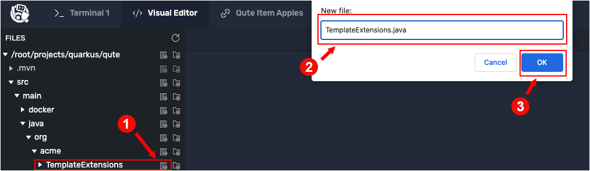

# Understanding template extension methods

Template extension methods are used to extend the set of data object's accessible properties.

Template extension methods allow you to declare new methods to predefined classes that you're using in your templates.  These new methods will available to your templates just as if they belonged to the predefined class.

You will start out by refactoring an existing template file in anticipation of implementing a template extension method. The template file you'll refactor is `qute/src/main/resources/templates/ItemResource/item.html`.


# Refactoring an existing template file

`Step 1a:` Using the **Visual Editor**, navigate to the directory `qute/src/main/resources/templates/ItemResource/`.

`Step 1b:` Click on the file named `item.html` in the Visual Editor directory tree to open the file for editing.

`Step 1c:` Replace all of the contents in the file `item.html` with the following code:

```html
<!DOCTYPE html>
<html>
<head>
<meta charset="UTF-8">
<title>{item.name}</title>
</head>
<body>
    <h1>{item.name}</h1>
    <div>Price: {item.price}</div>
    {#if item.price > 100}
    <div>Discounted Price: {item.discountedPrice}</div>
    {/if}
</body>
</html>
```

Let's take a moment to analyze the code.

# Analyzing the hello.html template file

Notice the use of the data expression `{#if item.price > 100}` at `Line 10`. The syntax of this data expression is an example of Qute's conditional control flow capability.

The conditional logic is such that if an item costs more than $100, a value for a discounted price will be displayed.

Also notice the data expression `{item.discountedPrice}`.

The field `item.discountedPrice}` does not exist in the existing implementation of `Item` class. The `item` class only has `name` and `price` fields.

Next, you'll add an extension to the Java code to make the `discountedPrice` property available to the template. Also, you'll write the logic that computes the value of `discountedPrice`.

# Creating a template extension class

`Step 2:` Go to **Terminal 1** and run the following command to create the directory name  `TemplateExtensions`:

```
mkdir /root/projects/quarkus/qute/src/main/java/org/acme/TemplateExtensions
```

----

`Step 3a:` Using the **Visual Editor**, navigate to the directory `qute/src/main/java/org/acme/TemplateExtensions`.

`Step 3b:` Click the `New File` icon to create the file `TemplateExtensions.java` in the directory `qute/src/main/java/org/acme/TemplateExtensions` as shown in the figure below.



`Step 3c:` Click the file name `TemplateExtensions.java` in the Visual Editor to open it for editing.

`Step 3d:` Add the following code to the file `TemplateExtensions.java`:

```java
package org.acme;

import java.math.BigDecimal;
import io.quarkus.qute.TemplateExtension;

@TemplateExtension
public class TemplateExtensions {

    public static BigDecimal discountedPrice(Item item) {
        return item.price.multiply(new BigDecimal("0.9"));
    }
}
```

Let's analyze the code.

# Analyzing the template extension method code

Decorating the class `TemplateExtensions` with the annotation [`@TemplateExtension`](https://quarkus.io/guides/qute-reference#template_extension_methods) implies that the class will indeed implement extension methods.

The actual work of implementing an extension method is done in the method `discountedPrice(Item item)` at `Line 9`.

Notice that the method `discountedPrice` takes a parameter named `item` of type `Item` (`org.acme.Item`).

As you might recall, `org.acme.Item` defines the properties `name` and `price`. The (`org.acme.Item` is the Java bean defined at `qute/src/main/java/org/acme/Item.java`.)

At this point an implicit operation comes into play. By convention, Qute takes the method name `discountedPrice` and implicitly attaches it to the `Item` object that is passed as a parameter to the extension method `discountedPrice(Item item)`. Thus, not only are there properties `Item.name` and `Item.price`, now `Item` has an implicit property named `Item.discountedPrice`.

The logic for calculating `Item.discountedPrice` is provided by the logic in the method `discountedPrice(Item item)`, as shown in the following snippet of code:

```java
return item.price.multiply(new BigDecimal("0.9"));
```

Operationally the value `Item.discountedPrice` is determined by multiplying the value of `item.price` by .09 and returning the result.

Granted, programming template extension methods requires a clear understanding of the implicit logic that's being executed by Qute behind the scenes.

It can take some time to get accustomed to the way Qute works. Thus, you might want to take a moment and review the hands-on steps you just executed.

|NOTE:|
|----|
|You can place template extension methods in any class that you annotate with `@TemplateExtension`. But be advised: Keep them either grouped by target type, or in a single `TemplateExtensions` class.|

# Exercising the template extension method

Now that all of the programming has been done, let's exercise the refactored code. First, you'll call the service endpoint using `curl`.

----

`Step 4:` Run the following command in **Terminal 1** to exercise the endpoint calling a data item with an `id` of 4:

```
curl localhost:8080/item/4
```

You'll see the following output:

```html
<!DOCTYPE html>
<html>
<head>
<meta charset="UTF-8">
<title>Mango</title>
</head>
<body>
    <h1>Mango</h1>
    <div>Price: 129.990000000000009094947017729282379150390625</div>
    <div>Discounted Price: 116.9910000000000081854523159563541412353515625</div>
</body>
</html>
```

According to the logic in the template HTML you saw above in `Step 1`, a discount is displayed for mangos because they cost more than $100.

----

`Step 5:` Run the following command in **Terminal 1** to exercise the endpoint calling a data item with an `id` of 1:

```
curl localhost:8080/item/1
```

You'll see the following output:

```
<!DOCTYPE html>
<html>
<head>
<meta charset="UTF-8">
<title>Apple</title>
</head>
<body>
    <h1>Apple</h1>
    <div>Price: 1.9899999999999999911182158029987476766109466552734375</div>
</body>
</html>
```

Apples do not display a discount because they cost less than $100.

----

`Step 6a:` Click the **Qute Item Mangos** tab in the horizontal menu bar at the top of the console window to the left.

`Step 6b:` Click the reload icon in the upper right of the horizontal menu bar as shown in the figure below.


You'll see the following output with a discount as shown in the figure above.


----

`Step 7a:` Click the **Qute Item Apples** tab in the horizontal menu bar at the top of the console window to the left.

`Step 7b:` Click the reload icon in the upper right of the horizontal menu bar as shown in the figure below.


Notice that there is only a price displayed for apples. No discount is shown. As mentioned above, the web page does not display a discount because Apples cost less than $100.

**Congratulations!**

You've covered the basics of template extension methods. You created a template HTML file that has a conditional data expression that uses an extension method. Then, you created a template extension.

Finally, you exercised the rendered template HTML to view the results of working with a extension template method.

----

**NEXT:** Working with templates to render periodic reports
