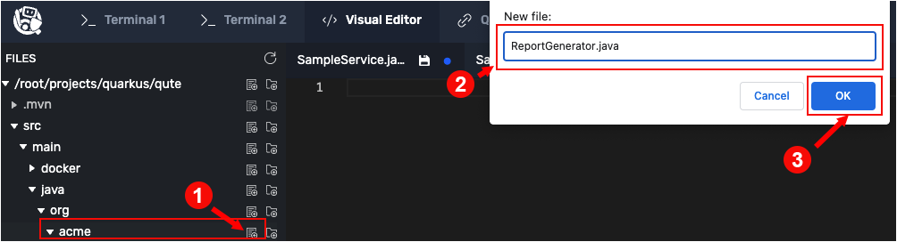

Templating engines can be useful when rendering periodic reports. This topic demonstrates how to create these type of reports.

The code uses the `quarkus-scheduler` extension, which was already added when the demonstration application was installed and invoked using the Maven Quarkus plugin at the beginning of this track.

In this topic you will create four items:

1. A new class that will represent a Java bean named `Sample`.
2. A service named `SampleService` that creates random data according to the fields declared in the `Sample` Java bean.
3. A template the emits data in JSON.
4. A class named `ReportGenerator` that will do the work of generating a report in a reactive manner.

You won't have to go through the effort of recompiling and deploying the code because, as you might recall, the demonstration application is running in Live Coding mode. Any changes you make in the source code will get compiled and deployed automatically by Quarkus.

Let's start by creating the `Sample` bean.

## Creating the Sample bean

The `Sample` bean represents a point-in-time snapshot of the state of something; for example, ambient room temperature or a patient's blood pressure.

To create the `Sample` bean, do the following steps.

----

`Step 1a:` Using the **Visual Editor**, navigate to the directory `qute/src/main/java/org/acme/`.


`Step 1b:` Click on the `New File` icon to create a file named `Sample.java` in the `qute/src/main/java/org/acme/` directory as shown in the figure below.


`Step 1c:` Add the following code to the file `Sample.java`:

```java
package org.acme;

public class Sample {
    public boolean valid;
    public String name;
    public String data;

    public Sample(boolean valid, String name, String data) {
        this.valid = valid;
        this.name = name;
        this.data = data;
    }

}
```

`Step 1d:` Click on the `Disk` icon or press the `CTRL+S` keys to save the `Sample.java` file.

Next, create a service class named `SampleService` that has a `get()` method. The `get()` method returns a random `List` of samples.

----

`Step 2a:` Using the **Visual Editor**, navigate to the directory `qute/src/main/java/org/acme/`


`Step 2b:` Click on the `New File` icon to create a file named `SampleService.java` in the `qute/src/main/java/org/acme/` directory, as shown in the figure below.


`Step 2c:` Add the following code to the file `SampleService.java`:

```java
package org.acme;

import java.util.List;
import java.util.Random;
import java.util.stream.Collectors;
import java.util.stream.IntStream;

import javax.enterprise.context.ApplicationScoped;

@ApplicationScoped
public class SampleService {
    private static final String[] names = {"James", "Deepak", "Daniel", "Shaaf", "Jeff", "Sally"};

    public List<Sample> get() {
        int count = new Random().nextInt(10);
        return IntStream.range(0, count)
            .mapToObj(idx -> Math.random() > 0.5)
            .map(valid -> new Sample(valid, names[(int)(Math.random() * names.length)], Math.random() + ""))
            .collect(Collectors.toList());
    }
}
```

`Step 2d:` Click on the `Disk` icon or press `CTRL+S` keys to save the `SampleService.java` file.

You now have a way to generate a continuous stream of random data based on the object definition described in the `Sample` bean.

## Creating a JSON template

Before you can create the actual Qute template file, you need to create a directory to store it in.

----

`Step 3:` Run the following command in **Terminal 1** to create the directory `qute/src/main/resources/templates/reports/v1`:

```
mkdir -p /root/projects/quarkus/qute/src/main/resources/templates/reports/v1
```

Next, let's create the template file.

----

`Step 4a:` Using the **Visual Editor**, navigate to the directory `qute/src/main/resources/templates/reports/v1/`.

`Step 4b:` Click on the `New File` icon to create a file named `report_01.json.template` in the `qute/src/main/resources/templates/reports/v1` directory as shown in the figure below.


`Step 4c:` Add the following code to the file `report_01.json.template`:

```json
{
    "time": "{now}",
    "samples": [
      {#for sample in samples}
      \{"name": "{sample.name ?: 'Unknown'}","data": "{#if sample.valid}{sample.data}{#else}--Invalid--{/if}"}{#if count < samples.size },{/if}
      {/for}
    ]
  }
```

The `report_01.json.template` emits data in structured manner according to a timestamp.

`Step 4d:` Click on the `Disk` icon or press `CTRL+S` keys to save the `report_01.json.template` file.

# Analyzing the JSON template

Here we are looping over the passed-in `samples`. You can iterate over `Iterable`s, `Map`s, and `Stream`s. Since we are rendering JSON, we also need to escape the first of any pair of JSON-related `}` or `{` using `\}` or `\{`.

Also note the use of the conditional [elvis operator](https://en.wikipedia.org/wiki/Elvis_operator) `{sample.name ?: 'Unknown'}`. If the `name` is `null` the default value `Unknown` is used.

## Creating periodic reports

`Step 5a:` Using the **Visual Editor**, navigate to the directory `qute/src/main/java/org/acme/`.

`Step 5b:` Click on the `New File` icon to create a file named `ReportGenerator.java` in the `qute/src/main/java/org/acme/` directory as shown in the figure below.



`Step 5c:` Add the following code to the file `ReportGenerator.java`:

```java
package org.acme;

import java.io.FileWriter;

import javax.enterprise.context.ApplicationScoped;
import javax.enterprise.event.Observes;
import javax.inject.Inject;

import io.quarkus.qute.Template;
import io.quarkus.qute.Location;
import io.quarkus.runtime.ShutdownEvent;
import io.quarkus.runtime.StartupEvent;
import io.quarkus.scheduler.Scheduled;

@ApplicationScoped
public class ReportGenerator {

    @Inject
    SampleService service;

    private FileWriter fout = null;

    @Location("reports/v1/report_01.json.template")
    Template report;

    @Scheduled(cron="* * * ? * *")
    void generate() throws Exception {
        String result = report
            .data("samples", service.get())
            .data("now", java.time.LocalDateTime.now())
            .render();
            System.out.println("report: " + result);
        if (fout != null) {
            fout.write(result + "\n");
            fout.flush();
        }

    }

    void onStart(@Observes StartupEvent ev) throws Exception {
        fout = new FileWriter("/tmp/report.json", true);
    }
    void onShutdown(@Observes ShutdownEvent ev) throws Exception {
        fout.close();
        fout = null;
    }
}
```
The code shown above generates reports periodically to a file in `/tmp`.


`Step 5d:` Click on the `Disk` icon or press `CTRL+S` keys to save the `ReportGenerator.java` file.

**KEY POINTS TO UNDERSTAND:**

* The code uses the `@ResourcePath` qualifier to specify the template path: `templates/reports/v1/report_01.json`.
* The `@Scheduled` annotation at `Line XX` instructs Quarkus to execute the `generate()` method every second. (For more information, see the [Scheduler](https://quarkus.io/guides/scheduler) guide.)
* The `TemplateInstance.render()` method triggers rendering the template. (Note that this method blocks the current thread.)
* The code uses Quarkus' `StartupEvent` and `ShutdownEvent` to manage the file I/O on startup and shutdown.

# Triggering a report

`Step 6:` Run the following command in **Terminal 1** to access the `hello` endpoint:

```
curl http://localhost:8080/hello?name=James
```

You get the following output:

```
Hello James from HelloResource!
```

Executing the command in `Step 6` above triggers report generation.

Assuming no errors, a `Sample` entry will be written to the `/tmp/report.json` file every second.

`Step 7:` Run the following command in **Terminal 1** to view the report continuously:

```console
tail -f /tmp/report.json
```

You'll see output similar to the following:

```json
{
    "time": "2022-04-21T22:30:35.000969",
    "samples": [
      {"name": "Jeff","data": "0.23984994653540892"},
      {"name": "Jeff","data": "0.8867636935236044"},
      {"name": "James","data": "0.3672510964874448"},
      {"name": "Deepak","data": "--Invalid--"},
      {"name": "Deepak","data": "0.13618854513825762"}
    ]
  }
{
    "time": "2022-04-21T22:30:36.001193",
    "samples": [
      {"name": "Sally","data": "0.7833450060326326"},
      {"name": "Jeff","data": "0.7343044249643622"},
      {"name": "Daniel","data": "0.7452815950519064"},
      {"name": "Sally","data": "0.2590073757626006"},
      {"name": "Daniel","data": "0.9834003620683878"},
      {"name": "Jeff","data": "0.22577470893349594"},
      {"name": "Deepak","data": "0.1547905261085607"}
    ]
  }
```

**Congratulations!**

In this topic you created a new Qute template that's used to emit data in JSON format. The data is emitted using the `quarkus-scheduler` extension. The data is emitted by the `ReportGenerator` class, which you also created. Report data is stored in the `/tmp` file. You called `http://localhost:8080/hello?name=James` to trigger the process makes the `ReportGenerator` append data to the report file `/tmp/report.json` continuously.

----

**NEXT:** Integrating reactive programming with Qute templates
