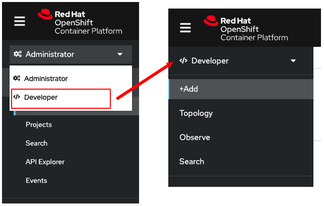

🔒 Logging in with the web console
===============================

Click the **Web Console** tab over the terminal area to open the OpenShift web console.

1. Use the following credentials to log in:

* **Username:** `admin`
* **Password:** `admin`

👀 Changing perspectives
========================

Upon logging in, you'll notice in the top left that you're in the **Administrator** perspective:


1. Change the to the **Developer** perspective by selecting **Administrator** and opening the following drop down menu:



📁 Understanding projects in OpenShift
===================================

OpenShift has an organizational unit called a **project**.
You use a **project** to group resources relating to your application.
The reason for organizing your application in a **project** is to enable controlled access and quotas for developers or teams.

You can think of a **project** as a visualization of the Kubernetes namespace based on the developer access controls.

🏗️ Creating a project
====================

1. From the OpenShift Web Console, click **+Add** on the left side menu.

2. Click **Create a project** and name the project `myproject`.


3. Next, click the **Create** button.

4. Scroll down the page and click on the  **Container images** box.


5. Enter the text below in the **Image name from external registry** text box.

```
quay.io/openshiftroadshow/parksmap:1.3.0
```

Adding content to the text boxes in the rest of the form is optional.

6. Scroll down the page and click **Create** to continue.

After you create the application, you will be presented with the **Topology** view as shown in the figure below.


Click **Check** to check your progress before proceeding. In the next section, you'll learn how to connect to your applications over HTTP ⬇️
