#  Pre Installed
Below is a list of things that we have already configured. Make sure you have everything in your environment before you proceed
- **Red Hat Service Interconnect CLI** - Service Interconnect comes with an easy to use command line interface  that allow users to easily
and safely configure and manage their interconnections. Using a simple command line, interconnections
are easily created avoiding extensive networking planning without compromising your organization's infrastructure and data.
- **Two OpenShift Clusters** - One will acts as a public cluster and the other as a private cluster
- **Terminal-public** - This tab is a linux terminal that is already remotely logged in to the Public OpenShift cluster  
- **Terminal-private** - This tab is a linux terminal that is already remotely logged in to the Private OpenShift cluster 
-  **Patient Portal** - Tab to accesss the patient portal frontend website 
-  **Skupper Console** - Tab to access the Service Interconnect console 
-  **Visual Edit Private** - This tab will be used to transfer the tokens from one machine to the other
to create the connections 

# Install the Frontend in the Public OpenShift Cluster
We are already remotely logged into the Public OpenShift cluster from the **Terminal-public** machine.

- Make sure your are on the**Terminal-public** tab: 

- Install the frontend app by copy pasting the commands below in to the **Terminal-public** CLI.
	```
	oc new-app quay.io/redhatintegration/patient-portal-frontend
	oc expose deployment patient-portal-frontend --port=8080
	oc create route edge --service=patient-portal-frontend --insecure-policy=Redirect
	oc set env deployment/patient-portal-frontend DATABASE_SERVICE_HOST=database
	```
- Wait for a minute and check if the frontend pods are running on the Public OpenShift Cluster
	```
	oc get pods
	```
- You should see an output similar to the one below:
	```,nocopy
	NAME                                      READY   STATUS    RESTARTS   AGE
	patient-portal-frontend-78f45d5fd-xtlhh   1/1     Running   0          10s
	```

- Now that the front end is up and running. Navigate to the patient portal frontend by clicking on the patient portal tab


- **Note:** You might see a **Your connection is not private** message on the browser as we are using a self-signed certificate.  You can ignore such errors during this excercise.  Click on **Advanced** and then click on the **"proceed to"** link as shown in the image below if you see this warning


- You should be able to see the front end of the patient portal without any patient names or doctor names as we have not established the connection with the database
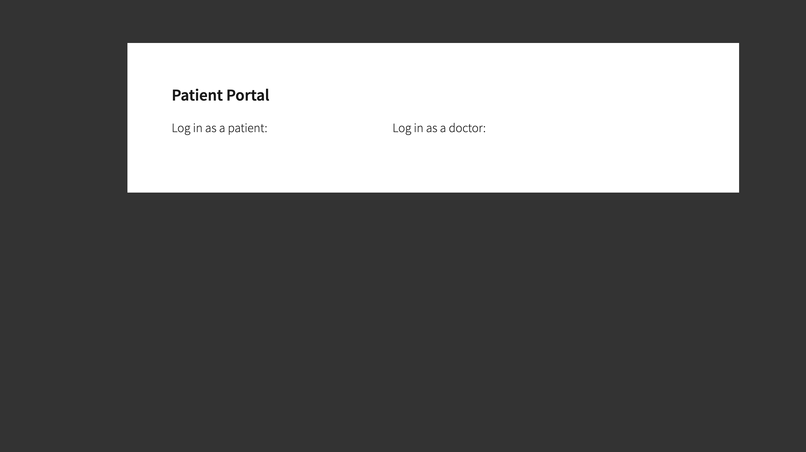

# Install the Database and Payment Process on the Private OpenShift Cluster
The Database contains a list of patients and doctors, that will show on the patient portal front end page once we make the connections.

The payment processor is a service that process the bill payments made by patients.

We are already remotely logged into the Private OpenShift cluster from the **Terminal-private** machine.

- Switch to the **Terminal-private**  tab before you do this section  

- Execute the following commands from the **Terminal-private** tab to deploy database in the private cluster
	```
	oc new-app quay.io/redhatintegration/patient-portal-database
	```

- Execute the following commands from the **Terminal-private** tab to deploy the payment processor  in the private cluster
	```
	oc new-app quay.io/redhatintegration/patient-portal-payment-processor
	oc expose deployment patient-portal-payment-processor --name=payment-processor --port=8080
	```

- Wait for a minute and then check if the database and payment processor pods are running on the Private OpenShift Cluster
	```
	oc get pods
	```
- You should see an output similar to the one below:
	```,nocopy
	NAME                                                READY   STATUS    RESTARTS   AGE
	patient-portal-database-7f847bdcfc-zxxlt            1/1     Running   0          23s
	patient-portal-payment-processor-748bbc7766-48nbh   1/1     Running   0          18s
	```


This brings us to the end of installation section.

In the next section we will use **[Red Hat Service Interconnect](https://developers.redhat.com/products/service-interconnect/overview)** to connect all these service to make the patient portal work.


# The Challenge
As indicated in the image below you are now done installing the patient portal frontend in the Public Cluster and the database and payment processor in the private cluster. Both these clusters are not connected.
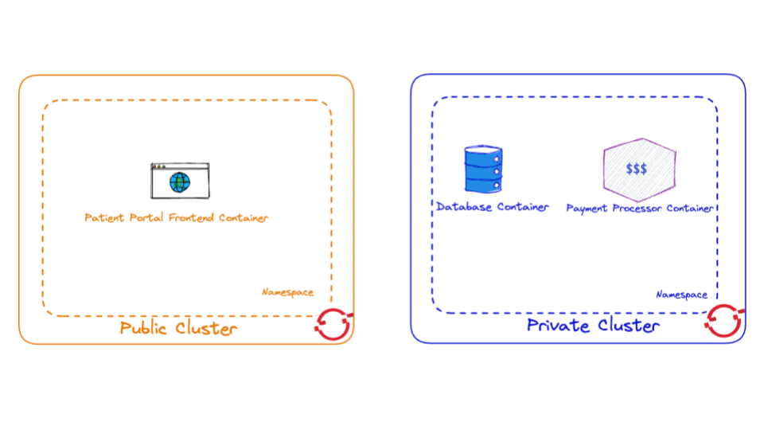

The challenge for us is now to enable the patient portal application to connect to the database and payment processor. For obvious reasons, we do not want to expose the database and payment processor over the public internet, so a private, secure link needs to be setup between the OpenShift instance on the public cloud and the private cloud. This can be accomplished with a VPN between the public cloud and the data center. However a **VPN can be hard to set up**, and **requires deep networking expertise**. Developers also need to request the network admins and go through a time taking approval process for the VPNs to be setup. **Red Hat Service Interconnect on the other hand creates a dedicated layer 7 service network and is a lot easier to set up**. It allows application Developers to establish secure interconnection with other services and applications in different environments without relying on network specialists. With Service Interconnect developers can now create secure virtual application networks without the cumbersome overhead, complexity and delays of traditional connectivity solutions.


# Connect the the Frontend in the Public OpenShift Cluster to the Database and Payment Processor deployed on the Private OpenShift Cluster
## **Intialize Red Hat Service Interconnect in the Public OpenShift Cluster**

This process will install Service Interconnect in the **public** namespace.
We are already remotely logged into the Public OpenShift cluster from the **Terminal-public** machine.

- Make sure you are on the **Terminal-public** tab  

- To initialize Service Interconnect in this public namespace you will need to issue the following command in the **Terminal-public**  window:
	```
	skupper init --enable-console --enable-flow-collector --console-auth unsecured
	```
- Output
	```,nocopy
	Skupper is now installed in namespace 'public'.  Use 'skupper status' to get more information.
	```

- Service Interconnect provides observability out of the box and comes with its own console, which you can access by clicking on the  Skupper Console tab

Note: You might see a **Your connection is not private** message on the browser as we are using a self-signed certificate. You can ignore such errors during this excercise. Click on **Advanced** and then click on the "**proceed to**" link as shown in the image below if you see this warning

- You should able to see the public cluster displayed in the console. At the moment there is not a lot to see as we have only installed one side of the service network. 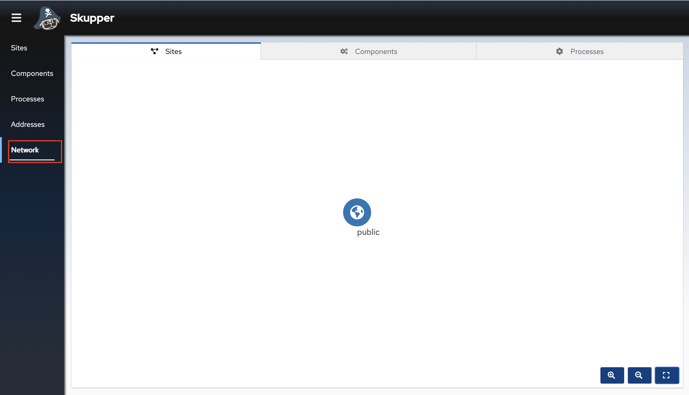


> **Note**
> *You might see some warnings about Pod Security violations in the console output. These can safely be ignored.*

- Now switch to the **Terminal-private** tab  

- In order to create the connection Service Interconnect must also be intialized in the Private Cluster also. Issue the following command in the **Terminal-private** tab:
	```
	skupper init --ingress none --router-mode edge --enable-console=false
	```

- Output
	```,nocopy
	Skupper is now installed in namespace 'private'.  Use 'skupper status' to get more information.
	```
> **Note**
> *You might see some warnings about Pod Security violations in the console output. These can safely be ignored.*


## **Linking the public and private clusters using Red Hat Service Interconnect**
Creating a link between Service Interconnect enabled namespaces requires a secret token that allows permission to create the link. The token carries the link details required for  connection. We will generate the token in the public cluster and use it to link the namespaces in the other clusters. All inter-site traffic is protected by mutual TLS**(mTLS)** using a private, dedicated certificate authority (CA). A claim token is not a certificate, but is securely exchanged for a certificate during the linking process. By implementing appropriate restrictions (for example, creating a single-use claim token), you can avoid the accidental exposure of certificates.


- Switch to **Terminal-public** tab  

- Generate the token in the **Terminal-public** tab
	```
	skupper token create ~/secret.token
	```
- View the token
	```
	cat root/secret.token
	```
- Output
	```,nocopy
	apiVersion: v1
	data:
		ca.crt: LS0tLS1CRUdJTiBDRVJUSUZJQ0FURS0tLS0tCk1JSURMVENDQWhXZ0F3SUJBZ0lSQUtDa1V6bW1Bc24vbHFrVHpwT3ZQUjR3RFFZSktvWklodmNOQVFFTEJRQXcKR2pFWU1CWUdBMVVFQXhNUGMydDFjSEJsY2kxemFYUmxMV05oTUI0WERUSXpNRFV4TXpBME5UVXdOMW9YRFRJNApNRFV4TVRBME5UVXdOMW93R2pFWU1CWUdBMVVFQXhNUGMydDFjSEJsY2kxemFYUmxMV05oTUlJQklqQU5CZ2txCmhraUc5dzBCQVFFRkFBT0NBUThBTUlJQkNnS0NBUUVBekJPZkFDVDdJVVdNSjQ4eEo3SHdPdkllYnNiSG8vU2YKQkdxeUdUSnUwbzlqSnBYS3ZydGkxcWVpZmpTV1hnczVLbHlMWDdjNkc1b1lPVWpsb1pqUzhQYXJ2WDcyUEhUTQoyQU93ZiszOWxWaTlsK1l4UHpxZEtZcXNLSWRFeE5FK2pEYzgvdGtnT1AwY2plOHpzMHdYK2RITi9nOFU1K0xMCmQwSE1TTWF0VHdwdTFtdGhtbk5tc2xTUWcrWVpONUh5Q0k2R3hUV3pGVDhlaHMzRGlLYzZrdTF2bHlDQ0VIa1EKazg4ZW5BWkZMbEpzYjZKTXIyaDBJSG5nZ0h5TFY4OEQ5bzlpblMwckFpODc0UWVYNFhkWnplY2dGYWVBVTJDdgpHQ1QzYWVXQXRyZ3FvaFc2ZmU2Ykx1WEhmMkxza2hXbk5uTU5mN3Y2UUxpSk16S0t0d2p1dndJREFRQUJvMjR3CmJEQU9CZ05WSFE4QkFmOEVCQU1DQXFRd0hRWURWUjBsQkJZd0ZBWUlLd1lCQlFVSEF3RUdDQ3NHQVFVRkJ3TUMKTUE4R0ExVWRFd0VCL3dRRk1BTUJBZjh3SFFZRFZSME9CQllFRk5rcitRVHMyZGNGZXlrZjFKOGpaV0hNN2RFaApNQXNHQTFVZEVRUUVNQUtDQURBTkJna3Foa2lHOXcwQkFRc0ZBQU9DQVFFQW5zWGl3eE9XaWx3UnlWMENXaE5QCk9wd0IxNDNHTHJRaEc2OHkvbGNTZThyMDc2dHQ0Nm42SlZlS1A3RklvemZwd01hTW0zSjFrd0ltQjhpVVVBZjgKbnhHZnRjOEVXaG45YlN6MVdUU0s1eitCUEp6NWpTRDhEb2pGNXpkUjNPejhBNDdCbVNwcS9SVkZIaE9nS2lpRApZdTRLbDd2Mm5hQ3JTNHFWZzRxNVlBWFAyaWc1R05NM1F6dWtIWHlON3ZucXlXZVlwVnAzU2NOdzhpd2RUUmVrCnN2cDhPcE0va0ZyMTlFSVBteWpPVzl2cHpPcWs5R0tkQjZZcUhWdkUraEdoSlQranFzcWxoMVhyNXpGVE5WWFAKY0F5YWY0TFRlTndWUVRZOXpSR3lBbXZYTzN4cThPcTJQNnFTNFhhSS94UFpGUUNFTGE3K2tZS25tSWdRcnF5awpLQT09Ci0tLS0tRU5EIENFUlRJRklDQVRFLS0tLS0K
		password: M3MzWTExYzVldWlvZzkxeE5MYThWNVFr
	kind: Secret
	metadata:
		annotations:
			skupper.io/generated-by: 76c142fb-7fa0-4218-8427-021c0ce29fb0
			skupper.io/site-version: 1.3.0
			skupper.io/url: https://claims-public.crc-rwwzd-master-0.crc.gcpjpffoqwu0.instruqt.io:443/ba863cd9-f14a-11ed-ad52-42010a050005
		creationTimestamp: null
		labels:
			skupper.io/type: token-claim
		name: ba863cd9-f14a-11ed-ad52-42010a050005
	```
> **Warning**
> Do not copy the token from here. Copy the token from the terminal as indicated in the subsequent steps

- Select the full token from the **Terminal** and carefully copy the token without missing any characters out. This is a very important step and any missing characters in the token will lead to failed connections
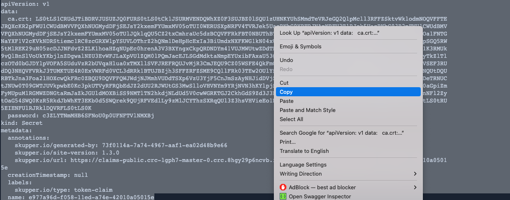

- Now switch to **Visual Edit Private**  

- The **Visual Edit Private** displays the file system of the private machine. Follow the below steps to copy the token into the private cluster.

- For the purpose of this lab we have already created an empty file here for you to paste the token. Locate the secret.token file under the home folder 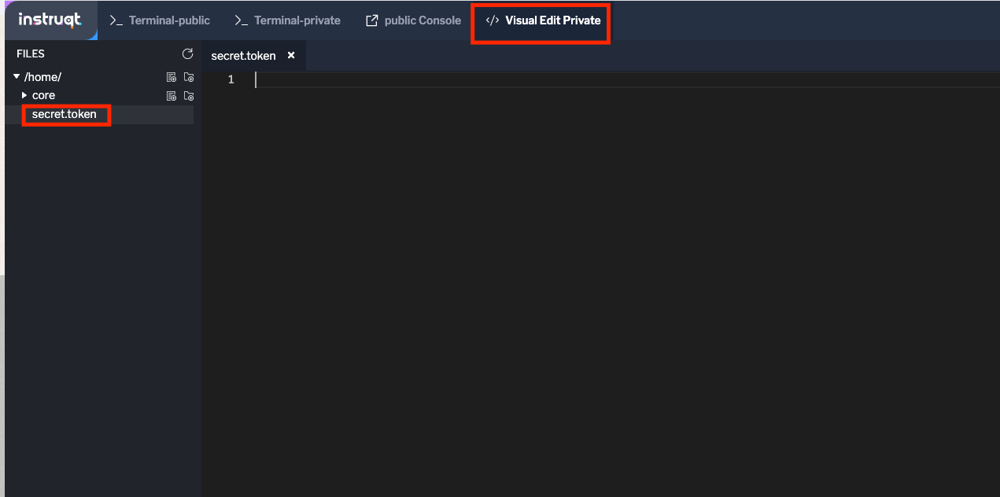

- Paste the token and save it.
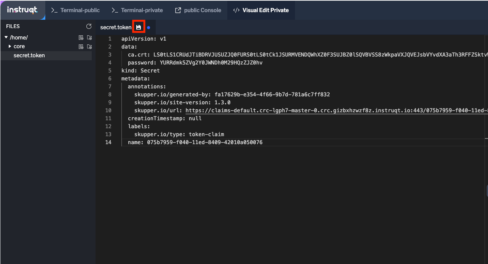
> **Note**
> Double check if you have properly save the token. The save icon and blue dot should disappear once your save is successful
> 

- Now that we have successfully save the token in the private machine. Let's switch back to the **Terminal-private** to create the connection
 

- Link the private cluster to the public cluster by executing the below command from the **Terminal-private**. This will utilize the token that we just transferred to create the link between the clusters.
	```
	skupper link create home/secret.token
	```
- Output
	```,nocopy
	Site configured to link to https://claims-public.crc-rwwzd-master-0.crc.uxi09xzkszec.instruqt.io:443/5e52022f-f13e-11ed-ac35-42010a050034 (name=link1)
	Check the status of the link using 'skupper link status'.
	```
- Check the status of the link after a few seconds:
	```
	skupper link status
	```
- Output
	```,nocopy
	Links created from this site:
	------------------------------
	Link link1 is connected
	Current links from other sites that are connected:
	----------------------------------------
	There are no connected links
	```

	- Verify that the private cluster now appears in the console as a part of the network you can access by clicking on the  Skupper Console tab

	- The private cluster should now appear in the console 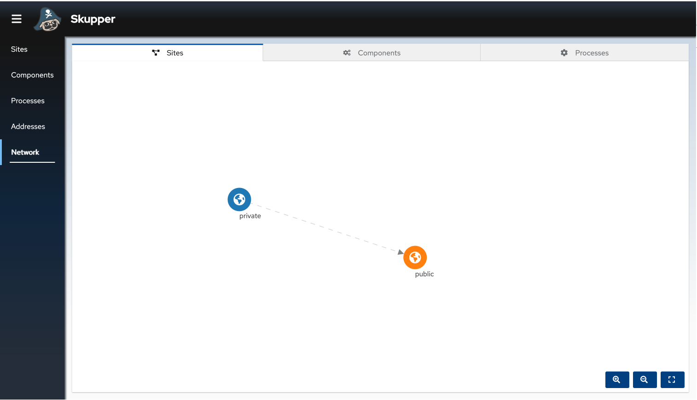

	Though we have linked both the namespaces in two different clusters, we have not exposed any services yet. We have to explicitly mention which services we want to expose over the Service network. By default **none** of the services in the namespaces are exposed by Red Hat Service Interconnect.

- You can verify this by going to the browser tab where you have opened the frontend and refreshing it. You will still see that the patient and doctors names are still not retrieved from the database and displayed on the portal


- Verify the same by going back to the console [skup-console.png](https://play.instruqt.com/assets/tracks/nrxvnbrjrvsz/5847ac559d3a8cc3b583de8a33d10474/assets/skup-console.png)
- Click on the components tab. You should not be able to see any lines or arrows connecting the individual services. 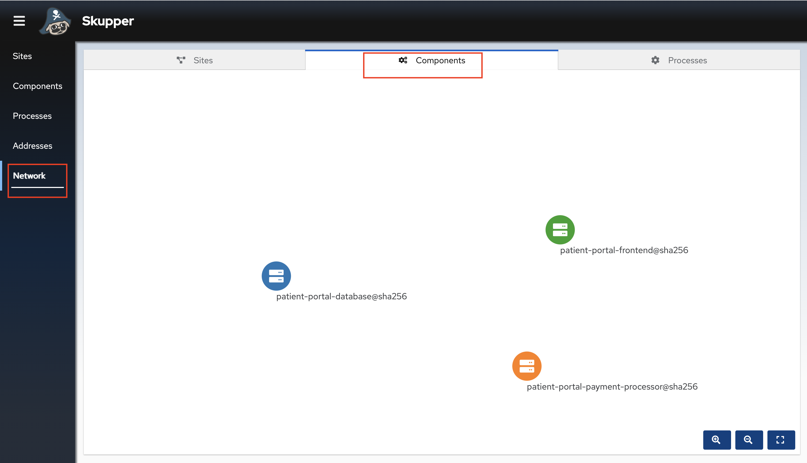

## **Exposing the services over the network using Red Hat Service Interconnect**
Now let's expose the database service over the service network. This will allow the Frontend on the Public cluster to connect to the database as if it was a local service, while in reality the service is a proxy for the real service running on the Private cluster.

- Switch back to the **Terminal-private** to create the connection
 

- Expose the database over the network
	```
	skupper expose deployment/patient-portal-database --address database --protocol tcp --port 5432
	```
- Output
	```,nocopy
	deployment patient-portal-database exposed as database
	```
- Let's also expose the payment-processor service over the service network.
	```
	skupper expose deployment/patient-portal-payment-processor --address payment-processor --protocol http --port 8080
	```
- Output
	```,nocopy
	deployment patient-portal-payment-processor exposed as payment-processor
	```

- You have now established a secure link between the two clusters, and exposed the database and payment processor as services on public cluster. This will allow the Frontend on the Public cluster to connect to the database and payment processor services as if they were a local service, while in reality these services are proxies for the real service running on the Private cluster. 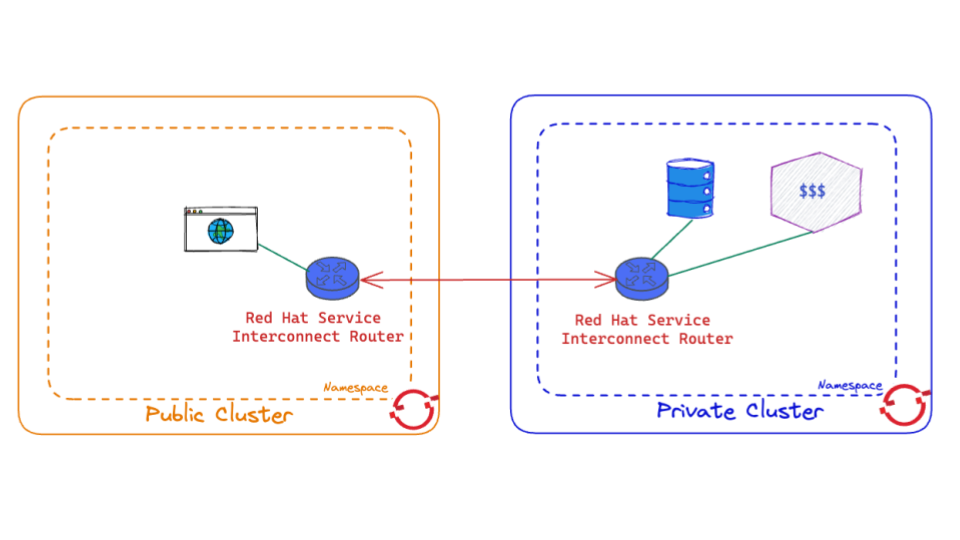

> **Note:**
> We are not exposing the database and payment processor service to the internet. Only the services which are part of the service network enabled by Red Hat Service Interconnect can access them

- You can verify this checking the list of svcs in the Public cluster

- Switch to the  **Terminal-Public** tab 

- Get a list of services deployed in the public namespace
	 ```
	oc get service
	```
- Output
	```,nocopy
	NAME                      TYPE        CLUSTER-IP     EXTERNAL-IP   PORT(S)                      AGE
	database                  ClusterIP   10.217.5.186   <none>        5432/TCP                     40s
	patient-portal-frontend   ClusterIP   10.217.5.67    <none>        8080/TCP                     6m19s
	payment-processor         ClusterIP   10.217.5.135   <none>        8080/TCP                     4s
	skupper                   ClusterIP   10.217.4.36    <none>        8010/TCP,8080/TCP,8081/TCP   5m19s
	skupper-router            ClusterIP   10.217.5.192   <none>        55671/TCP,45671/TCP          5m20s
	skupper-router-local      ClusterIP   10.217.4.103   <none>        5671/TCP                     5m20s
	```

	The database service and payment-processor are the proxy services created by exposing the database deployment in the Private cluster over the service network.


- After a few seconds go back to the browser tab where you have opened the patient portal front end and refresh it. You should now be able to see the the list of patients and doctors that have been retrieved from the database. This shows that we have successfully connected our front end to the database using Red Hat Service Interconnect.
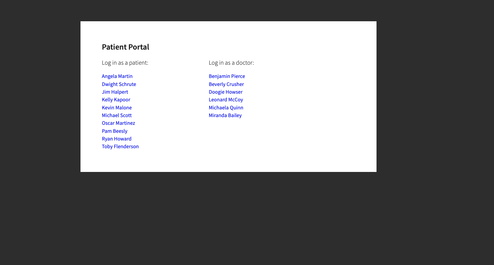

- Click on the Patient **Angela Martin**.


- Click the Bills tab to find the unpaid bills and hit the pay button.
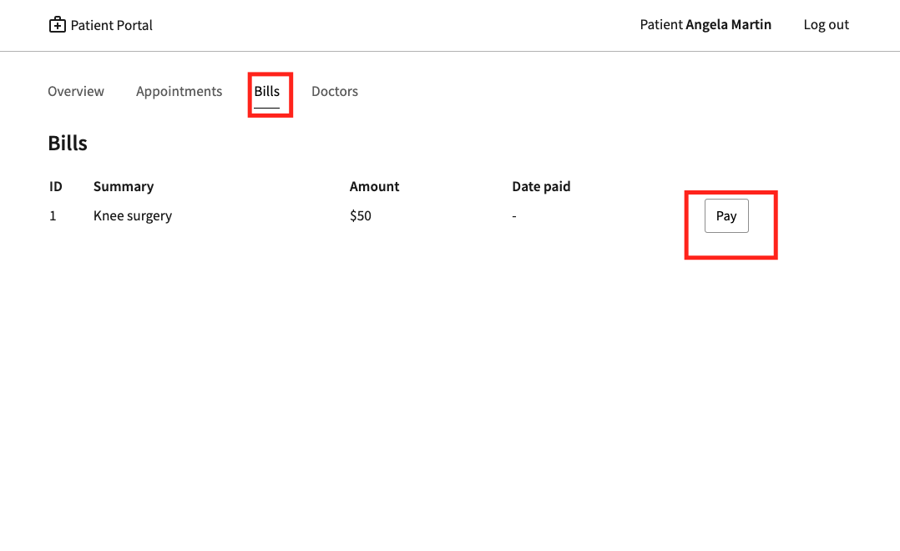

- Submit the payment


- Refresh the page. You should be able to see there is now a Date Paid value indicating that the payment is successful. This shows that we have successfully connected our payment-processor to the application using Red Hat Service Interconnect.
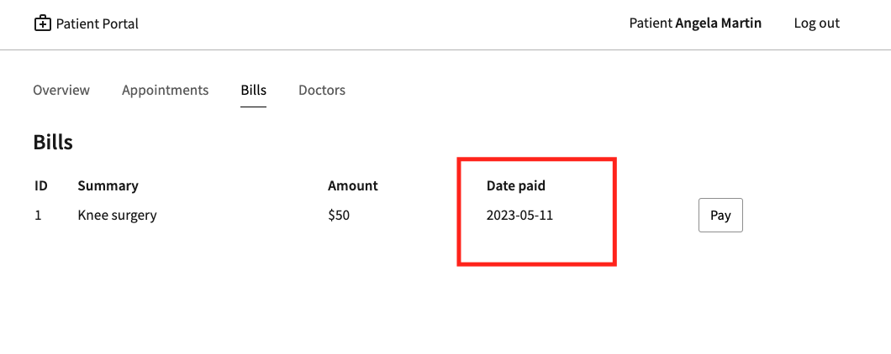

- Finally revisit the console tab [skup-console.png](https://play.instruqt.com/assets/tracks/nrxvnbrjrvsz/5847ac559d3a8cc3b583de8a33d10474/assets/skup-console.png)
- Click on the components tab. All the services should now be connected as shown below 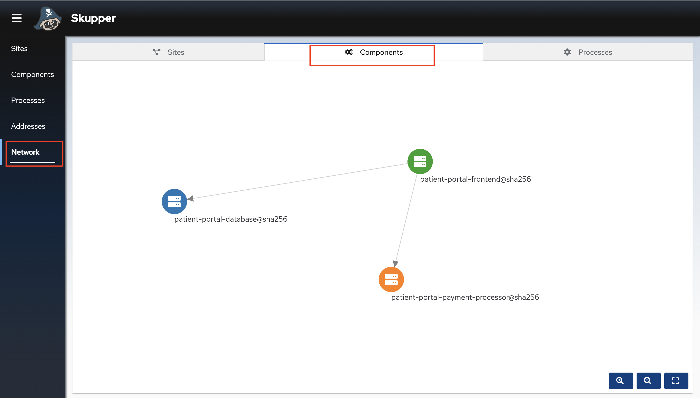


Congratulations! You successfully used Red Hat Service Interconnect to build a secure service network between services on two different OpenShift clusters and allowed application to connect and communicate over the secure network.
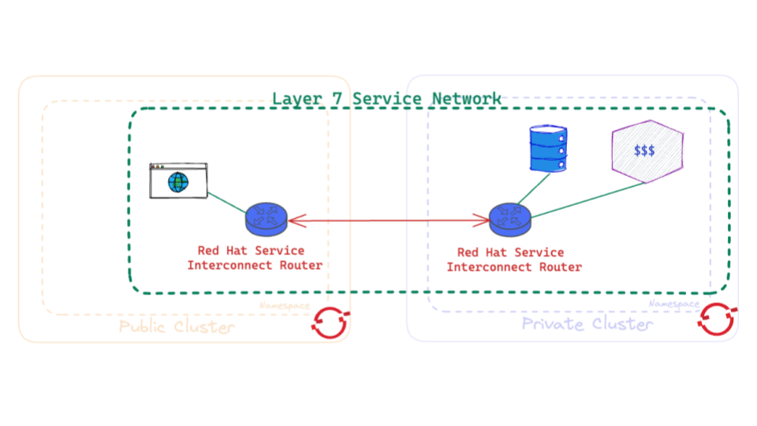

Learn more at about [Red Hat Service Interconnect by clicking here](https://developers.redhat.com/products/service-interconnect/overview).


