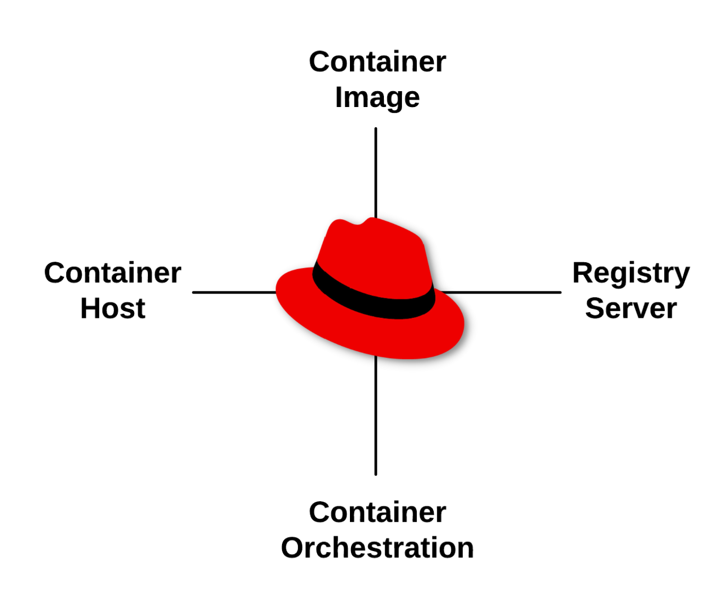

If you understand Linux, you probably already have 85% of the knowledge you need to understand containers. If you understand how processes, mounts, networks , shells and daemons work - commands like ps, mount, ip addr, bash, httpd and mysqld - then you just need to understand a few extra primitives to become an expert with containers. Remember that all of the things that you already know today still apply: from security and performance to storage and networking, containers are just a different way of packaging and delivering Linux applications. There are four basic primitives to learn to get you from Linux administrator to feeling comfortable with containers:

* [Container Images](https://developers.redhat.com/blog/2018/02/22/container-terminology-practical-introduction/#h.dqlu6589ootw)
* [Container Registries](https://developers.redhat.com/blog/2018/02/22/container-terminology-practical-introduction/#h.4cxnedx7tmvq)
* [Container Hosts](https://developers.redhat.com/blog/2018/02/22/container-terminology-practical-introduction/#h.8tyd9p17othl)
* [Container Orchestration](https://developers.redhat.com/blog/2018/02/22/container-terminology-practical-introduction/#h.6yt1ex5wfo66)

Once, you understand the basic four primitives, there are some advanced concepts that will be covered in future labs including:

* Container Standards: Understanding OCI, CRI, CNI, and more
* Container Tools Ecosystem - Podman, Buildah, Skopeo, cloud registries, etc
* Production Image Builds: Sharing and collaborating between technical specialists (performance, network, security, databases, etc)
* Intermediate Architecture: Production environments
* Advanced Architecture: Building in resilience
* Container History: Context for where we are at today

Covering all of this material is beyond the scope of any live training, but we will cover the basics, and students can move on to other labs not covered in the classroom. These labs are available online at http://learn.openshift.com/subsystems.

Now, let's start with the introductory lab, which covers these four basic primitives:

