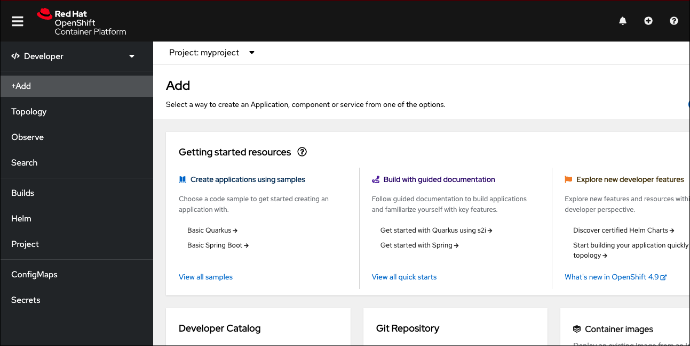

## Logging into OpenShift from the command line

In this topic, you will learn how to log into an OpenShift cluster from the command line. You'll create a project named `myproject`. Then you'll view that project in the OpenShift web console.

Let's get started by logging in. You log into OpenShift from the command line by running the following in the terminal window on the left. (Directly clicking the command line below copies the command to your computer's clipboard.)

----

`Step 1:` Run the following command to log into OpenShift:

```
oc login -u admin -p admin https://api.crc.testing:6443 --insecure-skip-tls-verify=true
```

You'll see results similar to the following:

```
Login successful.

You have access to 64 projects, the list has been suppressed. You can list all projects with 'oc projects'

Using project "default".
```

|NOTE:|
|----|
|You may need to wait a few minutes for the pods in openshift-authentication to be running before the command is successful.|

The command shown above will log you in using the credentials:

* **Username:** `admin`
* **Password:** `admin`

# Creating a new project

Next, you'll create a new project named `myproject` using the `oc` command line tool.

----

`Step 2 :` Run the following command to create a new project named `myproject`:

```
oc new-project myproject
```

You will see output similar to:

```
Now using project "myproject" on server "https://api.crc.testing:6443".

You can add applications to this project with the 'new-app' command. For example, try:

    oc new-app rails-postgresql-example

to build a new example application in Ruby. Or use kubectl to deploy a simple Kubernetes application:

    kubectl create deployment hello-node --image=k8s.gcr.io/serve_hostname
```

# Logging into the OpenShift web console

You can now log into the OpenShift web console using the `admin/admin` username/password pair login credentials.

----

`Step 3 :`  On the horizontal menu bar above the command line terminal on the right, click the tab titled `Web Console`. Clicking the tab will open the OpenShift web console in a new browser tab.

You'll be presented with a login page as shown in the figure below.


Use the `admin/admin` username/password pair to login.

Once logged in, you will be in the **Administrator** perspective. Notice that the first item in the vertical menu bar of the OpenShift console has the label **Administrator** as shown in the figure below:


Next you'll change to the **Developer** perspective.

# Changing to the Developer perspective

`Step 4 :`  Select `Developer` from the drop-down as shown in the figure below to change to the **Developer** perspective.


Next, you'll select the project you created previously in the OpenShift web console.

# Selecting the project

`Step 4a:` Click the **Add** button on the left side menu bar in the **Developer** perspective. The list of projects will appear.


`Step 4b:` Enter the search term `myproject` in the search text box. This action will filter out all projects except `myproject`. (Remember, you created `myprojects` previously using the terminal.)

`Step 4c:` Click the link `myproject` in the list.

The details of these 3 previous actions are shown in the figure below.


You'll be presented with an **Add** page that has a collection of text blocks as shown in the figure below.



# Congratulations!

You've completed the topic.

----

**NEXT:** Deploying an application using the web console

