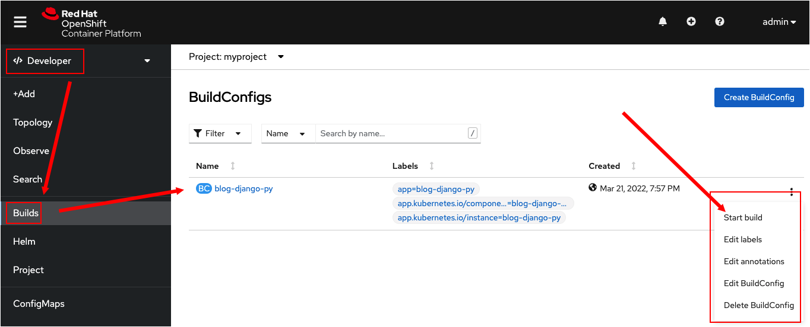
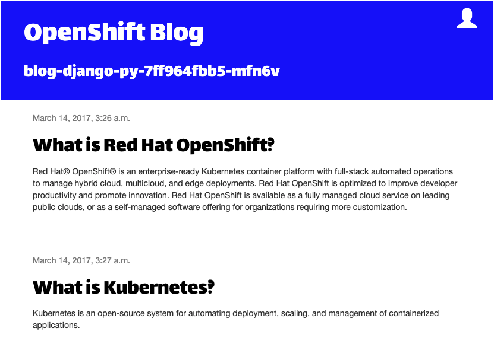

In this topic, you will learn how to use the command line to rebuild an app that's already running in OpenShift. Also, you will learn how to execute a rebuild in OpenShift when code changes in source control.

----

#  Triggering a build from the command line

The way to trigger a new build after making any changes is to use `oc start-build` command.

`Step 1:` Run the following command to rebuild blog-blog-django-py

```
oc start-build blog-django-py
```

You'll get output similar to the following:

```
build.build.openshift.io/blog-django-py-2 started
```

You can also trigger a build from within the OpenShift web console. Let's execute a build from the web console UI.

# Triggering a build from the OpenShift web console

`Step 2a:` Go to the **Builds** menu on the left of the Developer perspective as shown in the figure below.

`Step 2b:` Click the **Start build** item in the drop-down menu on the right side of the build page, as shown in the figure below.



You'll see results similar to the figure shown below.


---

As mentioned before, you can use `oc logs` to monitor the log output as the build runs. You can also monitor the progress of any builds in a project by running the command:

`Step 3:` Run the following command to monitor the progress of the running builds.

```
oc get builds --watch
```

As the build progresses, this should display output similar to:

```
NAME               TYPE     FROM          STATUS     STARTED          DURATION
blog-django-py-1   Source   Git@9c4f338   Complete   3 minutes ago        1m44s
blog-django-py-2   Source   Git@9c4f338   Running    About a minute ago
blog-django-py-3   Source   Git
```

----

`Step 4 :` Press the `CTRL+C` keys in the terminal window to exit watching the builds.

----

`Step 5 :` Run the following command to display information about the build configuration:

```
oc describe bc/blog-django-py
```

You'll get output similar to the following:

```
Name:           blog-django-py
Namespace:      myproject
Created:        2 minutes ago
Labels:         app=blog-django-py
                app.kubernetes.io/component=blog-django-py
                app.kubernetes.io/instance=blog-django-py
Annotations:    openshift.io/generated-by=OpenShiftNewApp
Latest Version: 3

Strategy:       Source
URL:            https://github.com/openshift-instruqt/blog-django-py
From Image:     ImageStreamTag openshift/python:latest
Volumes:        <none>
Output to:      ImageStreamTag blog-django-py:latest

Build Run Policy:       Serial
Triggered by:           Config, ImageChange
Webhook GitHub:
        URL:    https://api.crc.testing:6443/apis/build.openshift.io/v1/namespaces/myproject/buildconfigs/blog-django-py/webhooks/<secret>/github
Webhook Generic:
        URL:            https://api.crc.testing:6443/apis/build.openshift.io/v1/namespaces/myproject/buildconfigs/blog-django-py/webhooks/<secret>/generic
        AllowEnv:       false
Builds History Limit:
        Successful:     5
        Failed:         5

Build                   Status          Duration                Creation Time
blog-django-py-3        new             waiting for 24s         2022-03-22 16:14:22 +0000 UTC
blog-django-py-2        running         running for 43s         2022-03-22 16:14:03 +0000 UTC
blog-django-py-1        complete        1m43s                   2022-03-22 16:12:02 +0000 UTC

Events: <none>
```

Here you see details of the git repository that hosts the source code within the `describe` output.

Notice that the `describe` output above lists a list of GitHub webhook URLs. You can configure these URLs with a git hosting service to automatically trigger a new build when changes are committed and pushed to a git repository. However, be advised that you need ownership permission in the particular repository or a fork of the repository to trigger builds automatically.

# Triggering a binary input build using local code

A typical workflow to follow when developing an application is to create and update code in the application source code on your own local machine. Then, when you are ready to make the changes live, you commit the updated code locally and push the updates to the git repository linked to the build configuration. If a webhook has been configured, a new build and deployment will be triggered automatically when the commit is made. Also, you can trigger a new build manually.

OpenShift allows you to trigger a build against changed code stored in the local filesystem. You don't need to go through the effort of committing the changes to Git. Building code that's stored locally in OpenShift is called a binary input build.

Let's trigger a binary input build now.

`Step 6:` Run the following commands in the terminal window to the left to move into a new directory and clone the git repository that has the source code for the demonstration application:

```
cd /usr/tmp && git clone https://github.com/openshift-instruqt/blog-django-py
```

You'll get the output as follows:

```
Cloning into 'blog-django-py'...
remote: Enumerating objects: 3, done.
remote: Counting objects: 100% (3/3), done.
remote: Compressing objects: 100% (3/3), done.
remote: Total 412 (delta 0), reused 0 (delta 0), pack-reused 409
Receiving objects: 100% (412/412), 68.49 KiB | 556.00 KiB/s, done.
Resolving deltas: 100% (200/200), done.
```

Cloning the repository will create the subdirectory `blog-django-py`, which contains the source code for the application.

----

`Step 7:` Navigate to the working directory that has the source code from the demonstration application:

```
cd blog-django-py
```

----

`Step 8:` Run the following command to demonstrate how a build can be triggered from the local copy of the application source code without needing to commit changes back to the git repository.

```
echo 'BLOG_BANNER_COLOR=blue' >> .s2i/environment
```

The `echo` command above will update one of the environment variables used by OpenShift's `source code to image` (S2I) feature. The `echo` command changes the value of the environment variable `BLOG_BANNER_COLOR` to `blue`. This change will alter the background color of the blog post header area.

----

`Step 9:` Run the following command to start a new build:

```
oc start-build blog-django-py --from-dir=. --wait
```

You'll get output similar to the following:

```
Uploading directory "." as binary input for the build ...
...................
Uploading finished
build.build.openshift.io/blog-django-py-4 started
```

This version of running `oc start-build` is similar to what you ran before, except that the option setting `--from-dir=.` is also passed to the command.

The option setting `--from-dir=.` indicates that the local source code should be uploaded from the directory on the host where you are running the command. Building using the local code avoids the source code down from the hosted git repository.

The ``--wait`` option is supplied to indicate that the command should only return control when the build has been completed. This option can be helpful if integrating the build command into a script, and you need to ensure that the build has been completed before running a subsequent command.

----

`Step 9:` Go to the web page where the example code is running. You will see that the color of the header section on the web page has changed to blue, as shown in the figure below.



When you use the ``--from-dir=.`` option with ``oc start-build``, the contents from the current working directory will only be used for that one build.

If you wanted to run further builds with source code from your local directory, you would need to supply ``--from-dir=.`` each time.

# Reverting a build

`Step 10:` Run the following command to return the web page rendering back to using the source code hosted in the git repository:

```
oc start-build blog-django-py
```

You will see the following output:

```
build.build.openshift.io/blog-django-py-5 started
```

# Viewing a build in the web console

You can also run a build from the OpenShift web console.

`Step 11a:` Switch to the web console to monitor progress by viewing the log from the application detail.

`Step 11b:` Select **Build** from the left-hand side menu.

`Step 11c:` Select the build configuration for `blog-django-py` by selecting the **Builds** tab and then clicking on `blog-django-py-3`.

# Cancelling a build

If, for some reason, a build was started by accident or you realize it would fail anyway, you can cancel the build by running `oc cancel-build` and supplying the name of the build.

`Step 11:` Run the following command to cancel the build with the name `blog-django-py-5`:

```
oc cancel-build blog-django-py-5
```

You will see output indicating that the build has been canceled.

```
build.build.openshift.io/blog-django-py-5 marked for cancellation, waiting to be cancelled
build.build.openshift.io/blog-django-py-5 cancelled
```

----

`Step 12:` Run the following command to confirm that the build has been canceled:

```
oc get builds
```

This will output similar to the following:

```
NAME               TYPE     FROM             STATUS                       STARTED              DURATION
blog-django-py-1   Source   Git@9c4f338      Complete                     9 minutes ago        1m43s
blog-django-py-2   Source   Git@9c4f338      Complete                     7 minutes ago        1m41s
blog-django-py-3   Source   Git@9c4f338      Complete                     5 minutes ago        1m48s
blog-django-py-4   Source   Binary@9c4f338   Complete                     4 minutes ago        1m44s
blog-django-py-5   Source   Git@9c4f338      Cancelled (CancelledBuild)   About a minute ago   50s
```

Notice that the build `blog-django-py-5`, as shown above, has been canceled.

|NOTE:|
|----|
|Starting a build using source code from a local directory on your own machine can only be done from the command line. There is no way to trigger such a build from the web console.|

----

## Congratulations!

 You've completed this topic. You triggered a build from the command line. Then, you triggered a build using the OpenShift web console. Also, you updated the source code locally and did a build using the updated code. You ran a build that reset the demonstration application's website back to its original state. Finally, you started and canceled a build.

This is the final topic in this track.

# What's Next?

Congratulations on completing this lab. Keep learning about OpenShift:

* Visit the [Red Hat Developer learning page](https://developers.redhat.com/learn) for more labs and resources
* [Want to try a free, instant 30-day OpenShift cluster? Get started with the Developer Sandbox for Red Hat OpenShift](https://developers.redhat.com/developer-sandbox)

Don't forget to finish the lab and rate your experience on the next page. Thanks for playing!
