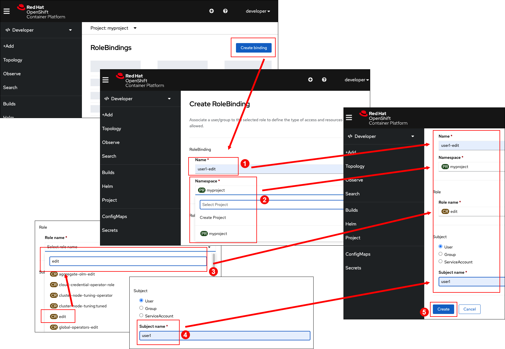

In this topic you will learn how to log in as a different user, and perform actions in OpenShift according to the logged in user. You'll also learn how to create a new user from the command line. Then you'll learn how to use the web console to give that new user `edit` permissions to work with your application via an OpenShift `rolebinding` resource object.

OpenShift supports multitenant clusters. This means that OpenShift supports many different users, each working on their own applications.

To support collaboration with others on your projects, you need to grant other users access to them. Access permissions can be granted at varying levels depending on what the given user needs to be able to do in your project.

In the steps that follow you will learn how other users can collaborate with you. The place to start is with creating another user named `user1`.

# Creating a new user at the command line

`Step 1:` Run the following command to create a new user with the username `user1` and the password `user1`.

```
oc login --username user1 --password user1
```

You'll get the following output:

```
Login successful.

You don't have any projects. You can try to create a new project, by running:

    oc new-project <projectname>
```

----

`Step 2:` Run the following command to get a list of projects that `user1` can access:

```
oc get projects
```

You'll receive the following output:

```
No resources found
```

OpenShift reports that there are no resources associated with `user1`. Thus, you can infer that there are no projects or applications associated with `user1`.

# Granting permissions to your OpenShift project

Once you have a user created by using the `oc` command line tool, go to the OpenShift web console to grant a new user access to a project.

Previously you logged into the OpenShift web console as the user `developer`. So, return to the web console to perform actions as `developer`.

Now grant the new user `user1` edit permissions to the project `myproject` using the web console.

# Configuring a `rolebinding` in the OpenShift web console

One way to grant a user permissions to a project in OpenShift is by using the web console to create a `rolebinding` resource object. Another way is to grant permission using `oc` at the command line.

Let's use the web console to create a `rolebinding` that grants edit permission to `user1` in the `myproject`.

----

`Step 3:` Go back to the browser window in which you are running the web console.

----

`Step 4a:` Click the **Project** tab on the vertical menu bar to the left of the web console page.

The web page for `myproject` will appear.

----

`Step 4b:` Click the menu item **Project access** tab in the horizontal menu in the `myproject` page.

----

`Step 4c:` Click the **Role Bindings** link in the **Project access** page.

The **RoleBindings** page will appear. (The entire process just described is shown in the figure below.)


----

`Step 4d:` Click the **Create binding** button in the **RoleBindings** page. This will display the **Create RoleBinding** details page.

Once the **Create RoleBinding** page appears, take the following five steps.

----

`Step 5a:`  Enter the text `user-edit` in the **Name** text box. This gives the **RoleBinding** an identifiable name.

----

`Step 5b:` Select the project `myproject` from the **Namespace** dropdown menu.

----

`Step 5c:` Select the text `edit` from the **Select role name** dropdown list.

----

`Step 5d:` Enter `user1` in the **Subject name** text box. This will bind the permission to the user.

----

`Step 5e:` Click the **Create** button at the bottom of the **Create RoleBinding** page.

The entire process is illustrated in the figure below.



# Viewing `user1`'s projects.

Now that you've bound `user1` to the **RoleBinding** named `user1-edit`, you will see via the terminal window that `user1` has access to the project named `myproject`. Let's take a look.

----

`Step 6:` Go to the back to the terminal in the interactive learning environment.

----

`Step 7:` Run the following command at the terminal prompt to get a list of the projects that `user1` is entitled to see. (Remember you are logged in as `user1` in the terminal window.)

```
oc get projects
```
You'll get the following output:

```
NAME        DISPLAY NAME   STATUS
myproject   myproject      Active
```

As you can see, `user1` now has access to the project created by the `developer` user.

In this case you gave `user1` the role type `edit` in the project. This allows the user to perform tasks within the project with the exception of tasks related to administration. Thus, the `user1` cannot make changes to project membership or delete the project.

You might also assign other users to have only `view` permissions, which means they can look at everything in the project, but not change anything. In addition, you can give users `admin` permissions, which gives them equal rights as the owner of the project, including editing project membership or deleting the project.

# Changing user permissions at the command line

Making changes to a project's membership can also be done from the command line using the `oc` command.

At this point `user1` has no projects of its own. Let's assign `user1` a project.

----

`Step 8:` Run the following command to confirm that the current user is indeed `user1`.

```
oc whoami
```
You'll get the following output:

```
user1
```

----

`Step 9:` Run the following command to create a project named `yourproject` that is assigned to `user1`:

```
oc new-project yourproject
```

You'll get the following output:

```
Now using project "yourproject" on server "https://api.crc.testing:6443".

You can add applications to this project with the 'new-app' command. For example, try:

    oc new-app rails-postgresql-example

to build a new example application in Ruby. Or use kubectl to deploy a simple Kubernetes application:

    kubectl create deployment hello-node --image=k8s.gcr.io/serve_hostname
```

----

`Step 10:` Run the following command to assign `view` permissions to the user `developer`.

```
oc adm policy add-role-to-user view developer -n yourproject
```

You'll get the following output:

```
clusterrole.rbac.authorization.k8s.io/view added: "developer"
```

# Confirming new permission assignment for `developer` at the command line

`Step 11:` Run the following command to log back into the terminal as the user named `Developer`.

```
oc login -u developer -p developer
```

You'll get the following output:

```
Login successful.

You have access to the following projects and can switch between them with 'oc project <projectname>':

    myproject
  * yourproject

Using project "yourproject".
```
Notice the output above: There are now two projects listed for the user named `developer`. One project is named `myproject`. The other project is named `yourproject`.

This is evidence that the work you did at the command line has taken affect.

# Confirming new permission assignment for `developer` in the web console

`Step 12:` Return to the main page in the web console.

----

`Step 13:` Select the project dropdown at the top of the web console. You'll see that the project named `yourproject` is in the project list for the user `developer`, as shown in the figure below.


# Congratulations!

 You've just created a new user named `user1`. You used the web console to give `user1` edit permissions to the project `myproject`. Finally you gave `user1` its own project named `yourproject` and used the web console to give the existing user `developer` view permission to the `yourproject` project.

----

**NEXT:** Switching users between accounts
