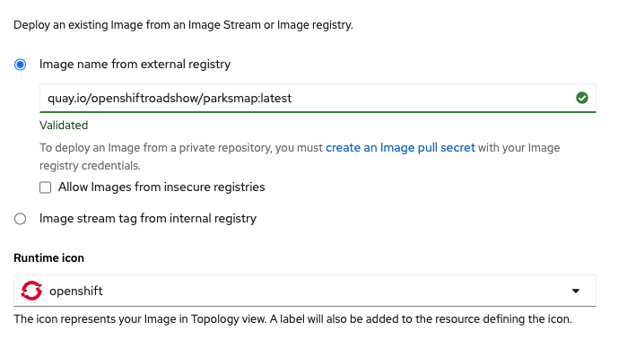
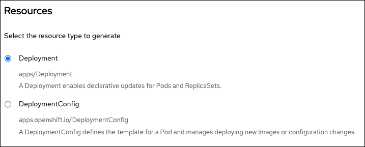

In this topic you will learn how to use the web console to identify a container image in an external container image registry. Then you will use that container image to create an application that runs in the project named `myproject`. The application you'll run is a simple blog web site.

----

`Step 1:` Go back to the project page for `myproject` in the web console and click the **Add+** button on the menu bar on the left.

----

`Step 2:` Scroll down the **Add** page until you get to the text block labeled **Container images**.

----

`Step 3:`  Click the label **Container images** as shown in the figure below.


You'll be presented with the **Deploy Image** page as shown in the figure below.


----

`Step 4:`  Enter the text below in the textbox labeled **Image name from external registry**:

```
quay.io/openshiftroadshow/parksmap:latest
```

The text above describes the container image that will be used for the application you're adding. In this case you are adding the ParksMap container image that is stored on the container registry `Quay.io` as shown in the figure below.



Once you enter the location of the container image in the text box above, OpenShift will fill in the configuration details automatically. The figure below shows how configuration information is automatically entered for the **General** section.


 The figure below shows how configuration information is automatically entered for the **Resources** section.

 

The final section titled **Advanced options**, which you'll see in a moment, has a checkbox that when selected will have OpenShift automatically create a `route` resource object to the application.

A `route` resource object publishes a URL that enables public access to the ParksMap application on the Internet.

The checkbox is selected automatically by OpenShift when adding the container image.

----

`Step 5:` Click the button labeled **Create** at the bottom of the **Add** page as shown in the figure below:


After you save the container image, OpenShift will do the work of creating the application automatically.

The **Add+** page will close.

Then you'll see the **Topology** page with a circular graphic appear as shown in the figure below.


This circular graphic represents the ParksMap application.

# Congratulations!

You've just added a container image to the the project named `myproject`.

----

**NEXT:** Exploring the Topology view