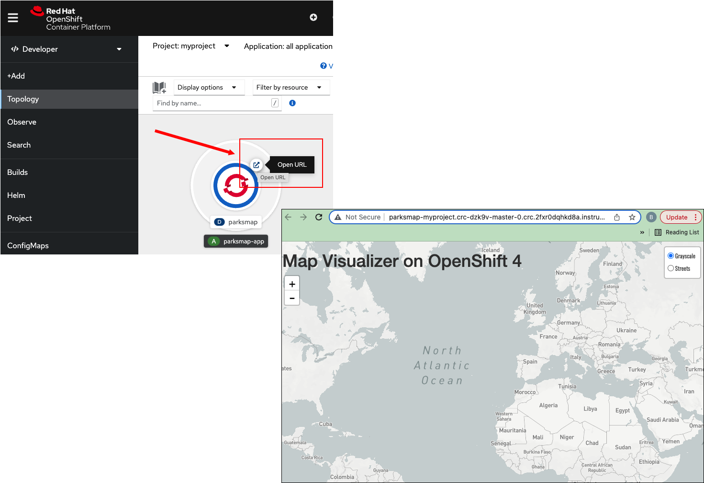

In this topic you will learn about different aspects of working with an application in OpenShift's Topology view. You'll learn how access the application on the Internet from within the **Topology** view. You'll also learn how to view the details of an application. Then, you'll learn how to scale ParksMap up by increasing the number of underlying `pod` resource objects.

# Accessing an application on the Internet using the Topology view

`Step 1:` Go to the web console and click the **Topology** menu item on the the left side of the page as shown in the figure below.

The **Topology** page with a circular graphic will appear as shown in the figure below. As mentioned in the previous topic, this circular graphic represents the ParksMap application.

Notice the the circular graphic has an icon at the upper right as highlighted by a red box shown in the figure below.

The icon represents the `route` to the ParksMap application.

----

`Step 2:` Click on the `route` icon to open the ParksMap application in a new browser tab as shown in the figure below.

Now, let's scale up the number of `pod` resource objects that support the application.

# Scaling the application up

`Step 3:` Go to the web console and click the center of the circular graphic for the ParksMap application as shown in the figure below.

The information page for the application will slide out on the right hand side.

----

`Step 4:`  Select the **Details** tab from the horizontal menu bar on the application's information page as shown in the figure below.

The **Details** tab reveals a circular graphic. This graphic describes the number of pods supporting the ParksMap application.

-----

`Step 5:` Click the up arrow on the right of the circular Pods graphic once. This action tells OpenShift to increase the number of application pods to 2.

Take a look at the figure above to see the visuals of this action. You now have 2 pods supporting the ParksMap application.

Increasing the number pods in ParksMap gives the application more capacity to handle traffic coming in from the Internet. You can use the web console to increase or decrease the number of pods in order to meet performance demands.

# Congratulations!

You've just learned to how to use the web console to view the details of an application in **Topology** view. You learned how to access the ParksMap application from the Internet by using its `route` URL. Also, you learned how to scale up an application using the graphical features available in the **Topology** view.

----

**NEXT:** Deleting the application using the web console
