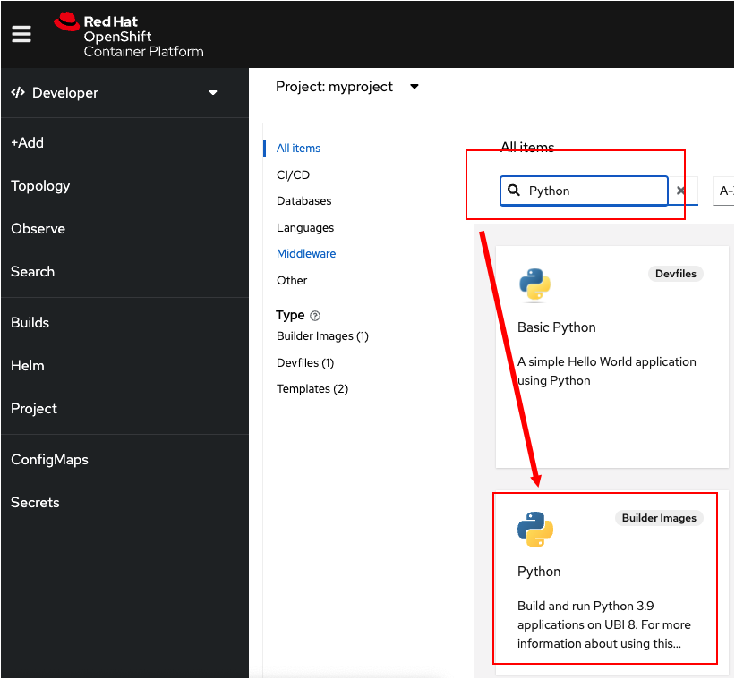
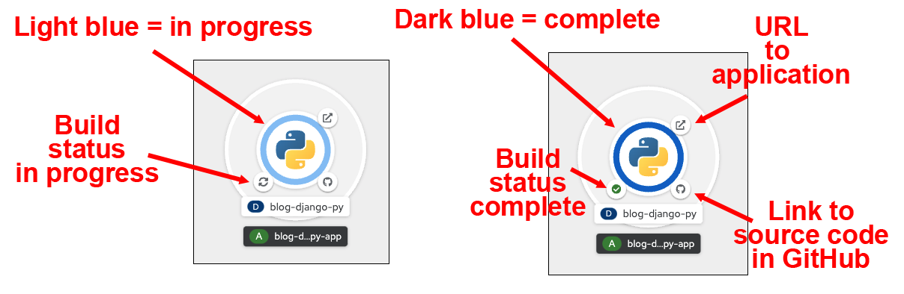
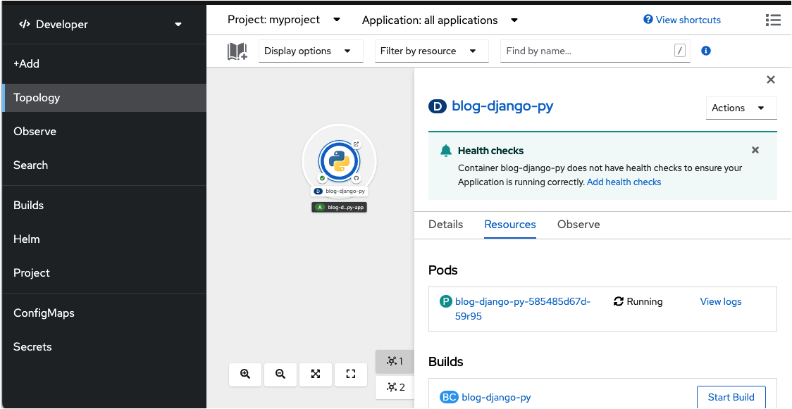

In this topic you will use the OpenShift web console to create and deploy an application from source code that is stored in GitHub.

First we need to select the type of application you're deploying. The first thing you need to do is select a service from the **Developer Catalog**. In this case, you can think of a service as an application configuration template. For demonstration purposes you will create and deploy a Python application.

# Selecting a service

`Step 1a:` In the OpenShift web console, click the **Add** button from the left-side vertical menu. You'll be presented with the **Add** page, which has a number of text blocks.

`Step 1b:` Scroll down a bit and click the **All services** text in the **Developer Catalog** text block as shown in the figure below.


----

You will be presented with the all service page that has a number of text blocks. At the top of the search page is a search text box.

`Step 2a:` Enter the term `python` in the search text box.

This action filters out all text blocks except those that are relevant to Python.

`Step 2b:` Select the text block labeled **Python** as shown in the figure below.



You'll be presented with a web page that is particular to the Python service you've just selected.

----

`Step 3:` Click the Create Application button as shown in the figure below.


You'll be presented with a web page titled **Create to Source-To-Image Application**.

You'll use this web page to import source code into OpenShift that's stored in GitHub. You'll use OpenShift's Source-To-Image capabilities to create a Linux container based on the source code in the GitHub repository.

----

`Step 4:`  At the **Git** section of the **Create to Source-To-Image Application** web page you'll see a textbox labeled **Git Repo URL**.

Enter the text:

```
https://github.com/openshift-instruqt/blog-django-py
```

into the **Git Repo URL** text box as shown in the figure below.


----

`Step 5a:` Scroll down the page. Notice that the **Create to Source-To-Image Application** web page has automatically filled in values in the **Application** and **Name** text boxes in the **General** section as shown in the figure below:


Keep scrolling.

Notice in the **Advanced options** section, as shown in the figure below, that **Create a route to the Application** checkbox is selected. This means that OpenShift will automatically create a URL that allows access to the application from the Internet.


`Step 5b:` Finally, click the **Create** button, as shown in the figure above. This action will save the source code data and start the build process for the application.

You will be presented wth the Topology overview page in the OpenShift web console while the build is in progress, as shown in the figure below.


# Anatomy of an application graphic in the Topology overview

The Topology page displays a visual representation of each of the components that are being deployed within a given project. In this case, the project `myproject` has only the Python application deployment. Thus there is only graphic.

Notice that the graphic for the Python application shown above has a blue circle surrounding the Python logo. Also, there are a number of smaller icons around the circle.

The color of the circle and the icons surrounding the circle have special meanings. The figure below describes the meaning of each of these graphical elements.



The Git icon shown to the lower right of the ring can be clicked on to take you to the hosted Git repository from which the source code for the application was built.

The icon shown to the lower left represents the application's build status. The icon will change from showing an hourglass, indicating that the build is starting, to a sync icon indicating the build is in progress, and finally to a tick or cross depending on whether the build was successful or failed. Clicking on this icon will take you to the details of the current build.

Once the application is running, the icon shown on the upper right can be clicked to open the URL for the application route which was created.

The ring itself will progress from being white, indicating the deployment is pending, to light blue indicating the deployment is starting, and blue to indicate the application is running. The ring can also turn dark blue if the application is stopping.

Clicking anywhere on the area enclosed by the ring will bring up a panel giving details of the resources for the application as shown in the figure below.



# Congratulations!

You've started the process of deploying a Python application using the OpenShift web console and the Create to Source-To-Image Application feature.

----
**NEXT:** Viewing the build logs for a deployment in the OpenShift Web Console